--- 
title: "Causal Inference Course"
author: "Ian Lundberg and Sam Wang"
date: "2024-08-21"
site: bookdown::bookdown_site
documentclass: book
bibliography: [book.bib, packages.bib]
# url: your book url like https://bookdown.org/yihui/bookdown
# cover-image: path to the social sharing image like images/cover.jpg
description: |
  An undergraduate course on causal inference
biblio-style: apalike
csl: chicago-fullnote-bibliography.csl
---

# Welcome {-}

Cornell [STSCI](https://classes.cornell.edu/browse/roster/FA23/class/STSCI/3900) / [INFO](https://classes.cornell.edu/browse/roster/FA23/class/INFO3900) / [ILRST 3900](https://classes.cornell.edu/browse/roster/FA23/class/STSCI/3900). Causal Inference. Fall 2023.

Welcome! Together, we will learn to make causal claims by combining data with arguments.

Taught by [Ian Lundberg](https://www.ianlundberg.org/), [Y. Samuel Wang](https://ysamuelwang.com/), [Mayleen Cortez-Rodriguez](https://www.mayleencortez.com/), and [Daniel Molitor](https://www.dmolitor.com/). Read about us [here](who-we-are)!

## Learning objectives {-}

As a result of participating in this course, students will be able to

* define counterfactuals as the outcomes of hypothetical interventions
* identify counterfactuals by causal assumptions presented in graphs
* estimate counterfactual outcomes by pairing those assumptions with statistical evidence

## Is this course for me? {-}

The course is designed for upper-division undergraduate students. We will assume familiarity with an introductory statistics course at the level of STSCI 2110, PAM 2100, PSYCH 2500, SOC 3010, ECON 3110, or similar courses.

Not a Cornell student? You are welcome to follow along on this site.

## Readings {-}

Especially in the beginning, this course draws heavily on

> Hernán, M.A., and J.M. Robins. 2020. [**Causal Inference: What If?**](https://www.hsph.harvard.edu/miguel-hernan/causal-inference-book/) Boca Raton: Chapman \& Hall / CRC.

We are grateful to the authors for this excellent text.

## Organization of the site {-}

Each course module in the left panel will span several lectures. Within each module, the right panel will help you navigate. We will build this site over the course of the semester, uploading lecture slides as we go. [Who we are](Who we are) tells you a bit about the teaching team.

## Land acknowledgment {-}

We recognize the university land acknowledgment, as well as an additional emphasis from the [Cornell American Indian and Indigenous Studies Program](https://cals.cornell.edu/american-indian-indigenous-studies).

> Cornell University is located on the traditional homelands of the Gayogo̱hó:nǫɁ (the Cayuga Nation). The Gayogo̱hó:nǫɁ are members of the Haudenosaunee Confederacy, an alliance of six sovereign Nations with a historic and contemporary presence on this land. The Confederacy precedes the establishment of Cornell University, New York state, and the United States of America. We acknowledge the painful history of Gayogo̱hó:nǫɁ dispossession, and honor the ongoing connection of Gayogo̱hó:nǫɁ people, past and present, to these lands and waters.

> This land acknowledgment has been reviewed and approved by the traditional Gayogo̱hó:nǫɁ leadership.

> In addition to the Gayogo̱hó:nǫɁ land acknowledgment but separate from it, the AIISP faculty would like to emphasize: Cornell's founding was enabled in the course of a national genocide by the sale of almost one million acres of stolen Indian land under the Morrill Act of 1862. To date the university has neither officially acknowledged its complicity in this theft nor has it offered any form of restitution to the hundreds of Native communities impacted. For additional information, see the [Cornell University and Indigenous Dispossession](https://blogs.cornell.edu/cornelluniversityindigenousdispossession/) website.

<!--chapter:end:index.Rmd-->


# Defining counterfactuals

## Observing versus intervening

> Aug 22. [**Slides**](assets/slides/lecture_1.1_observing_intervening.pdf)

Statistical inference is about observing: if I observe a sample from a population, what can I infer about that population? Causal inference is about intervening: if I take a sample from a population and intervene to change some exposure, what average outcome would result?

Today we will discuss observing, intervening, and why the difference is so important.

## Lab: Designing a study

> Aug 23

In this lab, we will start by getting to know one another. Then, we will discuss a hypothetical scenario.

A researcher (with whom you may disagree) says to you:
  > Coming to office hours frequently causes student success in the classroom.

In groups of about 3 students, discuss the following.

1. Imagine it is the **start** of the semester. How would you design a randomized experiment to assess this claim?
     * Imagine that you can assign students to a treatment condition and they will comply
     * Consider the details: who would you enroll, how would you define frequently, how would you assess success, etc.
2. Imagine it is the **end** of the semester. No randomized study was run. You want to conduct an observational study using administrative records (and you get IRB approval to do this). How would you design an observational study to assess this claim?

There is no expectation to have clear answers now. Over the course of the semester we will learn to formalize these types of questions and their solutions.

## Defining causal effects

> Aug 24. [**Slides.**](assets/slides/lecture_1.3_defining_causal_effects.pdf) After class, read Chapter 1 of [Hernán and Robins 2020](https://www.hsph.harvard.edu/miguel-hernan/causal-inference-book/) and begin Homework 1.

Today we will define average causal effects in the potential outcomes framework.

By the end of class, you will be able to

* define potential outcomes
* explain the Fundamental Problem of Causal Inference^[Holland [1986](https://doi.org/10.2307/2289064)]
* recall statistical concepts: random variables, expectation, conditional expectation

<!--chapter:end:01_defining_counterfactuals.Rmd-->


# (PART) Identification by exchangeability {-}

# Exchangeability and experiments

## Randomized experiments

> Aug 29. [**Slides.**](assets/slides/2-1_random_experiments.pdf) After class, read [Hernán and Robins 2020](https://www.hsph.harvard.edu/miguel-hernan/causal-inference-book/) Chapter 2 through the end of 2.1.

Much of this course will address observational studies with non-randomized treatments. To set the stage, today we will first discuss why randomized experiments are so powerful when they are possible.

## Lab: Statistics review with math and simulations

> Aug 30. [**Slides.**](assets/discussions/discussion2-slides.pdf)

The course will use several ideas from your previous coursework in statistics, including random variables, expected values, and independence. This lab will review these concepts in math and using simulations in R.

## Exchangeability and conditional randomization

> Aug 31. [**Slides.**](assets/slides/2-2_exchangeability.pdf) After class, read [Hernán and Robins 2020](https://www.hsph.harvard.edu/miguel-hernan/causal-inference-book/) Chapter 2.2.

We will talk about why experiments are good: they help us ask precise causal questions, and they are a setting in which a key assumption (exchangeability) holds by design. We will discuss exchangeability in simple randomized experiments and in experiments that are conditionally randomized so that treatment assignment probabilities are functions of pre-existing characteristics.

## Standardization and effect measures

> Sep 5. [**Slides.**](assets/slides/2-3_standardization.pdf) After class, read [Hernán and Robins 2020](https://www.hsph.harvard.edu/miguel-hernan/causal-inference-book/) Chapter 1.3 and 2.3.

Standardization is an important statistical procedure with two steps:

* estimate the causal effect in each population subgroup
* average over the population distribution of subgroups

In conditionally randomized experiments, standardization is essential to yield unbiased estimates of the population average causal effect. This strategy will also be essential in observational studies that we will discuss soon.

By the end of class, you will be able to

* describe different ways to quantitatively measure a causal effect
* estimate the average causal effect using data from a conditionally randomized experiment

## Lab: Analyze a randomized experiment

> Sep 6. [**Link to Materials**](discussion-3.-analyzing-an-experiment-in-r.html).
>
> [**Link to Solutions**](discussion-3.-analyzing-an-experiment-in-r-solutions.html)

This lab will use R to analyze data from a randomized experiment in which households were randomized to receive mailers encouraging them to vote, and the researchers examined effects on voter turnout ([Gerber, Green, & Larimer 2008](https://doi.org/10.1017/S000305540808009X)).

## Inverse probability weighting

> Sep 7. [**Slides.**](assets/slides/2-4_exchangeability.pdf) After class, read [Hernán and Robins 2020](https://www.hsph.harvard.edu/miguel-hernan/causal-inference-book/) Chapter 2.4, 3.1, and 3.2.

This class will introduce inverse probability weighting as an approach to estimate average causal effects when conditional exchangeability holds.

<!--chapter:end:02_exchangeability.Rmd-->


# Consistency and positivity

## Asking good causal questions

> Sep 12. [**Slides.**](assets/slides/3-1_consistency_positivity.pdf) After class, read [Hernán and Robins 2020](https://www.hsph.harvard.edu/miguel-hernan/causal-inference-book/) Chapter 3. Optionally, read [Hernán 2016](https://www.ncbi.nlm.nih.gov/pmc/articles/PMC5207342/).

Good causal questions are structured so that credibility is strong for two key assumptions: positivity and consistency.

1. **Positivity.** Every population subgroup receives every treatment value with non-zero probability
2. **Consistency.** Potential outcomes $Y^A$ are well-defined and linked to observable data

After class, you will be ready for a discussion in lab related to a common violation of the consistency assumption when one unit's treatment affects another unit's outcome.

## Lab: Interference

> Sep 13 [**Slides.**](assets/discussions/discussion4-interference.pdf)

When defining causal effects, we often discuss the outcome $Y^a$ that a person would realize if they were exposed to treatment value $a$. But definitions become harder if there exists **interference**: the outcome of unit $i$ depends on the treatment assigned to unit $j$. This discussion will focus on understanding interference and why we need to update our potential outcomes notation if interference is present.

<!--chapter:end:03_consistency_positivity.Rmd-->


# Directed Acyclic Graphs

## Marginal independence

> Sep 14. [**Slides.**](assets/slides/4-1_dags_marginal.pdf) After class, read [Hernán and Robins 2020](https://www.hsph.harvard.edu/miguel-hernan/causal-inference-book/) Chapter 6.1 and 6.2. For historical reference, optionally see [Greenland, Pearl, and Robins 1999](https://journals.lww.com/epidem/Abstract/1999/01000/Causal_Diagrams_for_Epidemiologic_Research.8.aspx).

This class will introduce key ideas about DAGs.

1. **Directed Acyclic Graph.** A series of nodes representing variables, connected by directed edges representing direct causal effects. Any node with an edge to at least two other nodes must be drawn on the graph.
2. **Path.** A path is a sequence of edges connecting two nodes
3. **Collider along a path.** A node such as $B$ where to directed edges collide: $A\rightarrow B \leftarrow C$. A collider blocks the path.

DAGs help us know if variables $A$ and $B$ are statistically related

* $A$ and $B$ are *marginally dependent* if and only if there exists an unblocked path connecting them
* $A$ and $B$ are *marginally independent* if and only if any paths connecting them are blocked


<script type="text/tikz">
  \begin{tikzpicture}
    \node (l) at (0,0) {$L$};
    \node (a) at (1,0) {$A$};
    \node (y) at (2,0) {$Y$};
    \draw[->] (l) -- (a);
    \draw[->] (a) -- (y);
    \draw[->] (l) to[bend right] (y);
  \end{tikzpicture}
</script>

## Conditional independence

> Sep 19. [**Slides.**](assets/slides/4-2_dag_conditional.pdf) After class, read [Hernán and Robins 2020](https://www.hsph.harvard.edu/miguel-hernan/causal-inference-book/) Chapter 6.3 and 6.4, and especially Fine Point 6.1 of which this page is an abbreviation.

Often, we want to condition on some set of variables $\vec{L}$ so that conditional exchangeability holds. 

A path is blocked if any node on the path is blocked. If every node on a path is open, then the entire path is open

1. A non-collider is blocked if is conditioned on, otherwise it is open
2. A collider is open if it or any of its descendants are conditioned on. Otherwise it is blocked


## Lab: DAGs Review and Causal discovery

> Sep 20. [**Slides.**](assets/discussions/discussion5-dags.pdf) After class, read [Hernán and Robins 2020](https://www.hsph.harvard.edu/miguel-hernan/causal-inference-book/) Fine Point 6.3.

In this lab, we're reviewing some DAG basics such as identifying paths and determining whether a path is open or closed. We'll also talk a bit about causal discovery and practice creating DAGs from data.

## Sufficient adjustment sets

> Sep 21. [**Slides.**](assets/slides/4-3_adjustment_sets.pdf) After class, read [Hernán and Robins 2020](https://www.hsph.harvard.edu/miguel-hernan/causal-inference-book/) 7.1--7.4.

When marginal exchangeability does not hold, we may be able to condition on some set of variables $\vec{L}$ so that conditional exchangeability holds. We can accomplish this by blocking all non-causal paths between $A$ and $Y$. A set that does that is called a sufficient adjustment set. To find a sufficient adjustment set, we will use the backdoor criterion:

1. The set $L$ blocks all backdoor paths
2. The set $L$ does not contain any descendants of $A$

<!--chapter:end:04_dags.Rmd-->


# Statistical modeling

## Why model?

> Sep 26. [**Slides.**](assets/slides/5-1_why_model.pdf) After class, read [Hernán and Robins 2020](https://www.hsph.harvard.edu/miguel-hernan/causal-inference-book/) Chapter 11.

To this point, we have not used any statistical models. Instead, we have

- taken means within subgroups
- then aggregated over subgroups

Today we will discuss how this strategy breaks down when there are many confounding variables, and thus many subgroups.

## Lab: Parametric g-formula

> Sep 27. Download the corresponding R Markdown file [**here**](assets/discussions/discussion6.Rmd).

Before discussion, make sure to download the data we'll be using. See the Ed Discussion post for more detail. 

After class, read [Hernán and Robins 2020](https://www.hsph.harvard.edu/miguel-hernan/causal-inference-book/) Chapter 13 and 15.1.

[**Solutions**](assets/discussions/discussion6-solutions.html) for lab exercise and [**slides**](assets/discussions/discussion6-slides.pdf)

## Inverse probability of treatment weighting

> Sep 28. [**Slides.**](assets/slides/5_3_ipw.pdf) Reading: After class, read [Hernán and Robins 2020](https://www.hsph.harvard.edu/miguel-hernan/causal-inference-book/) Chapter 12.1--12.5.

Today will introduce how to estimate causal effects by modeling the probability of treatment, also known as the propensity score.

## Matching

> Oct 3. [**Slides.**](assets/slides/5-4_matching_intro.pdf) After class, read [Hernán and Robins 2020](https://www.hsph.harvard.edu/miguel-hernan/causal-inference-book/) Chapter 15.2.

Today will introduce the idea of matching and how it allows us to estimate the average treatment on the treated.

## Lab: Matching in R

> Oct 4. [**Slides.**](assets/discussions/discussion7.pdf) [**R Markdown.**](assets/discussions/matching_lab.Rmd)

In this lab, we'll go over distance metrics when matching on multiple covariates. We'll also go over examples of using R to do matching to estimate causal effects.

## Discussion of matching

> Oct 5 [**Slides.**](assets/slides/5-5_matching_cont.pdf) [**R Markdown.**](assets/slides/matching_cont.Rmd)

We'll wrap up our discussion of matching by introducing propensity score matching and coarsened exact matching. We'll also discuss combining regression with matching methods to estimate causal effects. 

## Lab: Final Project + HW4 Q&A

> Oct 10 [**Slides**](assets/discussions/discussion8.pdf)

We'll talk about the final project!

## Worked example of statistical modeling

This section presents math and code for a worked example of statistical
modeling, including

- outcome modeling
- inverse probability of treatment weighting
- matching

We use these methods to answer a causal question:

> To what degree does completing a 4-year college degree by age 25
> increase the probability of having a college-educated spouse or
> residential partner at age 35?

The theory that motivates this question is as follows. College causes
people to personally have higher earnings. But it also affects the
probability that someone lives with a high-earning partner. A college
degree thus affects household incomes not only through its effect on
individual earnings but also through its effect on how individuals pool
into households.

### Data access

We have prepared data for you to study this question. You will need to
download these data directly from the data distributor for the [National
Longitudinal Survey of Youth 1997](https://www.bls.gov/nls/nlsy97.htm)
cohort. Here is how to do that.

First, download two supporting files from us:

- [nlsy97.NLSY97](https://drive.google.com/file/d/1YcyaC1R5u9_d0-AX4ivqDiU0bRnEsAsJ/view?usp=sharing)
  is a tagset file containing the variable names
- [prepare_nlsy97.R](https://drive.google.com/file/d/1fUdlhEsGGC0shREvu4znPPmJjtNi--Ko/view?usp=sharing)
  is an R script to prepare the data

put those files in a directory where you will work

Next, download data from the NLSY97.

- register with the survey
- log in to the NLS Investigator
- choose the NLSY97 study
- upload the tagset you downloaded from us
- download the data. When you do so, change the file name from `default`
  to `nlsy97`
- unzip the file. Find nlsy97.dat in the unzipped folder
- drag that file into the folder where you will work

In your R console, run the line of code below

``` r
install.packages("tidyverse") # if you do not have it yet
install.packages("Amelia")    # if you do not have it yet
source("prepare_nlsy97.R")
```

After following these steps, the data are in your working directory! You
can load the data quickly in the future by typing

``` r
library(tidyverse)
d <- readRDS("d.RDS")
```

Why can’t we just send you the data? Two reasons!

1.  The NLSY97 created a procedure to register users to encourage
    ethical use of the data for research
2.  By registering, you help the Bureau of Labor Statistics to know how
    many people are using the data, which is helpful for demonstrating
    the wide use of the data and is useful when securing funding for
    future surveys!

### Worked example: Outcome modeling

Outcome modeling is based on the following identification result, which
translates a causal quantity to a statistical estimand that does not
involve counterfactual outcomes.

$$\begin{aligned}
&E(Y^a) \\
&\text{by law of iterated expectation,}\\
&= E(E(Y^a\mid \vec{L})) \\
&\text{by exchangeability,}\\
&= E(E(Y^a\mid \vec{L}, A = a)) \\
&\text{by consistency,}\\
&= E(E(Y\mid \vec{L}, A = a))
\end{aligned}$$

We use the sample mean as our estimator for the outer expectation, and
we will discuss several estimators for the inner conditional
expectation. $$\begin{aligned}
\hat{E}(Y^a) &= \frac{1}{n}\sum_{i=1}^n \hat{E}(Y\mid \vec{L} = \vec\ell_i, A = a)
\end{aligned}$$

Now for intuition: that estimator tells to

1.  for each unit $i$ in our sample, estimate the expected outcome among
    people who look like this unit ($\vec{L} = \vec\ell_i$) but who got
    the treatment value of interest $A = a$.
2.  take the average of that estimate over all units

A **nonparametric** strategy in step (1) is to literally estimate the
expected outcome by taking the sample average among units who are
identical to unit $i$ along the confounders $\vec{L}$. But if there are
many confounding variables and few units, that might be few or zero
cases! A **parametric** strategy is to assume a model for the outcome,
such as

$$E(Y\mid \vec{L} = \vec\ell, A = a) = \alpha + a\beta + \vec\ell'\vec\gamma$$
where the parameters $\{\alpha,\beta,\vec\gamma\}$ could be estimated by
Ordinary Least Squares regression.

``` r
outcome_model <- lm(y ~ a + sex + race + 
                      mom_educ + dad_educ + 
                      log_parent_income +
                      log_parent_wealth +
                      test_percentile,
                    data = d)
```

Note: This could be any model you like! For example, you could add
interactions or use logistic regression instead.

With our model, we then want to predict the expected outcome under
treatment value $a$ for every unit with that unit’s observed confounder
values.

$$\hat{E}(Y\mid \vec{L} = \vec\ell_i, A = a) = \hat\alpha + a\hat\beta + \vec\ell'_i\hat{\vec\gamma}$$
In code, we would

1.  modify every unit’s treatment to the value $a$
    - intuition: if we actually intervened on this treatment in the
      world, the value of the treatment would change but the values of
      $\vec{L}$ would remain unchanged

``` r
# Make data where all are treated
d_if_treated <- d %>%
  mutate(a = "college")
# Make data where all are untreated
d_if_untreated <- d %>%
  mutate(a = "no_college")
```

2.  predict the outcome for every unit

``` r
predicted_outcome <- d %>%
  mutate(yhat1 = predict(outcome_model,
                         newdata = d_if_treated),
         yhat0 = predict(outcome_model,
                         newdata = d_if_untreated))
```

3.  average over the sample

``` r
predicted_outcome %>%
  summarize(average_yhat1 = mean(yhat1),
            average_yhat0 = mean(yhat0),
            average_effect = mean(yhat1 - yhat0))
```

    ## # A tibble: 1 × 3
    ##   average_yhat1 average_yhat0 average_effect
    ##           <dbl>         <dbl>          <dbl>
    ## 1         0.427         0.164          0.263

In the code above, we estimated three causal quantities

1.  $E(Y^1)$, the probability that a respondent would have a
    college-educated spouse or partner if we intervened to assign them
    to a college degree themselves
2.  $E(Y^0)$, the probability that a respondent would have a
    college-educated spouse or partner if we intervened to assign them
    to no college degree themselves
3.  $E(Y^1-Y^0)$, the average causal effect of a college degree on
    having a spouse or partner with a college degree

### Worked example: Treatment modeling

Using a different identification result, we can also proceed by a
parametric model for the treatment instead of the outcome. By this
strategy, the population mean outcome $E(Y^a)$ under treatment $a$
equals the weighted average over all units at their observed treatment,
weighted by a weight that equals

- when $A = a$, the inverse probability of treatment
- when $A\neq a$, zero

Below is an identification proof for inverse probability of treatment
weighting.

The math above is complicated, but the intuition is simpler: by
weighting, we create a pseudo-population in which treatment $A$ is
independent of the confounders $\vec{L}$. To do that, we need to know
the propensity score: the probability of the observed treatment value
given the confounders.

The identification result points toward an inverse probability of
treatment weighting estimator known as the Horvitz-Thompson estimator,
$$\hat{E}(Y^a) = \frac{1}{n}\sum_{i=1}^n \frac{Y_i\mathbb{I}(A_i=a)}{\hat{P}(A = a\mid\vec{L} = \vec\ell_i)}$$
A related estimator that is often used is the Hajek estimator, which
normalizes the weights to sum to 1.
$$\hat{E}(Y^a) = \frac{1}{\sum_{i=1}^n\frac{\mathbb{I}(A_i=a)}{\hat{P}(A = a \mid \vec{L} = \vec\ell_i)}}\sum_{i=1}^n \frac{Y_i\mathbb{I}(A_i=a)}{\hat{P}(A = a\mid\vec{L} = \vec\ell_i)}$$

In code, we would

1.  estimate a model for the probability of treatment given confounders,
    for example by logistic regression

``` r
treatment_model <- glm(I(a == "college") ~ 
                         sex + race + 
                         mom_educ + dad_educ + 
                         log_parent_income +
                         log_parent_wealth +
                         test_percentile,
                       data = d,
                       family = binomial)
```

2.  for every unit, predict the probability that $A = \text{College}$

``` r
predicted_p_college <- d %>%
  mutate(p_college = predict(treatment_model,
                             # the line below tells R
                             # to predict a probability
                             # rather than log odds
                             type = "response"))
```

3.  estimate the probability of the treatment observed

- for those who went to college, this equals `p_college`
- for those who did not, this equals `1 - p_college`

This quantity is often called the *propensity score*. It encapsulates
all information contained in confounders about the probability of
treatment.

``` r
predicted_p_scores <- predicted_p_college %>%
  mutate(propensity_score = case_when(
    a == "college" ~ p_college,
    a == "no_college" ~ 1 - p_college
  ))
```

4.  estimate mean outcomes among those with each treatment, weighted by
    the inverse propensity score. There are actually two ways to do
    this.

- the Horvitz-Thompson estimator relies on the fact that the true
  propensity scores sum to the number of observations

``` r
predicted_p_scores %>%
  summarize(y1 = mean(y * I(a == "college") / propensity_score),
            y0 = mean(y * I(a == "no_college") / propensity_score))
```

    ## # A tibble: 1 × 2
    ##      y1    y0
    ##   <dbl> <dbl>
    ## 1 0.374 0.164

- the Hajek estimator uses the weighted mean, thus normalizing weights
  to sum to 1

``` r
predicted_p_scores %>%
  group_by(a) %>%
  summarize(estimate = weighted.mean(y, w = 1 / propensity_score))
```

    ## # A tibble: 2 × 2
    ##   a          estimate
    ##   <chr>         <dbl>
    ## 1 college       0.401
    ## 2 no_college    0.163

While both are asymptotically valid, there are finite-sample reasons to
prefer the second estimator (Hajek).

### Worked example: Matching

We could also estimate by matching. Matching can be interpreted as an
outcome modeling strategy where the conditional mean outcome
$E(Y\mid\vec{A} = a, \vec{L} = \vec\ell_i)$ is estimated by the mean
outcome among a set of units whose confounder values are similar to
those of unit $i$ but who received the treatment value $a$ of interest.

One way of defining \`\`similar’’ is by propensity score matching: find
units whose probability of treatment given confounders was close to the
probability for unit $i$. For example, the code below,

- estimates the probability of college completion using logistic
  regression
- for each person who finished college, matches them to a non-college
  graduate whose probability of completing college was similar

``` r
library(MatchIt)
matched <- matchit(a == "college" ~ sex + race + mom_educ + 
                     dad_educ + log_parent_income + 
                     log_parent_wealth + test_percentile,
                   method = "nearest", 
                   distance = "glm",
                   estimand = "ATT",
                   data = d)
```

The variable `matched$weights` has one element for each person in the
dataset. It indicates how many times that person appears in the matched
sample. There are

- 1,533 college graduates with weight 1
- 1,533 matched non-graduates with weight 1
- 4,705 non-matched non-graudates with weight 0

``` r
table(d$a,matched$weights)
```

    ##             
    ##                 0    1
    ##   college       0 1533
    ##   no_college 4705 1533

Within the matched data, the non-graduates and graduates are similar
along confounding variables. We could then estimate

- the probability of having a college educated spouse among college
  graduates by its mean among these people
- the probability that would have persisted for them if they had not
  finished college, by its mean among their matched counterparts

``` r
d %>%
  mutate(weight = matched$weights) %>%
  group_by(a) %>%
  summarize(p_spouse_college = weighted.mean(y, w = weight))
```

    ## # A tibble: 2 × 2
    ##   a          p_spouse_college
    ##   <chr>                 <dbl>
    ## 1 college               0.528
    ## 2 no_college            0.232

An even better estimator might use linear regression to adjust for
differences within the matched pairs that exist because matches are not
identical.

``` r
matched_fit <- lm(y ~ a*(sex + race + mom_educ + 
                           dad_educ + log_parent_income + 
                           log_parent_wealth + test_percentile), 
                  data = d, 
                  weights = matched$weights)
```

Then, predict potential outcoems from that matched fit and report the
expected outcome among college graduates under their factual treatment
and under

``` r
# Create data frames for prediction
college_grads_factual <- d %>%
  filter(a == "college")
college_grads_counterfactual <- college_grads_factual %>%
  mutate(a = "no_college")

# Predict outcomes from the model
college_grads_factual %>%
  mutate(yhat_college = predict(matched_fit, 
                                newdata = college_grads_factual),
         yhat_no_college = predict(matched_fit,
                                   newdata = college_grads_counterfactual)) %>%
  # Report estimated average outcomes
  select(starts_with("yhat")) %>%
  summarize_all(.funs = mean) %>%
  # Estimate the causal effect
  mutate(effect = yhat_college - yhat_no_college)
```

    ## # A tibble: 1 × 3
    ##   yhat_college yhat_no_college effect
    ##          <dbl>           <dbl>  <dbl>
    ## 1        0.528           0.259  0.269

These results suggest that completing college increases the probability
of having a college-educated spouse or partner by about 27 percentage
points.

<!--chapter:end:05_statistical_modeling.Rmd-->

# (PART) Identification without exchangeability {-}

# Front door

> Oct 12. [**Slides.**](assets/slides/6-1_front_door.pdf) After class, read [Hernán and Robins 2020](https://www.hsph.harvard.edu/miguel-hernan/causal-inference-book/) Technical Point 7.4. Optionally, see [Glynn and Kashin 2018](https://doi.org/10.1080/01621459.2017.1398657)

This lecture is about how to engage with new methods for causal identification beyond backdoor adjustment. The learning goals are general

- engage with a new causal identification approach
- translate that method to code
- critique the identification assumptions

Front door methods for causal identification are one case that we use to show how the building blocks you already know have prepared you to learn new approaches to causal identification.

## Identification {-}

We focus on the simplest case for front door identification, depicted in the DAG below where the variables $A$, $M$, and $Y$ are binary.

<script type="text/tikz">
  \begin{tikzpicture}
    \node (a) at (0,0) {$A$};
    \node (m) at (1,0) {$M$};
    \node (y) at (2,0) {$Y$};
    \node (u) at (1,1) {$U$};
    \draw[->] (u) -- (a);
    \draw[->] (u) -- (y);
    \draw[->] (a) -- (m);
    \draw[->] (m) -- (y);
  \end{tikzpicture}
</script>

In this setting, the slides show the following identification result.

$$P(Y^a)=\sum_m P(M = m\mid A = a) \sum_{a'}P(A = a')P(Y\mid M = m, A = a')$$

## Code example {-}

The lecture slides translate this method into code in one simulated example. We are providing the code below to make it easy to copy and follow along.


```r
library(tidyverse)
```


```r
sim_data <- function(n = 100) {
  data.frame(U = runif(n)) %>%
    # Generate a binary treatment
    mutate(A = rbinom(n(), 
                      prob = U, 
                      size = 1)) %>%
    # Generate a binary mediator
    mutate(M = rbinom(n(), 
                      prob = .1 + .8*A, 
                      size = 1)) %>%
    # Generate a binary outcome
    mutate(Y = rbinom(n(), 
                      prob = plogis(U + .5*M), 
                      size = 1))
}
data <- sim_data(n = 10e3)
```

Examine the descriptive relationship between $A$ and $Y$.

```r
data %>%
  group_by(A) %>%
  summarize(Y = mean(Y))
```

```
## # A tibble: 2 × 2
##       A     Y
##   <int> <dbl>
## 1     0 0.604
## 2     1 0.737
```

Estimate the probability of each $M$ given $A$. Under the causal assumptions, this corresponds to the expected value of $M$ under assignment to each value of $A$ since $M\rightarrow A$ is unconfounded.

```r
p_M_given_A <- data %>%
  # Count size of each group
  group_by(A, M) %>%
  count() %>%
  # Convert to probability within A
  group_by(A) %>%
  mutate(p_M_under_A = n / sum(n)) %>%
  select(A,M,p_M_under_A) %>%
  print()
```

```
## # A tibble: 4 × 3
## # Groups:   A [2]
##       A     M p_M_under_A
##   <int> <int>       <dbl>
## 1     0     0       0.898
## 2     0     1       0.102
## 3     1     0       0.105
## 4     1     1       0.895
```

Within the front-door identification formula, you need the marginal probability of each treatment value.

```r
# Probability of each A
p_A <- data %>%
  # Count size of each group
  group_by(A) %>%
  count() %>%
  # Convert to probability
  ungroup() %>%
  mutate(p_A = n / sum(n)) %>%
  select(A,p_A) %>%
  print()
```

```
## # A tibble: 2 × 2
##       A   p_A
##   <int> <dbl>
## 1     0 0.501
## 2     1 0.499
```

You also need the outcome distribution given $M$ and $A$.

```r
# Probability of Y = 1 given M and A
p_Y_given_M_A <- data %>%
  group_by(A,M) %>%
  summarize(P_Y_given_A_M = mean(Y),
            .groups = "drop") %>%
  print()
```

```
## # A tibble: 4 × 3
##       A     M P_Y_given_A_M
##   <int> <int>         <dbl>
## 1     0     0         0.594
## 2     0     1         0.697
## 3     1     0         0.662
## 4     1     1         0.746
```

Given the above, you can use backdoor adjustment to identify the outcome under intervention on $M$ by backdoor adjustment for $A$.

```r
# Probability of Y = 1 under intervention on M
p_Y_under_M <- p_Y_given_M_A %>%
  left_join(p_A, by = "A") %>%
  group_by(M) %>%
  summarize(p_Y_under_M = sum(P_Y_given_A_M  * p_A)) %>%
  print()
```

```
## # A tibble: 2 × 2
##       M p_Y_under_M
##   <int>       <dbl>
## 1     0       0.628
## 2     1       0.721
```

Bringing the above together, we have front-door identification.

```r
# Probability of Y = 1 under intervention on A
p_Y_under_A <- p_M_given_A %>%
  left_join(p_Y_under_M,
            by = "M") %>%
  group_by(A) %>%
  summarize(estimate = sum(p_M_under_A * p_Y_under_M)) %>%
  print()
```

```
## # A tibble: 2 × 2
##       A estimate
##   <int>    <dbl>
## 1     0    0.637
## 2     1    0.711
```

<!--chapter:end:06_front_door.Rmd-->


# Instrumental variables

## Experimental settings

> Oct 17. [**Slides.**](assets/slides/7-1_iv_experimental.pdf)

An instrumental variable (IV) identification strategy applies when a treatment effect of $A$ on $Y$ is confounded by unobserved variables ($U$), but an **instrument** $Z$ creates random unconfounded variation in $A$.

<script type="text/tikz">
  \begin{tikzpicture}
    \node (l) at (0,0) {$L$};
    \node (a) at (1,0) {$A$};
    \node (y) at (2,0) {$Y$};
    \draw[->] (l) -- (a);
    \draw[->] (a) -- (y);
    \draw[->] (l) to[bend right] (y);
  \end{tikzpicture}
</script>

A very clean setting for IV is randomized experiments with non-compliance: an experimenter randomizes the assigned treatment ($Z$) but the actual treatment ($A$) may be unequal to $Z$ because some units do not follow their assignment. Our first class will discuss this setting.

## Lab: Instrumental Variable analysis in Code

In this lab we will implement instrumental variables estimators in R.

> October 18 [**Slides.**](assets/discussions/discussion9-slides.pdf) Download the
R Markdown file [**here**](assets/discussions/discussion9.Rmd). **_Update_**:
Solutions to the coding exercise are [**here**](assets/discussions/discussion9-solutions.Rmd).

## Observational settings

> Oct 19 [**Slides.**](assets/slides/7-2_iv_observational.pdf) After class, read [Hernán and Robins 2020](https://www.hsph.harvard.edu/miguel-hernan/causal-inference-book/) Chapter 16.

On Thursday, we move on to IV analysis in observational settings. Here we focus on the casual assumptions required for IV. These assumptions often hold by design in experiments with non-compliance. In observational settings, they can be more doubtful.

<!--chapter:end:07_instrumental_variables.Rmd-->


# Regression discontinuity

## Introduction

> Oct 24. [**Slides.**](assets/slides/8-1_rdd_intro.pdf) After class, read [Huntington Klein 2021](https://theeffectbook.net/ch-RegressionDiscontinuity.html) Chapter 20, sections 20.1 and 20.3.4.

In some settings, a treatment is assigned based solely off the value of a continuous variable. In these situations, we can identify a local ATE without many additional assumptions. Today will introduce how this works using regression discontinuity designs. 

## Lab: Regression Discontinuity - Bandwidth and Examples

> Oct 25 After lab, read [Huntington Klein 2021](https://theeffectbook.net/ch-RegressionDiscontinuity.html) Chapter 20, section 20.2.1.
[**Slides**](assets/discussions/discussion10.pdf) Download today's [**.Rmd document here**](assets/discussions/discussion10.Rmd).

We'll discuss bandwidth selection and triangular weighting. We'll also apply regression discontinuity to a concrete example and give you a chance to try it out for yourself.

## Discussion

> Oct 26. [**Slides.**](assets/slides/8-2_rdd_extensions.pdf) After class, read [Huntington Klein 2021](https://theeffectbook.net/ch-RegressionDiscontinuity.html) Chapter 20, sections 20.2.2. through 20.3.1.

We'll continue our discussion of regression discontinuity designs by discussing fuzzy RDD and validation checks for RDD.

<!--chapter:end:08_regression_discontinuity.Rmd-->


# Difference in difference

## Introduction

> Oct 31. [**Slides.**](assets/slides/9-1_did.pdf) No reading is required, but for reference see [Card \& Krueger 1994](https://davidcard.berkeley.edu/papers/njmin-aer.pdf)

Today we study the effect of a policy change in New Jersey, drawing on evidence from the neighboring state of Pennsylvania.

Difference in difference is an identification strategy to be used when one or more units become treated at some time point while others do not. If we believe an assumption of **parallel trends**, then we can use the change over time for the never-treated units to estimate the change over time that would have been experienced by the units who become treated, in a counterfactual world where they had not become treated.

## Lab

> Nov 1 [**Slides.**](assets/discussions/DIDdiscussion.pdf) Download the
R Markdown file [**here**](assets/discussions/DID-discussion.Rmd).

In lab, you will implement a difference in difference estimator in a specific setting. The example comes from [Malesky, Nguyen, \& Tran 2014](https://doi.org/10.1017/S0003055413000580) and will most closely follow the re-analysis of these data by [Egami \& Yamauchi 2023](https://doi.org/10.1017/pan.2022.8).

## Extensions of DID

> Nov 2. [**Slides.**](assets/slides/9-2_did_extensions.pdf) No reading is required, but for reference see [Egami \& Yamauchi 2023](https://doi.org/10.1017/pan.2022.8)

How do we know when the parallel trends assumption holds? And what do we do if it does not hold? This class discusses recent extensions of the DID framework.


<!--chapter:end:09_difference_in_difference.Rmd-->


# Synthetic control

## Introduction

> Nov 7 [**Slides.**](assets/slides/10-1_synth_control.pdf) 


## Lab

> Nov 8 [**Slides**](assets/discussions/discussion12.pdf)

We review the main idea behind synthetic control as well as compare and contrast synthetic control with matching and difference-in-differences. We also dig deeper into how to select weights in synthetic control and review a worked out example to assess performance of the method.

## Discussion

> Nov 9 [**Slides. (Updated with explanation of interference)**](assets/slides/10-2_synth_control_example.pdf). 
After class, read Chapter 10 of the Causal Inference Mixtape [Cunningham 2021](https://mixtape.scunning.com/10-synthetic_controls)

<!--chapter:end:10_synthetic_control.Rmd-->


# (PART) Areas of active research {-}

# Data-driven methods

## Introduction

> Nov 14 [**Slides.**](assets/slides/11-1_data_driven_intro.pdf)

For any given intervention, some subgroups of people will respond more than others. Ideas from machine learning can help us target human attention toward these subgroups.

**Concrete example.** Who responds most to a nudget to go for a walk? Imagine your first conduct a survey that asks people how much they love the fall, from ($X = 1$ for least) to ($X = 10$ for most). You then randomize them to a control condition ($A = \texttt{untreated}$) or a treatment condition ($A = \texttt{treated}$) that encourages them to go for a walk outside. The outcome $Y$ is active minutes in the day, as recorded on an activity tracker.

**Simulated data.** In real data, it can be difficult to evaluate causal estimators because the truth is unknown. Today we will use data simulated from a known process in order to study the properties of estimators. The code below will prepare your R environment with a function `simulate_sample()` that will generate data with 50 observations.


```r
library(tidyverse)
source("https://raw.githubusercontent.com/causal3900/causal3900.github.io/main/assets/data/simulate_sample.R")
```

Here is an example of the code to simulate data:

```r
simulated <- simulate_sample()
```

```
##   X         A          Y
## 1 1 untreated  41.799059
## 2 1   treated 137.694205
## 3 1 untreated   6.605945
## 4 1   treated  59.312291
## 5 1 untreated 171.225954
## 6 2   treated   7.841894
```

**Causal estimands.** In this example, we would like to estimate $$\tau_x = E(\underbrace{Y^1 - Y^0}_{\substack{\text{effect of}\\\text{nudge to walk}\\\text{on active}\\\text{minutes}}}\mid \underbrace{X = x}_{\substack{\text{among those}\\\text{with love of}\\\text{fall = }x}})$$
for each value $x = 1,\dots,10$. These estimands are the average causal effect of a nudge to walk ($A$) on active minutes ($Y$) within subgroups defined by each value of the scale for love of fall ($X$).

**Identification.** In our simulate data, $A$ is assigned at random. There are no backdoor paths between $A$ and $Y$.

**Estimator.** An estimator is a function that takes a dataset and returns estimates. Below is a nonparametric estimator for our setting.

```r
estimator <- function(data) {
  data %>%
    # Group by treatment A and confounder X
    group_by(A, X) %>%
    # Summarize by the average outcome within groups
    summarize(Y = mean(Y),
              .groups = "drop") %>%
    # Reshape the data
    pivot_wider(names_from = "A",
                values_from = "Y",
                names_prefix = "y_") %>%
    # Estimate the effect within groups
    mutate(effect = y_treated - y_untreated)
}
```

You can apply this estimator as follows.


```r
estimate <- estimator(simulated)
```

**Task.** Using a sample simulated on your computer, estimate the average causal effect of $A$ on $Y$ within subgroups defined by $X$. Report two numbers to us.

- for which value of $X$ is the estimated effect of $A$ most positive?
- what is that effect estimate?

We will discuss the distribution of estimates that we get as a class.

If you are ready early, you could think about how you might evaluate performance of this approach over many repeated simulations.

## Machine learning approaches

> Nov 16 [**Slides.**](assets/slides/11-2_data_driven_ml.pdf)

Today we generalize the ideas from Tuesday. We will discuss how sample splitting makes it easier to

- choose among many estimands
- choose among many estimators
- develop new data science approaches

<!--chapter:end:11_data_driven.Rmd-->


# Current research

## Research discussion: Sam

> Nov 21 [**Slides**](assets/slides/research_sam.pdf)

Today we will be discussing causal discovery: how we might learn DAGs from data

## Research discussion: Ian

> Nov 28 [**Slides**](assets/slides/research_ian.pdf) You can optionally read more at our project page: [ilundberg.github.io/pstratreg](https://ilundberg.github.io/pstratreg/).

Sometimes the treatment causes the outcome to be undefined. This problem has been well-studied in randomized controlled trials in biostatistics, when some people die before the end of the trial. We will talk about applications of this idea in the study of inequality that require adjustment for measured confounding. This is joint work with Soonhong Cho (PhD Candidate, UCLA Political Science).

<!--chapter:end:12_current_research.Rmd-->


# Course recap

> Nov 30 [**Slides**](assets/slides/13-1_course_recap.pdf)

We will review what we have learned this semester!

<!--chapter:end:13_course_recap.Rmd-->

# (PART) Discussions {-}

# Discussion 02. Stats review {-}

[**Slides**](assets/discussions/discussion2-slides.pdf)

To execute these simulations locally, [**download the .Rmd here**](assets/discussions/discussion2_download.Rmd)


```r
library(ggplot2)
library(ggmosaic)
library(tibble)
```

## Sample expectations converge to population

We can generate simulations to show that sample mean and variance converge to
population values.

```r
true_mean <- 2
true_var <- 5

sample_mean_seq <- 1:3000
sample_means <- vapply(
  sample_mean_seq,
  \(x) mean(rnorm(n = x, mean = true_mean, sd = sqrt(true_var))),
  numeric(1)
)
sample_variances <- vapply(
  sample_mean_seq,
  \(x) {
    data <- rnorm(n = x, mean = true_mean, sd = sqrt(true_var))
    sample_mean <- mean(data)
    sum((data - sample_mean)^2)/length(data)
  },
  numeric(1)
)

means <- tibble("N" = sample_mean_seq, "Sample Mean" = sample_means)
vars <- tibble("N" = sample_mean_seq, "Sample Variance" = sample_variances)

colors <- c("Sample Mean" = "lightblue", "Population Mean" = "red")

ggplot(means, aes(y = `Sample Mean`, x = N)) +
  geom_line(color = "lightblue") +
  geom_abline(slope = 0, intercept = true_mean, color = "red") +
  theme_bw()
```

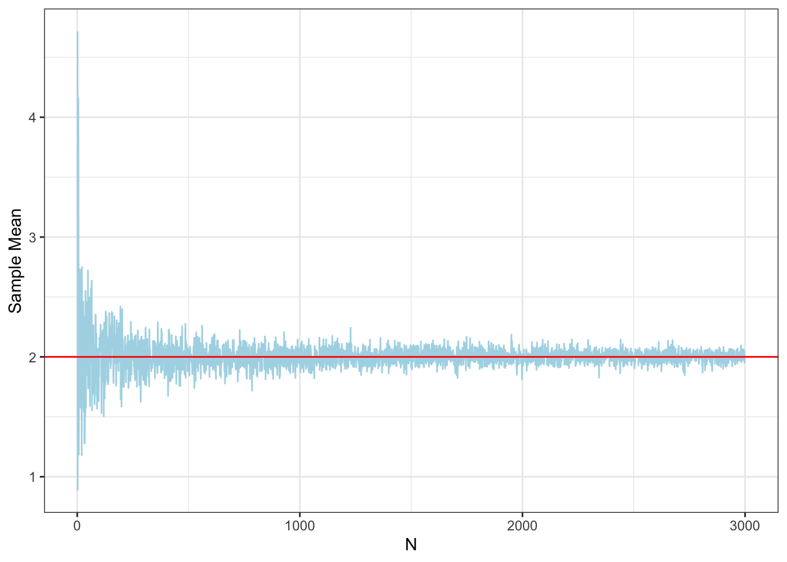

```r
ggplot(vars, aes(y = `Sample Variance`, x = N)) +
  geom_line(color = "lightblue") +
  geom_abline(slope = 0, intercept = true_var, color = "red") +
  theme_bw()
```

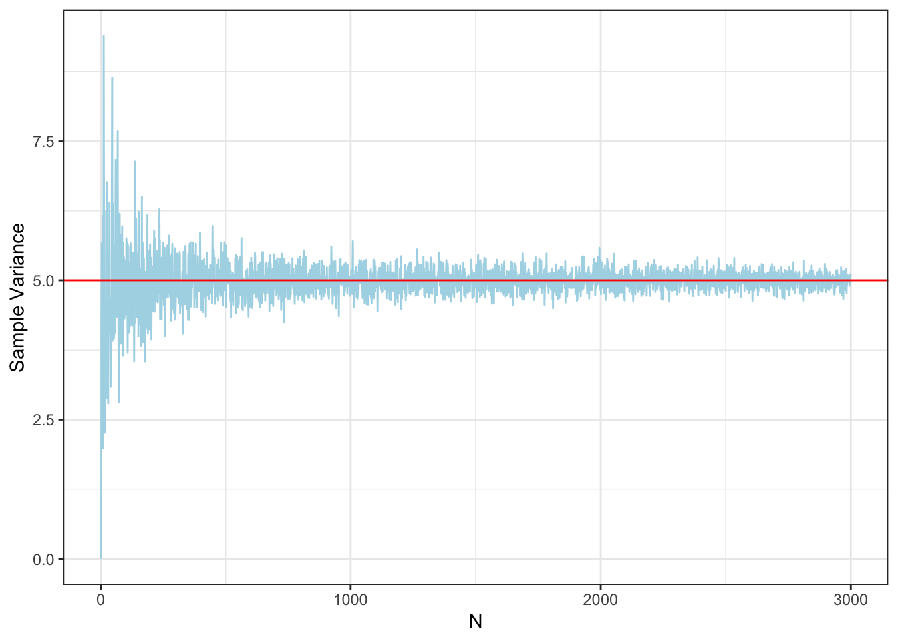

## Simulate conditional expectations

Simulate conditional expectations within groups that differ from the sample
mean.

```r
group1_means <- rnorm(100, mean = 20, sd = 5)
group2_means <- rnorm(100, mean = 30, sd = 5)
group_means <- data.frame(
  "Group" = c(rep("Group 1", 100), rep("Group 2", 100)),
  "Values" = c(group1_means, group2_means),
  "x" = rnorm(200, 5, sd = 3)
)
ggplot(group_means, aes(x = x, y = Values, color = Group)) +
  geom_point() +
  geom_abline(
    slope = 0,
    intercept = mean(group_means$Values),
    show.legend = TRUE,
    color = "gray30"
  ) +
  geom_abline(
    slope = 0,
    intercept = mean(group_means[group_means$Group == "Group 1", ]$Values),
    show.legend = TRUE,
    color = "#F8766D"
  ) +
  geom_abline(
    slope = 0,
    intercept = mean(group_means[group_means$Group == "Group 2", ]$Values),
    show.legend = TRUE,
    color = "#00BFC4"
  ) +
  theme_bw()
```

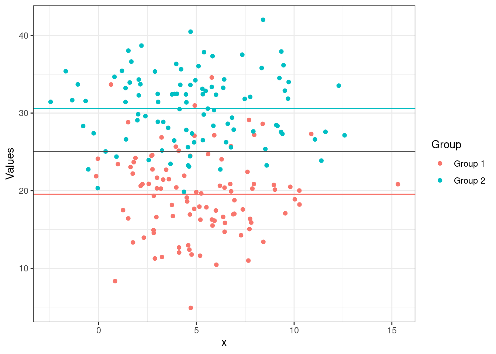

## Show independence of variables - example of two dice rolling


```r
dice_1 <- sample(1:6, 100000, replace = TRUE)
dice_2 <- sample(1:6, 100000, replace = TRUE)
dice <- tibble(
  "dice" = c(rep("Die 1", 100000), rep("Die 2", 100000)),
  "value" = c(dice_1, dice_2)
)

ggplot(data = dice) +
  geom_mosaic(aes(x = product(dice, value), fill = dice)) +   
  labs(y="", x="Value Rolled", title = "Independence of dice roll") +
  theme_bw() +
  theme(plot.title = element_text(hjust = 0.5), legend.position = "none")
```

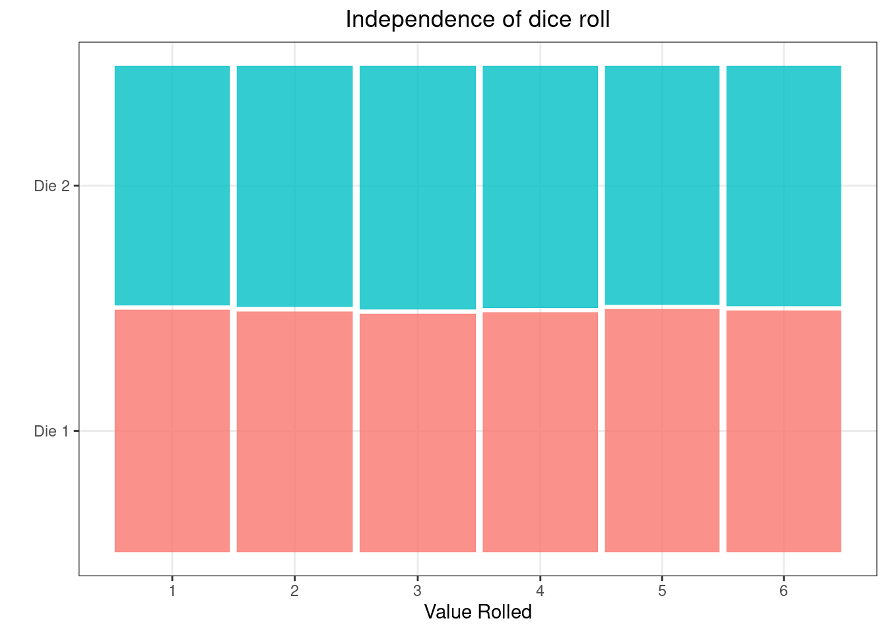

<!--chapter:end:discussion02.Rmd-->

---
output: html_document
---

# Discussion 03. Analyzing an Experiment in R {-}

[**Slides**](assets/discussions/discussion3-slides.pdf)


## Download .Rmd Document

Download today's [**.Rmd document here**](assets/discussions/discussion3.Rmd).


## Get out and Vote Experiment

In this lab, we explore an experiment that digs into the mechanisms
underlying __why people vote__. This exercise is based on: 

Gerber, Alan S., Donald P. Green, and Christopher W. Larimer. ["Social Pressure and Voter Turnout: Evidence from a Large-scale Field Experiment."](https://www.cambridge.org/core/journals/american-political-science-review/article/social-pressure-and-voter-turnout-evidence-from-a-largescale-field-experiment/11E84AF4C0B7FBD1D20C855972C2C3EB#) American Political Science Review 102.1 (2008): 33-48.

A long-standing theory as to why many people
vote is that it is driven by social norms (e.g. the understanding that voting
is their civic duty). This theory, while being a dominant theoretical 
explanation, had very little empirical backing for a long time. This experiment
examines this very theory by asking the question:
__to what extent do social norms cause voter turnout__?

### Experimental Design

In order to answer this question, approximately 80,000 Michigan households
were randomly assigned to treatment and control groups, where the treatment
group was randomly assigned to one of four possible treatment arms. These
treatment arms varied in the intensity of social pressure that they conveyed,
and were defined as follows:

1. The first treatment arm was mailed a letter that simply reminded them that
voting is a civic duty.
2. The second treatment arm was mailed a letter telling them that researchers
would be studying their voting turnout based on public records.
3. The third treatment arm was mailed a letter stating that their voting turnout 
would be revealed to all other members of their household.
4. The fourth treatment arm was mailed a letter stating that their voting turnout
would be revealed to their household *and* to their neighbors.

## Analyze Experiment
Download this RMarkdown file [here]().

### Necessary packages

__Note:__ If this errors you probably either don't have `dplyr` or `haven`
installed.


```r
library(dplyr)
library(haven)
```

### Import data

```r
gotv <- read_dta("https://causal3900.github.io/assets/data/social_pressure.dta")
```

> Alternatively (if you really want), you could download the data [here](assets/data/social_pressure.dta) and load it directly from your computer. Make sure to save the data into the same directory that your RMarkdown file is in. 
> Then you can you can import the data as:
>
> `gotv <- read_dta("social_pressure.dta")`

Run the following code to get a quick peek at the dataset using the [function `glimpse`](https://dplyr.tidyverse.org/reference/glimpse.html). This returns info such as the number of rows/columns, the column names, and the type of data in each column. Notice that we have information about year of birth `yob` but not explicitly age. Also notice that the treatments are labeled with the numbers 0 through 4.

```r
glimpse(gotv)
```

### Clean data

First, let's construct an age variable describing how old (in number of years)
each person was in the year 2006. The `yob` variable says which year each person
was born in. For this, we use the `mutate` function, which you can read about [here](https://dplyr.tidyverse.org/reference/mutate.html). 

> Given a person's year of birth, how do you calculate their age in the year 2006? Note that you can do arithmetic operations with information from the dataset. For example, if you have two columns `col_1` and `col_2` and you wanted to create a third column called `col_3` that was the sum of these two columns, you could write:
>
> `mutate(col_3 = col_1 + col_2)`

We have the code started for you below. Fill in the appropriate expression after `age = ` to add a column to `gotv` labeled `age` that contains how old each person was in 2006.


```r
gotv <- gotv |>
  mutate(age = )
```

Now, convert the `treatment` variable from it's numeric representation to the
corresponding labels which are

- 0: "Control" 
- 1: "Hawthorne" (this is the 'researchers viewing records via public data' treatment arm)
- 2: "Civic Duty" (this is the 'voting is your civic duty' treatment arm)
- 3: "Neighbors" (this is the 'voting turnout revealed to neighbors' treatment arm)
- 4: "Self" (this is the 'voting turnout revealed to household' treatment arm)


> For this, you will want to use the function `case_when` which is described [here](https://www.sharpsightlabs.com/blog/case-when-r/).
> The general syntax is `case_when(condition ~ output-value)`
> 
> For example, a condition would be `treatement == 0` and an output value would be `"Control"`. This would search for every value in the `treatment` column that equals `0` and replace that with the string `"Control"`.


We have started the code for you below. Decide what argument(s) to pass inside the parantheses of `case_when()`.

```r
gotv <- gotv |>
  mutate(treatment = case_when()) 
```

Now, when we use `glimpse` we see there is an added `age` variable and that the treatments have word instead of number labels.

```r
glimpse(gotv)
```

### Balance table

Next, we're going to confirm that our control and treatment groups look pretty
much the same across a set of covariates, i.e. that the two groups are *balanced on covariates*. Specifically this means we're going to calculate the mean value of a set of covariates across each of the treatment/control
arms, and we expect them to be pretty much equal if our randomization worked. This is related to the idea of exchangeability.

In this exercise, we are going to reproduce a table similar to Table 1 from the paper. We want a table that shows the mean value of the following covariates for each of the five treatment arms: Household size, Nov 2002, Nov 2000, Aug 2004, Aug 2002, Aug 2000, Female, and Age (in years). You should create a table with 5 rows, one for each treatment arm, and 8 columns, one for each covariate of interest. 

We have started some code for you below. What you need to do is:

- Pass an argument to `group_by()` so that we calculate seperate means for each treatment arm.
  - Look [here](https://dplyr.tidyverse.org/reference/group_by.html) for documentation on the `group_by` function.
- Pass an argument to `summarise()` that computes the mean of each covariate in `covariates` for each seperate treatment arm.
  - Look [here](https://dplyr.tidyverse.org/reference/summarise.html) for documentation on the `summarise` function.
  - You may find the function [`across`](https://dplyr.tidyverse.org/reference/across.html) useful here as well. You can use this function *inside* of `summarise()`!


```r
covariates <- c("sex", "age", "g2000", "g2002", "p2000", "p2002", "p2004", "hh_size")

gotv_balance <- gotv |>
  group_by(...) |>
  summarise(...)

print(gotv_balance)
```

Note that your numbers will not match up exactly with Table 1. What you want to notice is that the values in each column are similar across the rows.

### Results

Finally, let's replicate the final results (Table 2). For each treatment group, we calculate the percentage of individuals who got out and voted, as well as the total number of individuals in that group! We started the code for you below. You need to 

- Pass an argument to `group_by()` so that we are working with each treatment arm seperately (this should be the same as before!)
- Pass two arguments to `summarise()` to do the following:
  - Create a column titled `Percentage_Voting` that contains the percent of each group that voted
  - Create a column titled `num_of_individuals` that contains the total number of people in that group


```r
gotv_results <- gotv |>
  group_by(...) |>
  summarise(...)

print(gotv_results)
```


<!--chapter:end:discussion03.Rmd-->

---
output:
  pdf_document: default
  html_document: default
---

# Discussion 03. Analyzing an Experiment in R SOLUTIONS {.unnumbered}


These are *possible* solutions to the exercises from discussion. Your code may look different from ours, but as long as your output is the same that is all that matters!

You can download this file [here](assets/discussions/discussion3-solutions.Rmd).

## Necessary packages

**Note:** If this errors you probably either don't have `dplyr` or `haven` installed.


```r
library(dplyr)
library(haven)
```

### Import data


```r
gotv <- read_dta("https://causal3900.github.io/assets/data/social_pressure.dta")
```


```r
glimpse(gotv)
```

```
## Rows: 344,084
## Columns: 16
## $ sex           <dbl+lbl> 0, 1, 0, 1, 1, 0, 1, 0, 1, 0, 0,…
## $ yob           <dbl> 1941, 1947, 1951, 1950, 1982, 1981, …
## $ g2000         <dbl+lbl> 1, 1, 1, 1, 1, 0, 1, 1, 0, 1, 1,…
## $ g2002         <dbl+lbl> 1, 1, 1, 1, 1, 0, 1, 1, 0, 1, 1,…
## $ g2004         <dbl+lbl> 1, 1, 1, 1, 1, 1, 1, 1, 1, 1, 1,…
## $ p2000         <dbl+lbl> 0, 0, 0, 0, 0, 0, 0, 0, 0, 0, 0,…
## $ p2002         <dbl+lbl> 1, 1, 1, 1, 1, 0, 1, 1, 1, 1, 0,…
## $ p2004         <dbl+lbl> 0, 0, 0, 0, 0, 0, 0, 0, 0, 0, 1,…
## $ treatment     <dbl+lbl> 2, 2, 1, 1, 1, 0, 0, 0, 0, 0, 0,…
## $ cluster       <dbl> 1, 1, 1, 1, 1, 1, 1, 1, 1, 1, 1, 1, …
## $ voted         <dbl+lbl> 0, 0, 1, 1, 1, 0, 1, 1, 0, 0, 1,…
## $ hh_id         <dbl> 1, 1, 2, 2, 2, 3, 3, 3, 4, 4, 5, 6, …
## $ hh_size       <dbl> 2, 2, 3, 3, 3, 3, 3, 3, 2, 2, 1, 2, …
## $ numberofnames <dbl> 21, 21, 21, 21, 21, 21, 21, 21, 21, …
## $ p2004_mean    <dbl> 0.09523810, 0.09523810, 0.04761905, …
## $ g2004_mean    <dbl> 0.8571429, 0.8571429, 0.8571429, 0.8…
```

### Clean data

First, we construct an age variable describing how old (in number of years) each person was in the year 2006. The `yob` variable says which year each person was born in. \> For this, we use the `mutate` function, which you can read about [here](https://dplyr.tidyverse.org/reference/mutate.html).

Fill in the appropriate expression after `age =` to add a column to `gotv` labeled `age` that contains how old each person was in 2006.


```r
gotv <- gotv |>
  mutate(age = 2006 - yob)
```

Now, we convert the `treatment` variable from it's numeric representation to the corresponding labels which are

-   0: "Control"
-   1: "Hawthorne" (this is the 'researchers viewing records via public data' treatment arm)
-   2: "Civic Duty" (this is the 'voting is your civic duty' treatment arm)
-   3: "Neighbors" (this is the 'voting turnout revealed to neighbors' treatment arm)
-   4: "Self" (this is the 'voting turnout revealed to household' treatment arm)

> One solution uses the function `case_when` which is described [here](https://www.sharpsightlabs.com/blog/case-when-r/).


```r
gotv <- gotv |>
  mutate(treatment = case_when(
      treatment == 0 ~ "Control",
      treatment == 1 ~ "Hawthorne",
      treatment == 2 ~ "Civic Duty",
      treatment == 3 ~ "Neighbors",
      treatment == 4 ~ "Self")) 
```

> We could have done this differently. For the exercise, we split up the task into two pieces: create a new column `age` in `gotv` that contains the ages of each individual in 2006, and then replace the numeric treatment labels in the column `treatment` with alphabetic/word labels. You can actually do this all in one block of code as follows: 

```
gotv <- gotv |>
  mutate(
    age = floor(2006 - yob),
    treatment = case_when(
      treatment == 0 ~ "Control",
      treatment == 1 ~ "Hawthorne",
      treatment == 2 ~ "Civic Duty",
      treatment == 3 ~ "Neighbors",
      treatment == 4 ~ "Self")
    ) 
```

Another alternative solution
Now, when we use `glimpse` we see there is an added `age` variable and that the treatments have word instead of number labels.


```r
glimpse(gotv)
```

```
## Rows: 344,084
## Columns: 17
## $ sex           <dbl+lbl> 0, 1, 0, 1, 1, 0, 1, 0, 1, 0, 0,…
## $ yob           <dbl> 1941, 1947, 1951, 1950, 1982, 1981, …
## $ g2000         <dbl+lbl> 1, 1, 1, 1, 1, 0, 1, 1, 0, 1, 1,…
## $ g2002         <dbl+lbl> 1, 1, 1, 1, 1, 0, 1, 1, 0, 1, 1,…
## $ g2004         <dbl+lbl> 1, 1, 1, 1, 1, 1, 1, 1, 1, 1, 1,…
## $ p2000         <dbl+lbl> 0, 0, 0, 0, 0, 0, 0, 0, 0, 0, 0,…
## $ p2002         <dbl+lbl> 1, 1, 1, 1, 1, 0, 1, 1, 1, 1, 0,…
## $ p2004         <dbl+lbl> 0, 0, 0, 0, 0, 0, 0, 0, 0, 0, 1,…
## $ treatment     <chr> "Civic Duty", "Civic Duty", "Hawthor…
## $ cluster       <dbl> 1, 1, 1, 1, 1, 1, 1, 1, 1, 1, 1, 1, …
## $ voted         <dbl+lbl> 0, 0, 1, 1, 1, 0, 1, 1, 0, 0, 1,…
## $ hh_id         <dbl> 1, 1, 2, 2, 2, 3, 3, 3, 4, 4, 5, 6, …
## $ hh_size       <dbl> 2, 2, 3, 3, 3, 3, 3, 3, 2, 2, 1, 2, …
## $ numberofnames <dbl> 21, 21, 21, 21, 21, 21, 21, 21, 21, …
## $ p2004_mean    <dbl> 0.09523810, 0.09523810, 0.04761905, …
## $ g2004_mean    <dbl> 0.8571429, 0.8571429, 0.8571429, 0.8…
## $ age           <dbl> 65, 59, 55, 56, 24, 25, 47, 50, 38, …
```

Note, there are other ways you could have arrived here and that's totally fine as long as the results are the same!


### Balance table

Next, we confirm that our control and treatment groups look pretty much the same across a set of covariates, i.e. that the two groups are *balanced on covariates*. Specifically this means we calculate the mean value of a set of covariates across each of the treatment/control arms, and we expect them to be pretty much equal if our randomization worked. This is related to the idea of exchangeability.

> The solution below uses the functions [`group_by`](https://dplyr.tidyverse.org/reference/group_by.html), [`summarise`](https://dplyr.tidyverse.org/reference/summarise.html), and [`across`](https://dplyr.tidyverse.org/reference/across.html).
> 
> You may have done something different. If the output is the same (or very similar), then that should be fine!


```r
covariates <- c("sex", "age", "g2000", "g2002", "p2000", "p2002", "p2004", "hh_size")

gotv_balance <- gotv |>
  group_by(treatment) |>
  summarise(across(.cols = covariates, .fns = mean))

print(gotv_balance)
```

```
## # A tibble: 5 × 9
##   treatment    sex   age g2000 g2002 p2000 p2002 p2004
##   <chr>      <dbl> <dbl> <dbl> <dbl> <dbl> <dbl> <dbl>
## 1 Civic Duty 0.500  49.7 0.842 0.811 0.254 0.389 0.399
## 2 Control    0.499  49.8 0.843 0.811 0.252 0.389 0.400
## 3 Hawthorne  0.499  49.7 0.844 0.813 0.250 0.394 0.403
## 4 Neighbors  0.500  49.9 0.842 0.811 0.251 0.387 0.407
## 5 Self       0.500  49.8 0.840 0.811 0.251 0.392 0.402
## # ℹ 1 more variable: hh_size <dbl>
```

An alternative solution that does not explicitly use `group_by`:
```
covariates <- c("sex", "age", "g2000", "g2002", "p2000", "p2002", "p2004", "hh_size")

gotv_results <- gotv |>
  summarise(
    across(.cols = all_of(covariates), .fns = mean),
    .by = treatment
    )
print(gotv_results)
```
### Results

Finally, for each treatment group, we calculate the percentage of individuals who got out and voted, as well as the total number of individuals in that group! The solutions below use the function [`n`](https://www.rdocumentation.org/packages/dplyr/versions/0.7.8/topics/n) which counts the number of observations in the current group for you.


```r
gotv_results <- gotv |>
  group_by(treatment) |>
  summarise(Percentage_Voting = mean(voted), num_of_individuals = n())

print(gotv_results)
```

```
## # A tibble: 5 × 3
##   treatment  Percentage_Voting num_of_individuals
##   <chr>                  <dbl>              <int>
## 1 Civic Duty             0.315              38218
## 2 Control                0.297             191243
## 3 Hawthorne              0.322              38204
## 4 Neighbors              0.378              38201
## 5 Self                   0.345              38218
```

Alternatively, you could write this without using `group_by` explicitly: 
```
gotv |>
  summarise(Percentage_Voting = mean(voted), num_of_individuals = n(), .by = treatment)
```

<!--chapter:end:discussion03Solutions.Rmd-->

---
output: html_document
---

# Discussion 07. Causal Effects with Matching {-}

[**Slides**](assets/discussions/discussion7.pdf)
Download today's [**.Rmd document here**](assets/discussions/matching_lab.Rmd).

Some packages you may need to install first:

- optmatch: `install.packages("optmatch")`
- sandwich: `install.packages("sandwich")`
- MatchIt: `install.packages("MatchIt")`
- marginaleffects: `install.packages("marginaleffects")`


## R Markdown
Learn to do matching with the "MatchIt" package

First, we'll use the data set from last week to compare greedy vs optimal matching. We'll use the NLSY data since it is larger.

```r
d <- readRDS("assets/discussions/d.RDS")

# matchit function implements matching
# Formula: Treatment ~ variables to match on
# method: nearest is a greedy 1:1 matching without replacement
# distance: euclidean (other possible options are scaled_euclidean, mahalanobis, robust_mahalanobis)
# read more on distances here: https://rdrr.io/cran/MatchIt/man/distance.html#mat
m.out0 <- matchit(a == "college" ~ log_parent_income + log_parent_wealth
                              + test_percentile,
                              method = "nearest", distance = "euclidean",
                              data = d)
```

First compare optimal vs greedy. Optimal matching is usually better than greedy matching, as long as your data isn't too big  

```r
## Optimal vs greedy with NYLSR data
# With n = 1000; .01 sec vs .8 sec
# With n = 2000; .05 sec vs 8 sec
# With n = 4000; .1 vs 25

ind <- sample(nrow(d), size = 1000)

# Greedy is using nearest
system.time(m.out0 <- matchit(a == "college" ~ log_parent_income + log_parent_wealth
                              + test_percentile,
                              method = "nearest", distance = "euclidean",
                              data = d[ind, ]))
```

```
##    user  system elapsed 
##   0.016   0.000   0.016
```

```r
# method: optimal is optimal matching
system.time(m.out0 <- matchit(a == "college" ~ log_parent_income + log_parent_wealth
                              + test_percentile,
                              method = "optimal", distance = "euclidean",
                              data = d[ind, ]))
```

```
##    user  system elapsed 
##   1.290   0.077   1.524
```

On the full data, using optimal is possible, but can take a bit of time. On larger data sets, it might not be possible 

```r
# With full data set greedy matching takes ~ 0.5-1.5 seconds
system.time(m.out0 <- matchit(a == "college" ~ log_parent_income + log_parent_wealth
                              + test_percentile,
                              method = "nearest", distance = "euclidean",
                              data = d))
```

```
##    user  system elapsed 
##   0.605   0.077   0.684
```

```r
# Meanwhile, optimal matching takes 60-130 seconds
system.time(m.out0 <- matchit(a == "college" ~ log_parent_income + log_parent_wealth
                              + test_percentile,
                              method = "optimal", distance = "euclidean",
                              data = d))
```

```
##    user  system elapsed 
## 117.511   5.250 124.215
```

## Matching with job training data from "Evaluating the econometric evaluations of training programs with experimental data" (LaLonde 1986)
For the remainder of the lab, we'll use a portion of the data from a job training program. In particular, the treatment is whether or not someone participated in a job training program. The outcome of interest is their salary in 1978 (re78).

```r
# Load the data
data("lalonde")

# See what's in the data
?lalonde # this opens up the "Help" tab with the documentation! 
head(lalonde)
```

```
##      treat age educ   race married nodegree re74 re75
## NSW1     1  37   11  black       1        1    0    0
## NSW2     1  22    9 hispan       0        1    0    0
## NSW3     1  30   12  black       0        0    0    0
## NSW4     1  27   11  black       0        1    0    0
## NSW5     1  33    8  black       0        1    0    0
## NSW6     1  22    9  black       0        1    0    0
##            re78
## NSW1  9930.0460
## NSW2  3595.8940
## NSW3 24909.4500
## NSW4  7506.1460
## NSW5   289.7899
## NSW6  4056.4940
```

We expect income in 1974 is highly correlated with income in 1975. It also has a much higher variability than age.

```r
## Suppose there are 3 individuals
dat <- matrix(c(50, 5000, 5500,
                20, 5100, 5900,
                40, 5200, 6200), ncol = 3, byrow = T)
colnames(dat) <- c("age", "re74", "re75")

# Is individual 2 or 3 more similar to individual 1? 
# To answer this, we should compute the distances between individuals 1 and 2, and 1 and 3. 

# One way is to compute the Mahalanobis distance by first computing the covariance matrix of the confounding variables
# In this case, the confounders are age, re74, and re75
dataCov <- lalonde %>%
  select(age, re74, re75) %>%
  cov

# Then we compute the Mahalanobis distance with the function mahalanobis_dist
mahalanobis_dist( ~ age + re74 + re75, data = dat, var = dataCov)
```

```
##          1        2        3
## 1 0.000000 3.225953 1.098595
## 2 3.225953 0.000000 2.152528
## 3 1.098595 2.152528 0.000000
```

```r
# We can also compute the Euclidean distance
dist(dat, method = "euclidean")
```

```
##          1        2
## 2 413.4005         
## 3 728.0797 316.8596
```

Now let's try to run the matching procedure using the \texttt{matchit} function. 

```r
# For now, let's start with Euclidean distance, even if may not be great

# method: nearest (i.e. greedy 1:1)
# distance: euclidean
# data: lalonde (the data set we're working with)
# replace: True (T) or False (F) - whether to sample with or without replacement. 
    # Note, if allowing for replacement, greedy and optimal are the same
    # So for the function, you only need to specify if using method = "nearest"
# ratio: how many control matches for each treated unit
# caliper: by default, the caliper width in standard units (i.e., Z-scores)
m.out0 <- matchit(treat ~ re74 + re75 + age + race,
                  method = "nearest", distance = "euclidean",
                  data = lalonde, replace = F, 
                  ratio = 1, caliper = c(re74  = .2, re75 = .2))
```

## Assessing the matching
We can check how well the balancing has been done

```r
?summary.matchit # Look in the Help tab (on the bottom right) for documentation on summary.matchit


# interactions: check interaction terms too? (T or F)
# un: show statistics for unmatched data as well (T or F)
summary(m.out0, interactions = F, un = F)
```

```
## 
## Call:
## matchit(formula = treat ~ re74 + re75 + age + race, data = lalonde, 
##     method = "nearest", distance = "euclidean", replace = F, 
##     caliper = c(re74 = 0.2, re75 = 0.2), ratio = 1)
## 
## Summary of Balance for Matched Data:
##            Means Treated Means Control Std. Mean Diff.
## re74           1643.2931     1666.9106         -0.0048
## re75           1021.5989     1086.1734         -0.0201
## age              25.6971       26.1543         -0.0639
## raceblack         0.8400        0.2800          1.5403
## racehispan        0.0571        0.1714         -0.4833
## racewhite         0.1029        0.5486         -1.5040
##            Var. Ratio eCDF Mean eCDF Max Std. Pair Dist.
## re74           1.0122    0.0108   0.1543          0.0293
## re75           1.0026    0.0166   0.1543          0.0422
## age            0.4213    0.0894   0.2000          0.9967
## raceblack           .    0.5600   0.5600          1.7289
## racehispan          .    0.1143   0.1143          0.7249
## racewhite           .    0.4457   0.4457          1.6968
## 
## Sample Sizes:
##           Control Treated
## All           429     185
## Matched       175     175
## Unmatched     254      10
## Discarded       0       0
```

```r
# Std. Mean Diff (SMD): difference of means, standardized by sd of treatment group
# Var. Ratio: ratio of variances in treatment and control group. Compares spread of data
# Rubin (2001) presents rule of thumb that SMD should be less than .25 and variance ratio should be between .5 and 2
# Max eCDF: Kolmogorov-Smirnov statistic. Max difference across entire CDF
```

We can also visually asses the matches

```r
## Produces QQ plots of all variables in which.xs
plot(m.out0, type = "qq", which.xs = ~age + re74, interactive = F)
```


```r
## Plots the density of all variables in which.xs
plot(m.out0, type = "density", which.xs = ~age + re74 + race, interactive = F)
```


```r
## Plots the empirical CDF of all variables in which.xs
plot(m.out0, type = "ecdf", which.xs = ~age + re74, interactive = F)
```


## Estimating the effect
Given the matching (and assuming it is good enough), we can estimate the ATT. 

```r
# Produces data frame same as input, but has two additional columns
# weights: the weight of the row in the paired data set. Can be greater than 1
#         if the data set was matched more than once
# subclass: the index of the "pair"
#
m.out0.data <- match.data(m.out0, drop.unmatched = T)
head(m.out0.data)
```

```
##      treat age educ   race married nodegree re74 re75
## NSW1     1  37   11  black       1        1    0    0
## NSW2     1  22    9 hispan       0        1    0    0
## NSW3     1  30   12  black       0        0    0    0
## NSW4     1  27   11  black       0        1    0    0
## NSW5     1  33    8  black       0        1    0    0
## NSW6     1  22    9  black       0        1    0    0
##            re78 weights subclass
## NSW1  9930.0460       1        1
## NSW2  3595.8940       1       88
## NSW3 24909.4500       1       99
## NSW4  7506.1460       1      110
## NSW5   289.7899       1      121
## NSW6  4056.4940       1      132
```

```r
names(m.out0.data)
```

```
##  [1] "treat"    "age"      "educ"     "race"     "married" 
##  [6] "nodegree" "re74"     "re75"     "re78"     "weights" 
## [11] "subclass"
```

```r
# Also produces matched data set, though will duplicate rows if matching with replacement
# and a control is matched more than once
m.out0.data <- get_matches(m.out0)
```
As a first step, we could simply compare the means of the outcomes for both groups. Notice this is the first time we've looked at the outcomes!


```r
# Take the mean of both groups
# this will only work if all weights are 1
aggregate(re78~ treat, FUN = mean, data = m.out0.data)
```

```
##   treat     re78
## 1     0 5422.184
## 2     1 6193.594
```

```r
# Fitting a linear model on the treatments will work
# even if all weights are not 1. We just need to feed them in
fit1 <- lm(re78~ treat, data = m.out0.data, weights = weights)

# vcov: tells R to use robust standard errors
avg_comparisons(fit1, variables = "treat",
                vcov = "HC3",
                newdata = subset(m.out0.data, treat == 1),
                wts = "weights")
```

```
## Warning: The `treat` variable is treated as a categorical
##   (factor) variable, but the original data is of class
##   integer. It is safer and faster to convert such
##   variables to factor before fitting the model and
##   calling `slopes` functions.
##   
##   This warning appears once per session.
```

```
## 
##   Term Contrast Estimate Std. Error    z Pr(>|z|)   S 2.5 %
##  treat    1 - 0      771        753 1.02    0.306 1.7  -705
##  97.5 %
##    2248
## 
## Columns: term, contrast, estimate, std.error, statistic, p.value, s.value, conf.low, conf.high 
## Type:  response
```


## Fit your own model
Now try for yourself. Note, you will need to do something very similar for the homework with this dataset.

* Think about what an appropriate DAG might be and choose the variables you want to match on
  - Ask yourself: Do I know how to choose variables I should match on?
* Choose a matching procedure
  - Ask yourself: Do I know how to explain this matching procedure and its bias-variance trade off?
* Evaluate the balance in the match. If it doesn't look good, try another matching procedure
  - Ask yourself: Do I know what a balanced matching looks like? 
* Estimate the causal effect 
  - Ask yourself: Do I know what I just estimated?

<!--chapter:end:discussion07.Rmd-->

---
output: html_document
---

# Discussion 10. Causal Effects with Regression Discontinuity {-}

[**Slides**](assets/discussions/discussion10.pdf)
Download today's [**.Rmd document here**](assets/discussions/discussion10.Rmd).

## Choosing a bandwidth
One of the main difficulties of a regression discontinuity analysis is choosing a ``good'' bandwidth. This is a good example of the bias variance trade-off which appears all the time in statistics. In general, we will let the software choose this for us, but it will be helpful to run through a small example to better understand the subtleties involved. 

Suppose $Y$ is a very non-linear function of $X$, and we want to extrapolate and predict $Y$ at $X=0$.

```r
n <- 100
X <- runif(n, -5, 0)
### Y is a very non-linear function of X + some noise
Y <- 5 - 3*X + .6 * X^2 + .3 * X^3 + 15 * sin(X) + rnorm(n, sd = 4)
plot(X, Y, ylim = c(-15, 30), xlim = c(-5, 1))
abline(v = 0, col = "gray", lwd = 2)

### Avg Y when X = 0 is 5
points(0, 5, pch = 18, col = "orange", cex = 3)
```

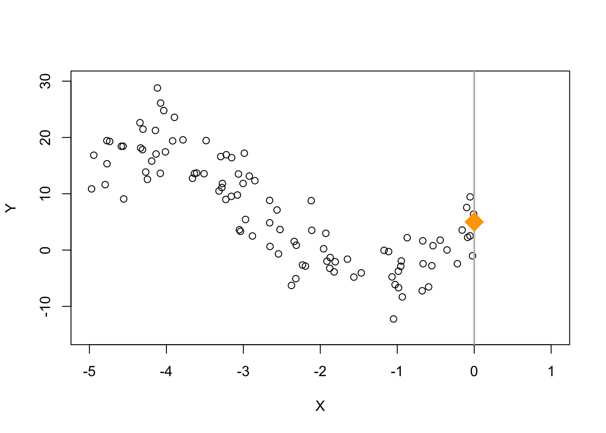

If we blindly fit a line to all our observations, the predicted value for $X=0$ is off by quite a bit.
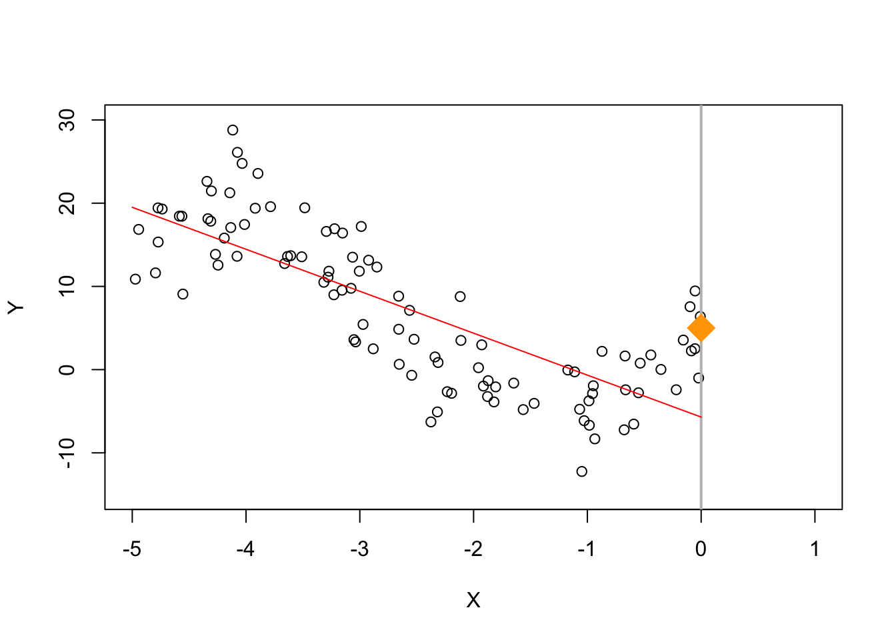

If we instead restrict ourselves to a smaller region around 0, we can do a bit better

```r
## Only consider points h away from 0
h <- 3

fit.mod.bandwidth <- lm(Y~X, subset = X > -h)
plotColor <- ifelse(abs(X) > h, "gray", "red")

plot(X, Y, ylim = c(-15, 30), xlim = c(-5, 1), col = plotColor)
abline(v = 0, col = "gray", lwd = 2)
segments(-h, predict(fit.mod.bandwidth, newdata = data.frame(X = -h)),
         0, predict(fit.mod.bandwidth, newdata = data.frame(X = 0)),col = "blue",
         lwd = 2)
points(0, 5, pch = 18, col = "orange", cex = 3)
```

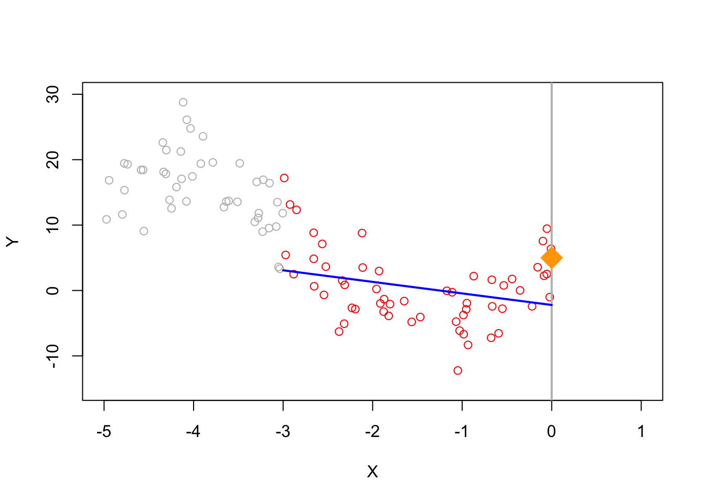
However, if we get more and more data, we don't really improve much

```r
n <- 10000
X <- runif(n, -5, 0)
Y <- 5 - 3*X + .6 * X^2 + .3 * X^3 + 15 * sin(X) + rnorm(n, sd = 4)
h <- 3
fit.mod.bandwidth <- lm(Y~X, subset = X > -h)
plotColor <- ifelse(abs(X) > h, "gray", "red")

plot(X, Y, ylim = c(-15, 30), xlim = c(-5, 1), col = plotColor)
abline(v = 0, col = "gray", lwd = 2)
segments(-h, predict(fit.mod.bandwidth, newdata = data.frame(X = -h)),
         0, predict(fit.mod.bandwidth, newdata = data.frame(X = 0)),col = "blue",
         lwd = 2)

points(0, 5, pch = 18, col = "orange", cex = 3)
```

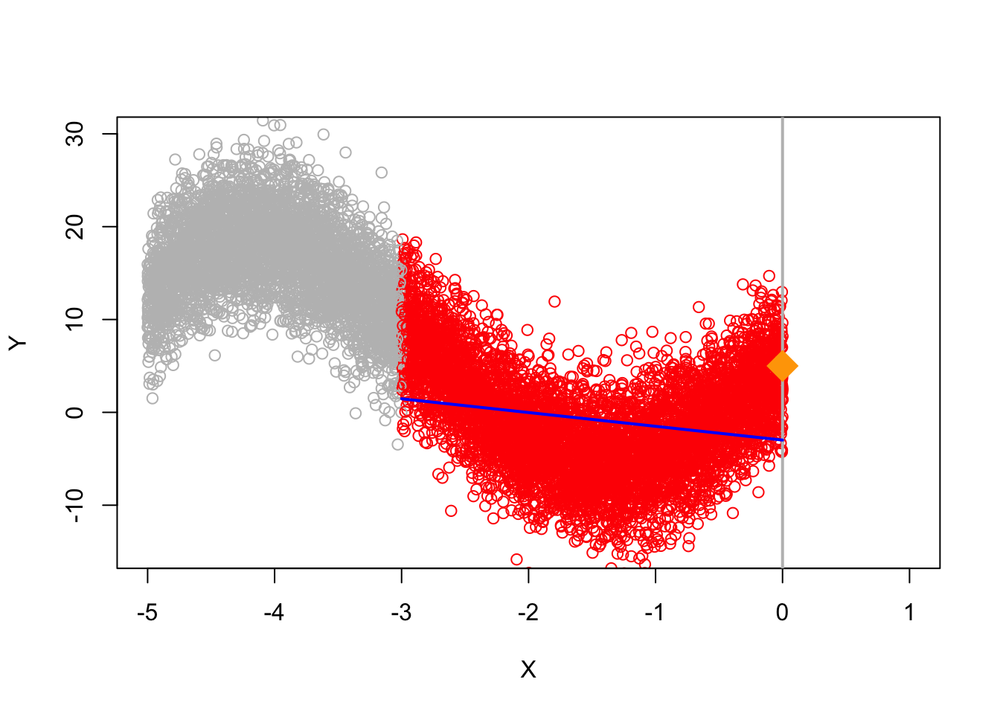

Ideally, we would decrease the bandwidth to reduce this bias, but this also means we are working with less data. Since each data point is noisy, if we were to get a new sample, the estimate could change quite a bit. Try running this a few times and see how much the estimate moves. Compare this which how much the estimate moves if the bandwidth is 2.


```r
h <- .3 # bandwidth
# h <- 2 
n <- 100
X <- runif(n, -5, 0)
Y <- 5 - 3*X + .6 * X^2 + .3 * X^3 + 15 * sin(X) + rnorm(n, sd = 4)

fit.mod.bandwidth <- lm(Y~X, subset = X > -h)
plotColor <- ifelse(abs(X) > h, "gray", "red")

plot(X, Y, ylim = c(-15, 30), xlim = c(-5, 1), col = plotColor)
abline(v = 0, col = "gray", lwd = 2)
segments(-h, predict(fit.mod.bandwidth, newdata = data.frame(X = -h)),
         0, predict(fit.mod.bandwidth, newdata = data.frame(X = 0)),col = "blue",
         lwd = 2)

points(0, 5, pch = 18, col = "orange", cex = 3)
points(0, predict(fit.mod.bandwidth, newdata = data.frame(X = 0)), col = "blue", pch = 19)
```

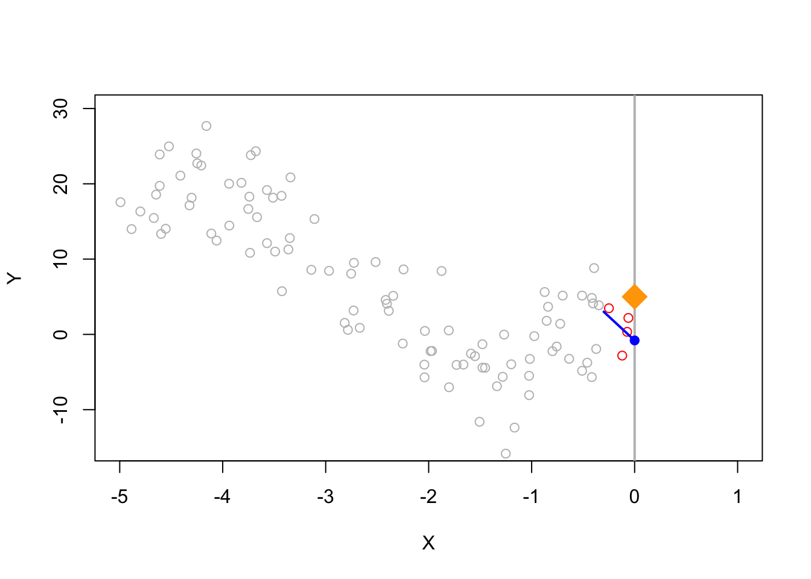

Knowing the best bandwidth is a hard problem, but generally speaking a good choice of bandwidth will get smaller as the sample size increases. 

If we measure accuracy in terms of average squared error, we can see when $n = 100$, a bandwidth of 1.2 seems to be best. However, test and see if how that changes for larger values of $n$


```r
n <- 100
h <- c(.5, .8, 1.2, 2)
sim.size <- 500
rec <- matrix(0, sim.size, 8)

for(i in 1:sim.size){
  X <- runif(n, -5, 0)
  Y <- 5 - 3*X + .6 * X^2 + .3 * X^3 + 15 * sin(X) + rnorm(n, sd = 4)

  fit.mod.bandwidth1 <- lm(Y~X, subset = X > -h[1])
  fit.mod.bandwidth2 <- lm(Y~X, subset = X > -h[2])
  fit.mod.bandwidth3 <- lm(Y~X, subset = X > -h[3])
  fit.mod.bandwidth4 <- lm(Y~X, subset = X > -h[4])

  rec[i, 1] <- (predict(fit.mod.bandwidth1, newdata = data.frame(X = 0)) - 5)^2
  rec[i, 2] <- (predict(fit.mod.bandwidth2, newdata = data.frame(X = 0)) - 5)^2
  rec[i, 3] <- (predict(fit.mod.bandwidth3, newdata = data.frame(X = 0)) - 5)^2
  rec[i, 4] <- (predict(fit.mod.bandwidth4, newdata = data.frame(X = 0)) - 5)^2
  
  rec[i, 5] <- predict(fit.mod.bandwidth1, newdata = data.frame(X = 0))
  rec[i, 6] <- predict(fit.mod.bandwidth2, newdata = data.frame(X = 0))
  rec[i, 7] <- predict(fit.mod.bandwidth3, newdata = data.frame(X = 0))
  rec[i, 8] <- predict(fit.mod.bandwidth4, newdata = data.frame(X = 0))

}
```

```
## Warning in predict.lm(fit.mod.bandwidth1, newdata =
## data.frame(X = 0)): prediction from rank-deficient fit;
## attr(*, "non-estim") has doubtful cases

## Warning in predict.lm(fit.mod.bandwidth1, newdata =
## data.frame(X = 0)): prediction from rank-deficient fit;
## attr(*, "non-estim") has doubtful cases
```

```r
colMeans(rec)
```

```
## [1] 11.017238  5.433852  3.815900 12.390484  4.870329
## [6]  4.772089  4.179710  1.788163
```

```r
boxplot(as.list(data.frame(rec[, 5:8])), ylim = c(0, 20))
abline(h = 5, col = "red")
```

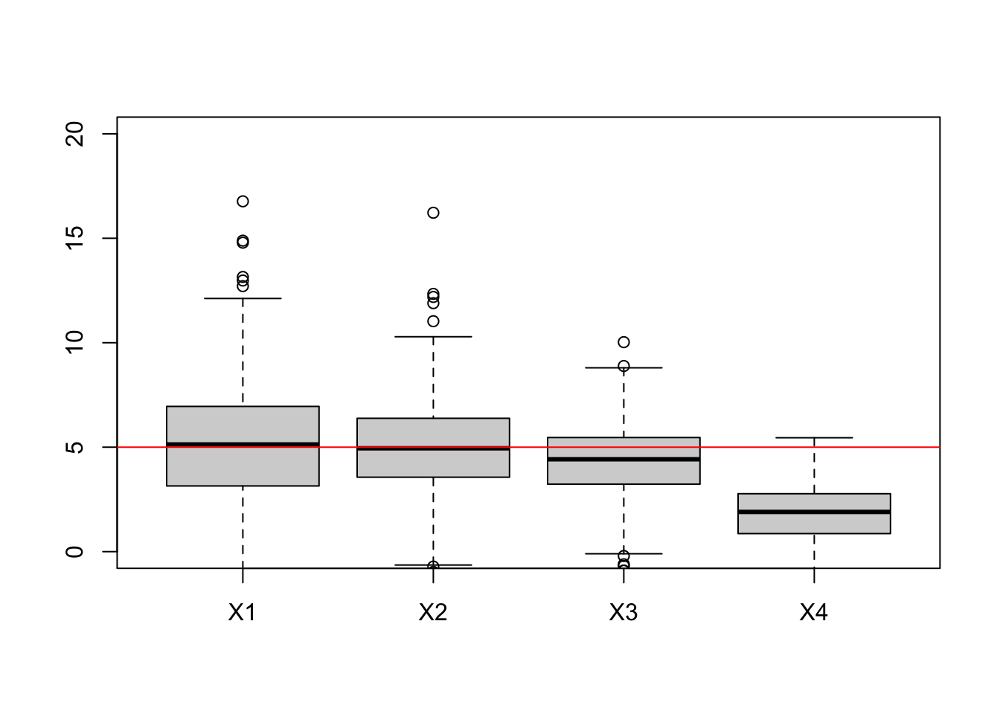
### Weighted Least Squares

When we estimate a linear regression model, we usually pick linear coefficients to minimize the squared errors
$$\min_b \sum_i(Y_i - X_i b)^2$$
and the squared error for each observation count are considered equally. But if a good fit around some points is more important than other points, we can also use weighted least squares where $w_i$ is a weight. 
$$\min_b \sum_i w_i(Y_i - X_i b)^2$$
When $w_i$ is larger, the squared error for observation $i$ will cost more so the selected linear coefficient will prioritize minimizing errors where $w_i$ is large. In our particular setting, we want to prioritize fitting the data well around $0$, so we can use weights which are ``triangular'' which prioritize points near $0$.  


```r
n <- 200
X <- runif(n, -5, 0)
Y <- 5 - 3*X + .6 * X^2 + .3 * X^3 + 15 * sin(X) + rnorm(n, sd = 4)
weight <- 1 - abs(X) / 5 
plot(X, weight, type = "p", main = "Triangular Weights")
```

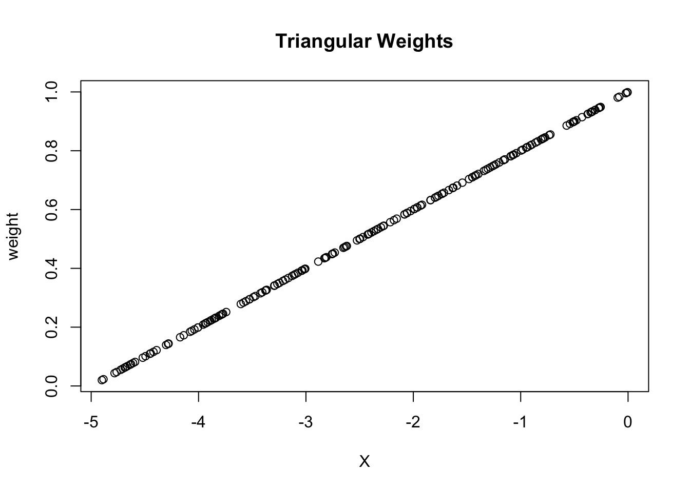


#### Question
If we use a bandwidth of $h$ (i.e., only include observations within $h$ of the cut-off), what does this mean the the weights would be?   


When using triangular weights, we can see that this does better than using all the points.


```r
n <- 200
h <- 3
X <- runif(n, -5, 0)
Y <- 5 - 3*X + .6 * X^2 + .3 * X^3 + 15 * sin(X) + rnorm(n, sd = 4)

weight <- 1 - abs(X) / 5 
# We don't include a bandwidth, but instead use triangular weights
fit.mod <- lm(Y~X)
fit.mod.weights <- lm(Y~X, weights = weight)
fit.mod.bandwidth <- lm(Y~X, subset = abs(X) < h)

plotColor <- ifelse(abs(X) > h, "gray", "red")

plot(X, Y, ylim = c(-15, 30), xlim = c(-5, 1), col = plotColor)
abline(v = 0, col = "gray", lwd = 2)
segments(-h, predict(fit.mod.bandwidth, newdata = data.frame(X = -h)),
         0, predict(fit.mod.bandwidth, newdata = data.frame(X = 0)),col = "blue",
         lwd = 2)

# Fit from weighted least squares
segments(-5, predict(fit.mod.weights, newdata = data.frame(X = -h)),
         0, predict(fit.mod.weights, newdata = data.frame(X = 0)),col = "green",
         lwd = 2)

# Fit from ordinary least squares
segments(-5, predict(fit.mod, newdata = data.frame(X = -h)),
         0, predict(fit.mod, newdata = data.frame(X = 0)),col = "purple",
         lwd = 2)

points(0, 5, pch = 18, col = "orange", cex = 3)
points(0, predict(fit.mod.bandwidth, newdata = data.frame(X = 0)), col = "blue", pch = 19)
points(0, predict(fit.mod.weights, newdata = data.frame(X = 0)), col = "green", pch = 19)
points(0, predict(fit.mod, newdata = data.frame(X = 0)), col = "purple", pch = 19)
```

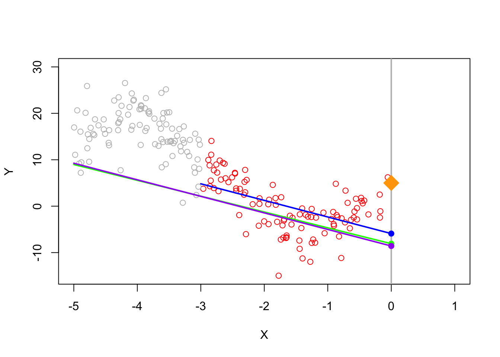
In practice, we can combine both a hard thresholding bandwidth as well as triangular weights (within the bandwidth) 

```r
# bandwidth
h <- 3
n <- 200
X <- runif(n, -5, 0)
Y <- 5 - 3*X + .6 * X^2 + .3 * X^3 + 15 * sin(X) + rnorm(n, sd = 4)

# weight is triangular within the bandwidth
weight <- ifelse(abs(X) < h, 1 - abs(X) / h, 0) 

plot(X, weight, type = "p", main = "Triangular Weights")
```

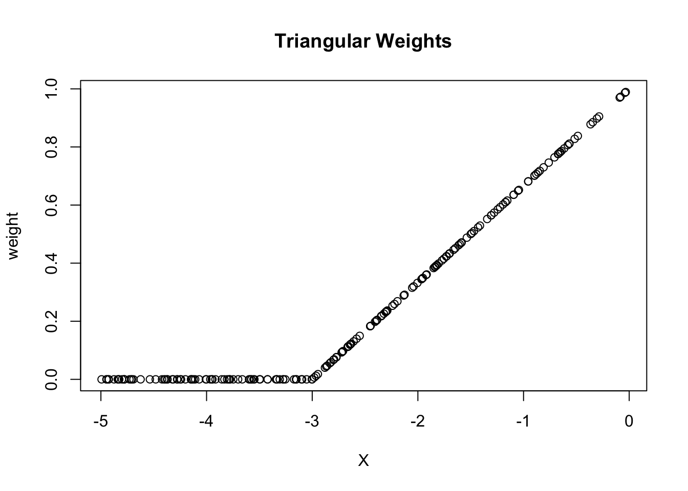
\newpage

## RDD Analysis
Now let's apply a regression discontinuity analysis to data. This example follows the analysis ``Randomization Inference in the Regression Discontinuity Design: An Application to Party Advantages in the U.S. Senate'' by Cattaneo, Frandsen, and Titiunik (2015) and their replication file.

Political scientists are interested in the effect of being an incumbent (the currently elected politician) on the share of votes in an election. Being the current public official means increased name recognition, fundraising opportunities, etc. On the other hand, being an incumbent means you can get blamed for all the bad things that have happened during your term. 

The data we analyze considers US senators. Each state in the US has two senators with 6 year terms, and the election for each of the two senators alternates every 3 years. So for instance, there are two senate seats: A and B. In 2000 senate seat A undergoes an election, in 2003 senate seat B undergoes an election but senate seat A continues, in 2006 senate seat A undergoes an election but senate seat B continues on, etc. 

We will look at the causal effect on being an incumbent in senate races in two different ways.First, does being an incumbent effect your vote share the next time you run for office? Second, if the other sitting senator is from your same party, what is the effect on your election share?  

#### Question
* Consider the first question and draw out a causal diagram where the treatment is being an incumbent and the outcome of interest is vote share in an election.
* How might we use regression discontinuity to provide an answer to this question?

### Data
We'll examine data from US Senate races from 1914 to 2010 to try and answer these questions. 


```r
install <- function(package) {
  if (!require(package, quietly = TRUE, character.only = TRUE)) {
    install.packages(package, repos = "http://cran.us.r-project.org", type = "binary")
    library(package, character.only = TRUE)
  }
}

install("ggplot2")
install("lpdensity")
install("rddensity")
install("rdrobust")
install("rdlocrand")

data <- read.csv("https://raw.githubusercontent.com/rdpackages-replication/CIT_2020_CUP/master/CIT_2020_CUP_senate.csv")

head(data)
```

```
##         state year dopen population presdemvoteshlag1
## 1 Connecticut 1914     0    1233000          39.15937
## 2 Connecticut 1916     0    1294000          39.15937
## 3 Connecticut 1922     0    1431000          33.02737
## 4 Connecticut 1926     0    1531000          27.52570
## 5 Connecticut 1928     1    1577000          27.52570
## 6 Connecticut 1932     0    1637000          45.57480
##         demmv demvoteshlag1 demvoteshlag2 demvoteshfor1
## 1  -7.6885610            NA            NA      46.23941
## 2  -3.9237082      42.07694            NA      36.09757
## 3  -6.8686604      36.09757      46.23941      35.64121
## 4 -27.6680560      45.46875      36.09757      45.59821
## 5  -8.2569685      35.64121      45.46875      48.47606
## 6   0.7324815      45.59821      35.64121      51.74687
##   demvoteshfor2 demwinprv1 demwinprv2 dmidterm dpresdem
## 1      36.09757         NA         NA        1        1
## 2      45.46875          0         NA        0        1
## 3      45.59821          0          0        1        0
## 4      48.47606          0          0        1        0
## 5      51.74687          0          0        0        0
## 6      39.80264          0          0        0        0
```

```r
# presdemvoteshlag1 is democratic vote share in the previous presidential election
# demmv is the democratic margin of victory in the current senate election (i.e., democratic percentage - next closest percentage)
#   so a value just above 0 indicates a very close victory, a value just below 0 indicates a very close loss
# demovoteshlag1 and 2 indicates the vote share 1 and 2 election cycles ago
# demovoteshfor1 and 2 indicates the vote share 1 and 2 elections cycles in the future
```


For the first analysis, we will consider whether being the incumbent effects vote share in the next election. Thus, the outcome of interest is \texttt{demvoteshfor2} because the next time the same seat goes up for election is 2 cycles in the future.


```r
dem_vote_t2 <- data$demvoteshfor2
dem_margin_t0 <- data$demmv

# plot the data
# Set p = 0 for a straight line (i.e., regression with X^p)
rdplot(y = dem_vote_t2, x =  dem_margin_t0, nbins = c(1000, 1000), p = 0, col.lines = "red", col.dots = "lightgray", title = "Incumbency Advantage", y.lim = c(0,100), x.label = "Dem Margin of Victory", y.label = "Dem Vote Share in next election")
```

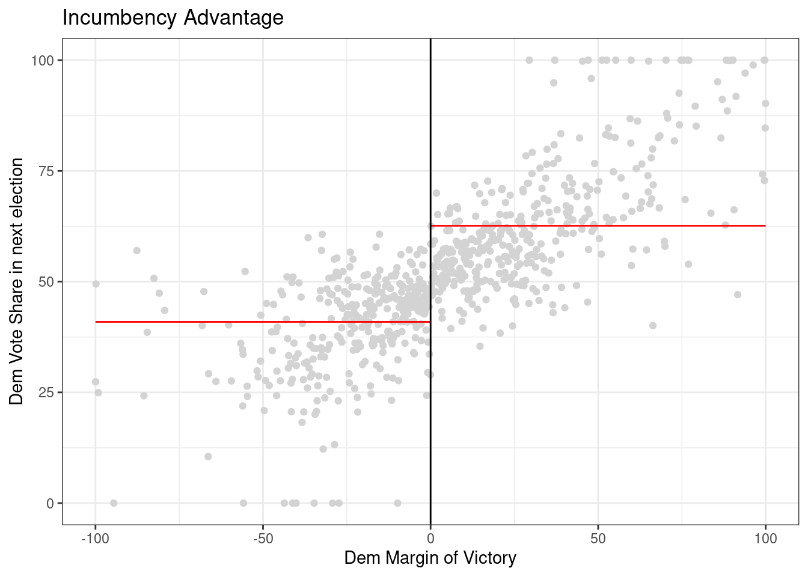

Let's zoom in a bit to the closer races and use non-linear regression. There appears to still be a slight discontinuity. 

```r
rdplot(dem_vote_t2[abs(dem_margin_t0) <= 25], dem_margin_t0[abs(dem_margin_t0) <= 25], nbins = c(2500, 500), p = 4, col.lines = "red", col.dots = "lightgray", title = "",  y.lim = c(0,100))
```

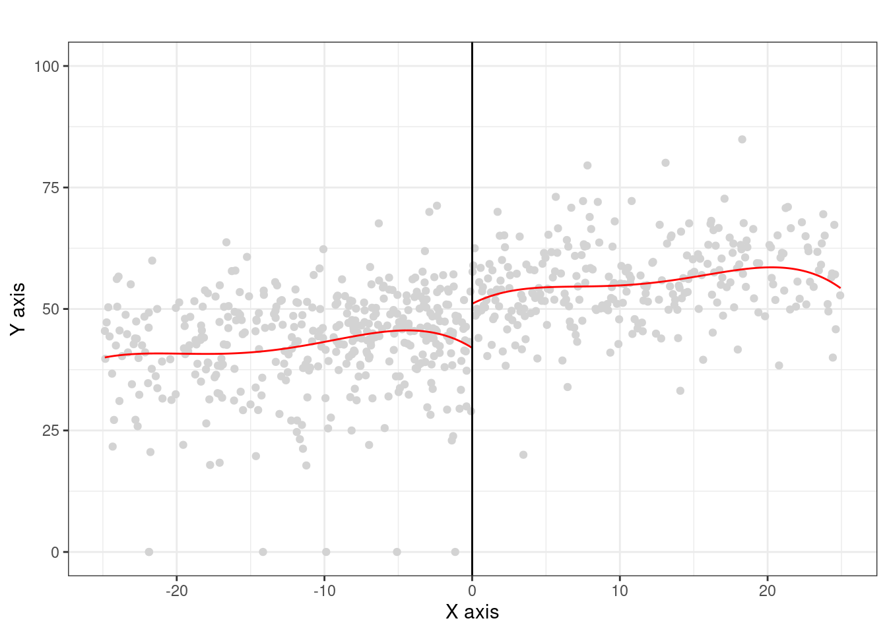

### Estimating the causal effect
As an example, we'll manually set the bandwidth to 10, and then estimate a linear regression on both sides of the cut-off. The estimated intercept is the prediction at $0$, so to get the estimate, we just take the difference.

```r
# Set bandwidth to 10
h <- 10
# Fit regression to left and right of cut-off
lm_left <- lm(dem_vote_t2 ~ dem_margin_t0, subset = dem_margin_t0 < 0 & abs(dem_margin_t0) <= h)
lm_right <- lm(dem_vote_t2 ~ dem_margin_t0, subset = dem_margin_t0 > 0 & abs(dem_margin_t0) <= h)

# Estimate is difference in interecepts
lm_right$coefficients[1] - lm_left$coefficients[1] 
```

```
## (Intercept) 
##    6.898794
```

We can try the same with the triangular weights.

```r
h <- 10
weight <- ifelse(abs(dem_margin_t0) < h, 1 - abs(dem_margin_t0) / h, 0) 

## Note we don't need subs
lm_left <- lm(dem_vote_t2 ~ dem_margin_t0, subset = dem_margin_t0 < 0 & abs(dem_margin_t0) <= h, weights = weight)
lm_right <- lm(dem_vote_t2 ~ dem_margin_t0, subset = dem_margin_t0 > 0 & abs(dem_margin_t0) <= h, weights = weight)


# Estimate is difference in interecepts
lm_right$coefficients[1] - lm_left$coefficients[1] 
```

```
## (Intercept) 
##    7.984687
```

#### Question
* Describe in both mathematical notation, and in plain language what causal effect is being estimated.

## Using rdrobust
As you can see, getting the estimates aren't so difficult once we've selected a bandwidth. But selecting a good bandwidth can be tricky and getting standard errors on the estimate are also difficult.  We can use the R package \texttt{rdrobust} to select the bandwidth, estimate the causal effect quantities, and give standard errors. 


```r
# uniform kernel with bandwidth 10
out <- rdrobust(dem_vote_t2, dem_margin_t0, kernel = 'uniform',  p = 1, h = 10)
summary(out)
```

```
## Sharp RD estimates using local polynomial regression.
## 
## Number of Obs.                 1297
## BW type                      Manual
## Kernel                      Uniform
## VCE method                       NN
## 
## Number of Obs.                  595          702
## Eff. Number of Obs.             245          206
## Order est. (p)                    1            1
## Order bias  (q)                   2            2
## BW est. (h)                  10.000       10.000
## BW bias (b)                  10.000       10.000
## rho (h/b)                     1.000        1.000
## Unique Obs.                     595          702
## 
## =============================================================================
##         Method     Coef. Std. Err.         z     P>|z|      [ 95% C.I. ]       
## =============================================================================
##   Conventional     6.899     1.722     4.007     0.000     [3.525 , 10.273]    
##         Robust         -         -     3.891     0.000     [5.156 , 15.624]    
## =============================================================================
```


```r
# triangular kernel with bandwidth 10
out <- rdrobust(dem_vote_t2, dem_margin_t0,  kernel = 'triangular',  p = 1, h = 10)
summary(out)
```

```
## Sharp RD estimates using local polynomial regression.
## 
## Number of Obs.                 1297
## BW type                      Manual
## Kernel                   Triangular
## VCE method                       NN
## 
## Number of Obs.                  595          702
## Eff. Number of Obs.             245          206
## Order est. (p)                    1            1
## Order bias  (q)                   2            2
## BW est. (h)                  10.000       10.000
## BW bias (b)                  10.000       10.000
## rho (h/b)                     1.000        1.000
## Unique Obs.                     595          702
## 
## =============================================================================
##         Method     Coef. Std. Err.         z     P>|z|      [ 95% C.I. ]       
## =============================================================================
##   Conventional     7.985     1.838     4.344     0.000     [4.382 , 11.587]    
##         Robust         -         -     4.387     0.000     [6.595 , 17.249]    
## =============================================================================
```


If we don't specify a bandwidth directly, the software will choose for us

```r
# uniform kernel with software selected bandwidth
out <- rdrobust(dem_vote_t2, dem_margin_t0, kernel = 'triangular',  p = 1)
summary(out)
```

```
## Sharp RD estimates using local polynomial regression.
## 
## Number of Obs.                 1297
## BW type                       mserd
## Kernel                   Triangular
## VCE method                       NN
## 
## Number of Obs.                  595          702
## Eff. Number of Obs.             360          323
## Order est. (p)                    1            1
## Order bias  (q)                   2            2
## BW est. (h)                  17.754       17.754
## BW bias (b)                  28.028       28.028
## rho (h/b)                     0.633        0.633
## Unique Obs.                     595          665
## 
## =============================================================================
##         Method     Coef. Std. Err.         z     P>|z|      [ 95% C.I. ]       
## =============================================================================
##   Conventional     7.414     1.459     5.083     0.000     [4.555 , 10.273]    
##         Robust         -         -     4.311     0.000     [4.094 , 10.919]    
## =============================================================================
```


### Try on your own

Now try on your own and estimate the causal effect of the senator who is not up for election being a democrat on the democratic vote share of the senator who is up for election. In this case, the outcome of interest is demvoteshfor1 since we are interested in the immediately following election.  


```r
dem_vote_t1 <- data$demvoteshfor1
dem_margin_t0 <- data$demmv

# plot the data
# Set p = 0 for a straight line (i.e., regression with X^p)
rdplot(y = dem_vote_t1, x =  dem_margin_t0, nbins = c(1000, 1000), p = 0, col.lines = "red", col.dots = "lightgray", title = "Incumbency Advantage", y.lim = c(0,100), x.label = "Dem Margin of Victory", y.label = "Dem Vote Share in next election")
```

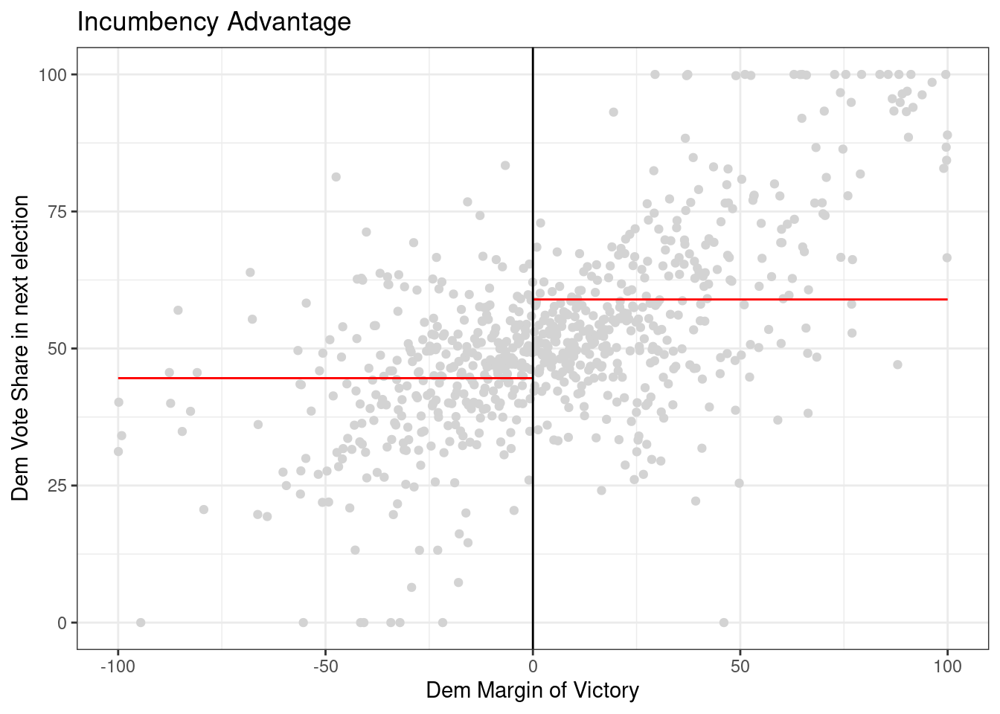

<!--chapter:end:discussion10.Rmd-->

---
output: html_document
---


# Discussion 12. Empirical Application: How the Onset of Violent Conflict Affects Economic Output {-}

We will demonstrate the synthetic control method using data from [Abadie and 
Gardeazabal (2003)](https://www.aeaweb.org/articles?id=10.1257/000282803321455188), which studied the economic effects of conflict, using the
terrorist conflict in the Basque Country as a case study. This paper used a 
combination of other Spanish regions to construct a synthetic Basque Country
resembling many relevant economic characteristics of the Basque Country before
the onset of political terrorism in the 1970s.

## Load the Data
Let's go ahead and load our packages and data. If you notice that there is quite
a lot of missing data, don't worry, that's how it is meant to be!

```r
install <- function(package) {
  if (!require(package, quietly = TRUE, character.only = TRUE)) {
    install.packages(package, repos = "http://cran.us.r-project.org", type = "binary")
    library(package, character.only = TRUE)
  }
}

# Load packages
install("dplyr")
install("Synth")

# Load data
data("basque")
glimpse(basque)
```

```
## Rows: 774
## Columns: 17
## $ regionno              <dbl> 1, 1, 1, 1, 1, 1, 1, 1, 1, 1…
## $ regionname            <chr> "Spain (Espana)", "Spain (Es…
## $ year                  <dbl> 1955, 1956, 1957, 1958, 1959…
## $ gdpcap                <dbl> 2.354542, 2.480149, 2.603613…
## $ sec.agriculture       <dbl> NA, NA, NA, NA, NA, NA, 19.5…
## $ sec.energy            <dbl> NA, NA, NA, NA, NA, NA, 4.71…
## $ sec.industry          <dbl> NA, NA, NA, NA, NA, NA, 26.4…
## $ sec.construction      <dbl> NA, NA, NA, NA, NA, NA, 6.27…
## $ sec.services.venta    <dbl> NA, NA, NA, NA, NA, NA, 36.6…
## $ sec.services.nonventa <dbl> NA, NA, NA, NA, NA, NA, 6.44…
## $ school.illit          <dbl> NA, NA, NA, NA, NA, NA, NA, …
## $ school.prim           <dbl> NA, NA, NA, NA, NA, NA, NA, …
## $ school.med            <dbl> NA, NA, NA, NA, NA, NA, NA, …
## $ school.high           <dbl> NA, NA, NA, NA, NA, NA, NA, …
## $ school.post.high      <dbl> NA, NA, NA, NA, NA, NA, NA, …
## $ popdens               <dbl> NA, NA, NA, NA, NA, NA, NA, …
## $ invest                <dbl> NA, NA, NA, NA, NA, NA, NA, …
```

## Data definitions

The following are definitions of all the variables you see above:

- `regionno` and `regionname`: Numeric identifiers for each Spanish region,
and the names (as a character) of each region.

- `year`: The year corresponding with each row of the data. Spans from
1955-1997.

- `gdpcap`: 1960–1969 averages for real GDP per-capita measured in thousands of
1986 USD.

- Variables with `sec.` prefix: 1961–1969 average percentage of total GDP for
six different industries. For example, the first non-missing value of 
`sec.agriculture` is = 19.54. This means that in 1961, the Agriculture industry 
made up about 20% of the total GDP in all of Spain (note the `regionname`
variable = `Spain (Espana)`.

- Variables with `school.` prefix: 1964–1969 averages for the share of the 
working-age population that was illiterate (`school.illit`), the share with up
to primary school education (`school.prim`), the share with some high school
(`school.med`), the share with high school (`school.high`), and the share with
more than high school (`school.post.high`).

- `popdens`: 1969 population density measured in people per square kilometer.

- `invest`: 1964–1969 averages for gross total investment divided by total GDP.

Running the following line of code will show you some helpful information in the "Help" box on the bottom right of your R Studio Screen. We call this *documentation*. It tells you what the outcome variable and predictor variables are, plus descriptions of each variable in the dataset. Please ask us if you have any additional questions about what each variable means.


```r
?basque
```

### Questions For You
After running the code above and reading the documentation for the dataset, answer the following questions:

1. What years are contained in the dataset?

**Answer.** 

2. How many Spanish regions are contained in the dataset?

**Answer.**

3. What is the outcome variable and what is it called in the dataset?

**Answer.**

4. What are the possible predictor variables?

**Answer.**

## Prepare the data for analysis using `dataprep`

The **first step** is to reorganize the dataset into an appropriate format that is
suitable for the main estimator function `synth()`. To do this, we will use the
`dataprep()` function. To see more examples and details on data extraction, run
`?dataprep` in your console. This should pop up a helpful page in the "Help" tab on the bottom right of your R Studio screen.

In the code below, we need to tell Synth the following:

1. What our predictor variables are (split up into two groups)
  - (a) `predictors`: variables that are non-missing for all years included in our analysis
  - (b) `special.predictors`: for predictor variables with missing values or require a little extra handling
2. How we want these predictor variables to be aggregated (in our case, the average)
3. What time period we are considering (in our case, 1964 to 1969)
4. What the outcome variable is (in our case, `gdpcap`)
5. What variable(s) identify the different regions (`regionname`) and/or 
numbers (`regionno`).
6. What variable denotes the time period (`year`)
7. Which region is the treated unit (region 17 AKA Basque Country) 
8. Which regions are control units (`c(2:16,18)`)
9. What time period we want to train out model in (pre-treatment period 1960:1969)
10. The time-period over which our outcome data should be plotted
(usually before and after treatment, e.g., 1955 to 1997)

Okay, now let's prepare what we've just described in code. 
We've added comments in the code to explain exactly what's happening in each line.
We are creating a "prepared" dataset `dataprep.out` by running our "unprepared" data through the `dataprep` function. 
This is because the Synth package requires the data to be in a specific format to do synthetic control.


```r
dataprep.out <- dataprep(
  foo = basque,          # Our analysis data that needs to be prepared
  predictors = c(        # 1(a). list the variables that we want to use as predictors
    "school.illit",     
    "school.prim",       
    "school.med",
    "school.high",
    "school.post.high",
    "invest"
  ),
  predictors.op = "mean",               # 2. Tell Synth to take the average of all variables in `predictors` above.
  time.predictors.prior = 1964:1969,    # 3. Take the average of variables in `predictors` from 1964 to 1969.
  special.predictors = list(            # 1(b). Additional variables to include as predictors in our model:
    list("gdpcap", 1960:1969 , "mean"), # -    Take the average of `gdcap` from 1960 to 1969
                                        # -    Take the average of all others for every OTHER year from 1961 to 1969
    list("sec.agriculture", seq(1961, 1969, 2), "mean"),
    list("sec.energy", seq(1961, 1969, 2), "mean"),
    list("sec.industry", seq(1961, 1969, 2), "mean"),
    list("sec.construction", seq(1961, 1969, 2), "mean"),
    list("sec.services.venta", seq(1961, 1969, 2), "mean"),
    list("sec.services.nonventa", seq(1961, 1969, 2), "mean"),
    list("popdens", 1969, "mean")       # -    Take the average of `popdens` only in 1969
  ),
  dependent = "gdpcap",                 # 4. Specify our outcome variable
  unit.variable = "regionno",           # 5(a). Specify the numeric identifier of each region
  unit.names.variable = "regionname",   # 5(b). Specify the name of each region
  time.variable = "year",               # 6. Specify what variable is our time variable
  treatment.identifier = 17,            # 7. Specify which region in `regionno` is our treated region
  controls.identifier = c(2:16, 18),    # 8. Specify which regions in `regionno` should be in our donor pool
  time.optimize.ssr = 1960:1969,        # 9. Specify what years should make up our pre-treatment time period
  time.plot = 1955:1997                 # 10. Specify what years to plot our outcome variable for
)
```

Notice that in the code above we use the arguments `predictors`, 
`predictors.op`, and `time.predictors.prior`, and the rest of the information
for the other predictor variables is specified in the `special.predictors`
list. This functionality was designed to allow for easy handling of
several predictors with the same operator (e.g. taking the average) over the
same pre-treatment period (in this case, the school and investment variables)
as well as additional custom (or “special”) predictors with varying operators
and time-periods. For example, the variables for the sector production
shares (e.g. `sec.agriculture`) is only available on a biennial basis
(1961,1963,...,1969) extracted which is why we use the code `seq(1961,1969,2)`.
More details and examples on the use of the `special.predictors`
can be seen by running `?dataprep` in the console.

## Construct our Synthetic Control

Now, we're ready to use the `synth()` function to create the synthetic control
for the GDP of the Basque Country region of Spain. As described in discussion,
this means that `synth()` will create weights for each of the other regions
so that the weighted average of the other regions' GDP will closely match the
true GDP of the Basque Country region.

```r
synth.out <- synth(data.prep.obj = dataprep.out, method = "BFGS")
```

```
## 
## X1, X0, Z1, Z0 all come directly from dataprep object.
## 
## 
## **************** 
##  searching for synthetic control unit  
##  
## 
## **************** 
## **************** 
## **************** 
## 
## MSPE (LOSS V): 0.008864605 
## 
## solution.v:
##  0.03881798 0.001220442 4.26792e-05 0.0001235262 1.6599e-06 1.76355e-05 0.04072702 0.2396775 0.02234054 0.248494 0.005974697 0.01098894 0.04858995 0.3429834 
## 
## solution.w:
##  1.67e-08 4.27e-08 7.43e-08 2.78e-08 2.97e-08 5.545e-07 3.66e-08 4.28e-08 0.8508029 9.23e-08 2.75e-08 4.94e-08 0.1491958 4.13e-08 9.75e-08 1.167e-07
```
We'll explore the model output below. 

## Summarizing our Synthetic Control with Tables

First, we can begin by creating some summary tables from our Synthetic Control
model.

```r
synth.tables <- synth.tab(dataprep.res = dataprep.out, synth.res = synth.out)
```

The `synth.tables` variable now contains four tables that will help us evaluate
our synthetic control. The first table looks at our pre-treatment period and
compares the predictor values between the Basque Country (denoted `Treated` in
the table) and our Synthetic Control. **Note** we want the values in the
`Treated` and `Synthetic` columns to be really close together.

```r
synth.tables$tab.pred
```

```
##                                          Treated Synthetic
## school.illit                              39.888   256.335
## school.prim                             1031.742  2730.092
## school.med                                90.359   223.341
## school.high                               25.728    63.437
## school.post.high                          13.480    36.154
## invest                                    24.647    21.583
## special.gdpcap.1960.1969                   5.285     5.271
## special.sec.agriculture.1961.1969          6.844     6.179
## special.sec.energy.1961.1969               4.106     2.760
## special.sec.industry.1961.1969            45.082    37.636
## special.sec.construction.1961.1969         6.150     6.952
## special.sec.services.venta.1961.1969      33.754    41.104
## special.sec.services.nonventa.1961.1969    4.072     5.371
## special.popdens.1969                     246.890   196.287
##                                         Sample Mean
## school.illit                                170.786
## school.prim                                1127.186
## school.med                                   76.260
## school.high                                  24.235
## school.post.high                             13.478
## invest                                       21.424
## special.gdpcap.1960.1969                      3.581
## special.sec.agriculture.1961.1969            21.353
## special.sec.energy.1961.1969                  5.310
## special.sec.industry.1961.1969               22.425
## special.sec.construction.1961.1969            7.276
## special.sec.services.venta.1961.1969         36.528
## special.sec.services.nonventa.1961.1969       7.111
## special.popdens.1969                         99.414
```
We can see that the values in the `Treated` and `Synthetic` columns are pretty
different for some variables so this would indicate that perhaps our synthetic
control isn't as similar as we would like.

Next, we can look at the weights that got assigned to each of the non-treatment
regions. We can drop regions that have a weight of 0 since those regions don't
contribute to our synthetic control at all!

```r
synth.tables$tab.w[synth.tables$tab.w$w.weights != 0, ]
```

```
##    w.weights            unit.names unit.numbers
## 10     0.851              Cataluna           10
## 14     0.149 Madrid (Comunidad De)           14
```
From the `w.weights` column we can see that only two regions contribute to our
synthetic control. The Cataluna region makes up approximately 85% of our
synthetic control and the Madrid region makes up the additional 15%. This means
that out of 16 regions in our donor pool, only 2 of them were picked to create
our synthetic control!

Finally we can look at the weights that got assigned to each of our predictor
variables. This can be interpreted as the relative importance of each of our
predictor variables.

```r
synth.tables$tab.v
```

```
##                                         v.weights
## school.illit                            0.039    
## school.prim                             0.001    
## school.med                              0        
## school.high                             0        
## school.post.high                        0        
## invest                                  0        
## special.gdpcap.1960.1969                0.041    
## special.sec.agriculture.1961.1969       0.24     
## special.sec.energy.1961.1969            0.022    
## special.sec.industry.1961.1969          0.248    
## special.sec.construction.1961.1969      0.006    
## special.sec.services.venta.1961.1969    0.011    
## special.sec.services.nonventa.1961.1969 0.049    
## special.popdens.1969                    0.343
```

We can see that the `school.med`, `school.high`, `school.post.high`, and
`invest` variables had a weight of 0, which means that they are the least
important and had no impact in the creation of our synthetic control. On the 
other hand, the population density in 1969 (`special.popdens.1969`) was the
most important variable.

## Summarizing our Synthetic Control with Plots

Finally, we can plot the economic output for the Basque Contry region and
compare it to the economic output for our Synthetic Control. To make a
convincing case for a large treatment effect, we would like to see the two
trajectories of the outcome variable for the Basque Country and its Synthetic
Control unit to be quite similar prior to the violent conflict and to diverge
sharply when the violent conflict occurs.

Let's create such a plot and see if it indicates a significant treatment effect.

```r
path.plot(
  synth.res = synth.out,
  dataprep.res = dataprep.out,
  Ylab = "real per-capita GDP (1986 USD, thousand)",
  Xlab = "year",
  Ylim = c(0, 12),
  Legend = c("Basque country", "synthetic Basque country"),
  Legend.position = "bottomright"
)
abline(a = NULL, b = NULL, h = NULL, v = 1975, col = "red")
```

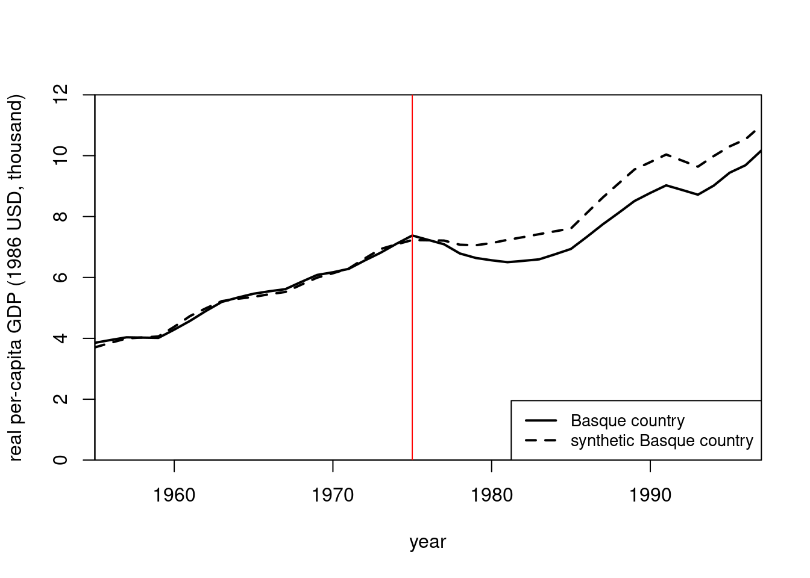

We can see that the economic output of both units looks super similar until
1975 which is when the violent conflict began in earnest. From that point on,
the economic output of the Basque Country drops significantly. This would
indicate that the violent conflict had a fairly large and negative impact on
economic output in the Basque Country region.

Another way we can visualize this is by creating the same plot, but instead
of showing two lines for the outcome of the Basque Country region and the
outcome of the Synthetic Control Unit, we plot a single line that is the
difference between the two lines in each time period.

```r
gaps.plot(
  synth.res = synth.out,
  dataprep.res = dataprep.out,
  Ylab = "gap in real per-capita GDP (1986 USD, thousand)",
  Xlab = "year",
  Ylim = c(-1.5, 1.5),
  Main = NA
)
abline(a = NULL, b = NULL, h = NULL, v = 1975, col = "red")
```

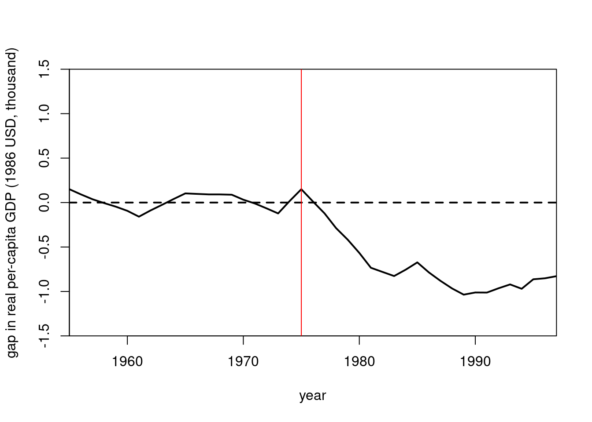

This plot conveys the same information as before. That is, the economic output
of the Basque Country region drops well below the economic output of the
Synthetic Control unit once the violent conflict begins in 1975. In other words
the violent conflict lowers economic output.

## Summary

In this tutorial, we've walked through how to prepare data for the Synthetic
Control method with the following steps:

- Prepare your data using the `dataprep()` function.

- Create a Synthetic Control unit using the `synth` function.

- Evaluate our model with tables using the `synth.tab` function.

- Plot the outcomes of our treated unit and our synthetic control unit with the
`path.plot` and `gaps.plot` functions.


<!--chapter:end:discussion12.Rmd-->


# (PART) Assignments {-}

# Due dates {-}

Th 31 Aug, 5pm. Submit HW 1.

Th 7 Sep, 5pm. Peer reviews for HW 1.

Th 14 Sep, 5pm. Submit HW 2.

Th 21 Sep, 5pm. Peer reviews for HW 2.

Th 28 Sep, 5pm. Submit HW 3.

Th 5 Oct, 5pm. Peer reviews for HW 3.

Th 19 Oct, 5pm. Submit HW 4.

Th 26 Oct, 5pm. Peer reviews for HW 4.

Sun 5 Nov, 5pm. Submit HW 5.

Th 9 Nov, 5pm. Peer reviews for HW 5.

Th 16 Nov, 5pm. Submit HW 6.

* note: no peer reviews for this homework

T 21 Nov, 5pm. Submit project writeup.

W 29 Nov. Present project in lab.


<!--chapter:end:pset_dates.Rmd-->


# Final Project {-}

The final project is an opportunity to engage with a published research paper that asks a causal question. You will choose one paper from a set that we have prepared. For that paper, you will carry out two tasks.

## 1. Summarize what the authors have done {-}

Choose one causal estimand from the paper. For that estimand,

* Define the estimand using potential outcomes
* Present the identification assumptions that link the quantity to observable data
* Discuss the estimator that the authors use to estimate the target quantity

In many papers, the three steps above are stated in English and may involve some ambiguity. You may not be certain what quantity the authors wanted to estimate, or exactly what they assumed. In these settings, your task is to choose one interpretation of what the authors have done and make your interpretation precise.

## 2. Propose a new quantity to estimate  {-}

In the second part, you will propose a new causal estimand. If you were to collect new data or conduct new analysis to estimate a new quantity, what would that quantity be? For this part of the assignment, you can write as though you have unlimited resources to collect any amount and kind of data you would want.

* Define a new causal estimand
* Present the identification assumptions that link the quantity to observable data
* Discuss the estimator that you would use to estimate the target quantity

There is one restriction: for part 2, your proposed analysis **cannot involve a randomized treatment.** While experiments are terrific ways of conducting research, the identification and estimation assumptions in randomized experiments can be trivial. In order to practice the skills learned in this class, we want you to focus on a non-randomized setting.

## Format of the final project {-}

### Working in groups {-}

We anticipate that most students will carry out the final project in groups of 4--5 students who are all in the same discussion section. Near the middle of the semester, we will circulate a form for you to tell us if there are people you'd like to work with, or if you'd like us to randomize you to a group so you can meet new people. If you prefer to work alone, just come talk to us, and we can discuss how that could work.

### Writeup {-}

**Writeup due Nov 21 at 5pm**

Your group will submit a writeup that is between 1,500 and 2,000 words, typeset using RMarkdown.

### Presentation {-}

**Presentations Nov 29 during discussion**

Each group will make a 10-minute presentation, using slides. Your presentation should involve both parts (1) and (2).

### Grading {-}

We will post rubrics on Canvas when we assign final project groups.

## Published papers for the project {-}

Your group will study one of the following papers:

1. Stuart, E. A., \& Green, K. M. (2008). [Using full matching to estimate causal effects in nonexperimental studies: Examining the relationship between adolescent marijuana use and adult outcomes.](https://www.ncbi.nlm.nih.gov/pmc/articles/PMC5784842/) Developmental Psychology, 44(2), 395.
     * This paper is an example of matching
2. Halloran, M. E., & Hudgens, M. G. (2018). [Estimating population effects of vaccination using large, routinely collected data.](https://doi.org/10.1002/sim.7392) Statistics in Medicine, 37(2), 294-301.
     * This paper is an example of addressing interference
3. Eggers, A. C., \& Hainmueller, J. (2009). [MPs for sale? Returns to office in postwar British politics.](https://doi.org/10.1017/S0003055409990190) American Political Science Review, 103(4), 513-533.
     * This paper is an example of regression discontinuity
4. Acharya, A., Blackwell, M., \& Sen, M. (2016). [The political legacy of American slavery.](https://doi.org/10.1086/686631) The Journal of Politics, 78(3), 621-641.
     * This paper is an example of instrumental variables


<!--chapter:end:pset_project.Rmd-->


# Problem Set 1. Definitions {-}

Relevant material will be covered by **Aug 24**. Problem set is due **Aug 31**.

Welcome to the problem set! This homework will practice conceptual and notation ideas for descriptive and causal inference.

To complete the problem set, [**Download the .Rmd**](assets/psets/pset1_download.Rmd) and complete the homework. Omit your name so we can have anonymous peer feedback. Compile to a PDF and submit the PDF on [Canvas](https://canvas.cornell.edu/courses/57329).

## 1. Practice with potential outcomes {-}

Jose says that coming to Cornell caused him to discover statistics, and it became his major! He says that if he had gone to NYU, he would have stuck with biology.

### 1.1 (7 points) {-}

In Jose's claim, what is the treatment?

**Answer.** Your answer here

### 1.2 (7 points) {-}

Using the mathematical notation we discussed in class, define the two potential outcomes to which Jose is referring

**Answer.** Your answer here

### 1.3 (7 points) {-}

In a sentence or two, say how the Fundamental Problem of Causal Inference applies to Jose's claim.

**Answer.** Your answer here

### 1.4 (7 points) {-}

Using conditional expectations or probabilities, write the following in math: the probability of majoring in statistics is higher among students who attend Cornell than among students who attend NYU.

**Answer.** Your answer here

### 1.5 (7 points) {-}

Give one reason why the average causal effect of attending Cornell versus NYU (the quantity from 1.2, averaged over all students) might be different from the average descriptive difference (from 1.4) in rates of majoring in statistics.

**Answer.** Your answer here

## 2. A sailing class {-}

You are looking into a sailing class through Cornell Wellness! For each claim below, tell us whether the claim is causal or descriptive.

### 2.1 (5 points) {-}

Last year, there was a survey of students who did and did not take the class. The proportion reporting that they felt prepared to sail on Cayuga Lake was higher among those who took the class.

**Answer.** Your answer here

### 2.2 (5 points) {-}

Last year, there was a survey of students before and after the class. The proportion reporting that they felt prepared to sail on Cayuga Lake was higher in the survey taken after the class.

**Answer.** Your answer here

### 2.3 (5 points) {-}

On average, the students in this class emerged more prepared to sail than they would have been without the class.

**Answer.** Your answer here

## Session info {-}

The chunk below will record information about your R session, which is useful for debugging issues in homework assignments that contain code.


```r
sessionInfo()
```

```
## R version 4.3.1 (2023-06-16)
## Platform: aarch64-apple-darwin20 (64-bit)
## Running under: macOS Sonoma 14.5
## 
## Matrix products: default
## BLAS:   /Library/Frameworks/R.framework/Versions/4.3-arm64/Resources/lib/libRblas.0.dylib 
## LAPACK: /Library/Frameworks/R.framework/Versions/4.3-arm64/Resources/lib/libRlapack.dylib;  LAPACK version 3.11.0
## 
## locale:
## [1] en_US.UTF-8/en_US.UTF-8/en_US.UTF-8/C/en_US.UTF-8/en_US.UTF-8
## 
## time zone: America/New_York
## tzcode source: internal
## 
## attached base packages:
## [1] stats     graphics  grDevices utils     datasets 
## [6] methods   base     
## 
## loaded via a namespace (and not attached):
##  [1] digest_0.6.33     R6_2.5.1          bookdown_0.35    
##  [4] fastmap_1.2.0     xfun_0.39         cachem_1.1.0     
##  [7] knitr_1.43        memoise_2.0.1     htmltools_0.5.8.1
## [10] rmarkdown_2.22    lifecycle_1.0.3   xml2_1.3.4       
## [13] cli_3.6.1         downlit_0.4.4     sass_0.4.9       
## [16] withr_2.5.0       jquerylib_0.1.4   compiler_4.3.1   
## [19] rstudioapi_0.14   tools_4.3.1       evaluate_0.21    
## [22] bslib_0.8.0       yaml_2.3.7        fs_1.6.2         
## [25] jsonlite_1.8.7    rlang_1.1.1
```

<!--chapter:end:pset1.Rmd-->

---
header-includes:
  \usepackage{framed}
  \usepackage{xcolor}
  \let\oldquote=\quote
  \let\endoldquote=\endquote
  \renewenvironment{quote}{\begin{shaded*}\begin{oldquote}}{\end{oldquote}\end{shaded*}}
urlcolor: blue
---

# Problem Set 2. Experiments {-}

Relevant material will be covered by **Sep 7**. Problem set is due **Sep 14**.

To complete the problem set, [**Download the .Rmd**](https://raw.githubusercontent.com/causal3900/causal3900.github.io/main/assets/psets/pset2_download.Rmd) and complete the homework. Omit your name so we can have anonymous peer feedback. Compile to a PDF and submit the PDF on [Canvas](https://canvas.cornell.edu/courses/57329).

This problem set is based on:

Bertrand, M \& Mullainathan, S. 2004. "[Are Emily and Greg More Employable Than Lakisha and Jamal? A Field Experiment on Labor Market Discrimination](https://www-jstor-org.proxy.library.cornell.edu/stable/3592802)." American Economic Review 94(4):991--1013.

Here's a heads-up about what will be hard in this problem set

- for some, reading a social science paper will be hard
- for some, mathematical statistics will be hard
- for some, R coding will be hard

For almost no one will all three be easy.

> We want to support you to succeed! Text in this format is here to help you.

## 1. Conceptual questions about the study design {-}

Read the first 10 pages of the paper (through the end of section 2). In this paper,

- the unit of analysis is a resume submitted to a job opening
- the treatment is the name at the top of the resume
- the outcome is whether the employer called or emailed back for an interview

### 1.1. (5 points) Fundamental Problem {-}

One submitted resume had the name "Emily Baker." It yielded a callback. The same resume could have had the name "Lakisha Washington." Explain how the Fundamental Problem of Causal Inference applies to this case (1--2 sentences). 

### 1.2. (5 points) Exchangeability {-}

In a sentence, state what exchangeability means in this study. For concreteness, for this question you may suppose that the only names in the study were "Emily Baker" and "Lakisha Washington." Be sure to explicitly state the treatment and the potential outcomes.

### 1.3. (10 points) Something you liked {-}

State something concrete that you appreciate about the study design, other than randomization.

## 2. Analyzing the experimental data {-}

Load packages that our code will use.

```r
library(tidyverse)
library(haven)
```

Download the study's data from OpenICPSR: [https://www.openicpsr.org/openicpsr/project/116023/version/V1/view](https://www.openicpsr.org/openicpsr/project/116023/version/V1/view). This will require creating an account and agreeing to terms for using the data ethically. Put the data in the folder on your computer where this .Rmd is located. Read the data into R using `read_dta`. 


```r
d <- read_dta("lakisha_aer.dta")
```


> If you have an error, you might need to set your working directory first. This tells R where to look for data files. At the top of RStudio, click Session -> Set Working Directory -> To Source File Location.

You will now see `d` in your Global Environment at the top right of RStudio.

We will use four variables:

| Name | Role | Values
| ---- | ---- | ------
`call` | outcome | 1 if resume submission yielded a callback
| | | 0 if not
`firstname` | treatment | first name randomly assigned to resume
`race` | category of treatments | `b` if first name signals Black
| | | `w` if first name signals white
`sex` | category of treatments | `f` if first name signals female
| | | `m` if first name signals male

For 2.1--2.4, we will think of `race` as the treatment. For 2.5--2.6, we will think of `firstname` as the treatment.

Restrict to these variables using `select()`.


```r
d_selected <- d %>%
  select(call, firstname, race, sex)
```

> If you are new to R, here is what just happened:
>
> - created a new object `d_selected`
> - used the assignment operator `<-` to put something in that object
> - we started with our data object `d`
> - we used the pipe operator `%>%` to hand `d` down into a new action
> - the action `select()` selected only the variables of interest
>
> We will often analyze data by starting with a data object and handing that through a series of actions connected by the pipe `%>%`

### 2.1. (5 points) Point estimates of expected potential outcomes {-}

The top of Table 1 reports callback rates: 9.65\% for white names and 6.45\% for Black names. Reproduce those numbers. To do so, take the code below but add a `group_by()` action between `d_selected` and `summarize`.

> Here's a [reference](https://r4ds.had.co.nz/transform.html#grouped-summaries-with-summarise) that introduces `group_by` and `summarize`.


```r
d_summarized <- d_selected %>%
  summarize(callback_rate = mean(call),
            number_cases = n()) %>%
  print()
```

```
## # A tibble: 1 × 2
##   callback_rate number_cases
##           <dbl>        <int>
## 1        0.0805         4870
```

### 2.2. (5 points) Inference for expected potential outcomes {-}

Use `mutate()` (see [reference page](https://dplyr.tidyverse.org/reference/mutate.html#ref-examples)) to create a new columns containing the standard error of each estimate as well as lower and upper limits of 95% confidence intervals.  

> To make this easier, here is a quick math review and R functions you can use.

> **Standard error in math.** Let $Y^a$ be a Bernoulli random variable, taking the value 1 if a random resume with name $a$ yields a callback and 0 otherwise. Let $\pi^a = P(Y^a=1)$ be the probability of a callback. From statistics, you know this has variance $V(Y^a) = \pi^a (1-\pi^a)$. We have estimated by an average: $\hat\pi^a = \frac{1}{n_a}\sum_{i:A_i=a} Y_i^a$. If we did this many times in many hypothetical samples, we would not always get the same estimate. In fact, our estimate would have sampling variance $V(\hat\pi^a) = \frac{\pi^a(1-\pi^a)}{n_a}$. We know this because $\hat\pi^a$ is a mean of $n_a$ independent and identically distributed random variables $Y^a$. The standard error is the square root of the sampling variance: $SE(\hat\pi^a) = \sqrt\frac{\pi^a(1-\pi^a)}{n_a}$. We can estimate this standard error by plugging in our estimate $\hat\pi^a$ for the true unknown $\pi^a$ wherever it appears.

> **Standard error in code.** We translated the standard error formula into code for you below. This function accepts an estimated probability `p` and sample size `n` and returns the estimated standard error. You can use this `se_binary()` function in your code within `mutate()` just like how `mean()` was used within `summarize()` at the start of the problem set.

> 
> ```r
> se_binary <- function(p, n) {
>   se <- sqrt( p * (1 - p) / n )
>   return(se)
> }
> ```

> **Sampling distribution in math.** Because $\hat\pi^a$ is a sample mean, we know something about its sampling distribution: in the limit as the sample size grows to infinity, across hypothetical repeated samples the distribution of $\hat\pi^a$ estimates becomes Normal. This is by the Central Limit Theorem! Across repeated samples, the middle 95% of estimates will fall within a known range: $\pi^a \pm \Phi^{-1}(.975) \times SE(\hat\pi^a)$, where $\Phi^{-1}()$ is the inverse cumulative distribution function of the standard Normal distribution. You might have previously learned that $\Phi^{-1}(.975) \approx 1.96$, so what might be familiar to you is the number 1.96.

> **Sampling distribution in a graph.**

> 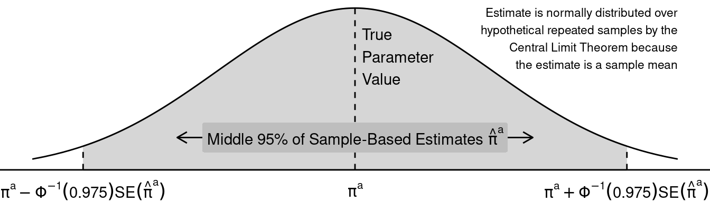

> **Confidence interval in math.** We get a 95% confidence interval by plugging in the estimates $\hat\pi^a$ and $\widehat{SE}(\hat\pi^a)$ to the limits above. This interval is centered on the estimate $\hat\pi^a$ and has a nice property: if we repeatedly made a confidence interval by this procedure using hypothetical samples from the population, our interval would contain the unknown true parameter $\pi^a$ 95% of the time.

> **Confidence interval in code.** We translated the confidence interval formula into code for you below. These functions accept an estimate and standard error and return the lower and upper bounds (respectively) of a 95% confidence interval that assumes a Normal sampling distribution. You can use these functions in your code within `mutate()` just like how `mean()` was used within `summarize()` at the start of the problem set.
> 
> ```r
> ci_lower <- function(estimate, standard_error) {
>   estimate - qnorm(.975) * standard_error
> }
> ci_upper <- function(estimate, standard_error) {
>   estimate + qnorm(.975) * standard_error
> }
> ```

### 2.3. (5 points) Interpret your confidence interval {-}

In words, interpret the confidence intervals. Be sure to discuss what their property is over hypothetical repeated samples, and be sure to frame your answer using the numbers and variables from the actual experiment we are analyzing. 

### 2.4. (5 points) Visualize expected potential outcomes {-}

Using `ggplot()`, visualize the estimated callback rate by race. Use `geom_point()` for point estimates and `geom_errorbar()` for confidence intervals, with race on the `x` axis and estimates on the `y` axis. Label the axes using full words.

> If you have never used `ggplot`, see [Ch 3](https://r4ds.had.co.nz/data-visualisation.html) of R for Data Science by Hadley Wickham.

### 2.5. (5 points) Estimate and visualize by firstname {-}

Do distinct first names yield distinct effects? Repeat 2.2--2.4, but now create estimates grouped by `race`, `sex`, and `firstname`. Visualize point estimates and confidence intervals.

> One way to visualize is by placing first names on the $x$-axis and using a `facet_wrap()` layer to facet over race and sex.

```r
your_ggplot +
  facet_wrap(~ race + sex,
             scales = "free_x", 
             nrow = 1)
```
> Any strategy to visualize is fine, as long as it shows estimates for each `firstname` and indicates the `race` and `sex` signaled by that `firstname`

### 2.6. (5 points) Interpret {-}

Within race and sex, not all first names have the same effect. Suppose these are true differences (not due to sampling variability). What does this tell you about the importance of researcher decisions about which names to use as treatments?

<!--chapter:end:pset2.Rmd-->


# Problem Set 3. DAGs. {-}

Relevant material will be covered by **Sep 21**. Problem set is due **Sep 28**.

To complete the problem set, [**copy this code**](https://raw.githubusercontent.com/causal3900/causal3900.github.io/main/assets/psets/pset3_download.Rmd) into a .Rmd and complete the homework. Omit your name so we can have anonymous peer feedback. Compile to a PDF and submit the PDF on [Canvas](https://canvas.cornell.edu/courses/57329).

Note: For this problem set only, you alternatively may complete the homework by hand. This is because you are welcome to draw DAGs by hand instead of producing them by code. If you do this, scan or take a picture of your document.

## 1. True or False {-}

For 1.1--1.5, answer True or False: $X$ is a sufficient adjustment set to identify the causal effect of $A$ on $Y$. Explain in one sentence. If False, state the backdoor path that is unblocked conditional on $X$. A path is a linear series of nodes connected by arrows; see examples in 1.6 and 1.7.

<style>.img-responsive {
  max-width: 100%;
}
</style>

<div class="panel">
  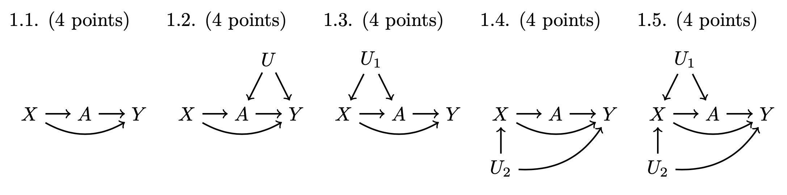
</div>

### 1.6 (3 points) {-}

True or False? Conditioning on $X$ blocks this path: $A\leftarrow B \leftarrow X \rightarrow C \rightarrow Y$


### 1.7 (3 points) {-}

True or False? Conditioning on $X$ blocks this path: $A\leftarrow B \rightarrow X \leftarrow C \rightarrow Y$


## 2. Draw a DAG (10 points) {-}

A researcher comes to you with a proposal: identify the causal effect of $A$ on $Y$ by adjusting for any variable $X$ that predicts $A$ and also predicts $Y$. They propose that machine learning can thus solve causal identification for us.

The researcher is wrong. Show them why. Draw a DAG in which

- the effect of $A$ on $Y$ is unconfounded
- a variable $X$ is statistically associated with $A$
- a variable $X$ is statistically associated with $Y$
- but one does not need to adjust for $X$ to identify the causal effect


## 3. Using DAGs in a new context {-}

DAGs are not just useful for causal inference: they can be useful whenever we need to know whether one variable is statistically independent of another. This is true, for example, when drawing inference about a population from a sample.

A researcher uses an opt-in online web survey to draw inference about support for President Biden. They ask respondents: ``Do you approve of President Biden's performance in office?'' with the answer choices Yes/No. The researcher also gathers data on two demographic characteristics: whether the respondent completed college and current employment. They write:

> My sample is not representative. Suppose for every person in the population, $S$ denotes whether they are included in my sample. Then $S$ is related to their approval of President Biden ($Y$).
> 
> However, I believe my sample *is* representative when I look at a set of people who all take the same value along college completion and employment, such as those who finished college and are currently employed. If these variables are $X_1,X_2$, I believe this independence statement: $S$ is independent of $Y$ given $X_1,X_2$. I will therefore get population estimates by a procedure with several steps: use my sample to estimate the mean outcome $E(Y\mid \vec{X} = \vec{x})$ in each stratum, then use Census data to estimate the size of each stratum $P(\vec{X} = \vec{x})$ in the population, then estimate $E(Y) = \sum_{\vec{x}}E(Y\mid \vec{X} = \vec{x})P(\vec{X} = \vec{x})$.

This researcher's reasoning is a common strategy known as **post-stratification**. This question is about formalizing a set of conditions under which the researcher is right and wrong.

Before you begin, we want to emphasize one aspect of the researcher's assumption that is different from the exchangeability assumption for causal inference.

* for causal claims, we assume conditional exchangeability: $A$ independent of $Y^a$ given $\vec{X}$
     * involves the potential outcome $Y^a$
     * holds if the only unblocked paths between $A$ and $Y$ are causal paths
* for sample-to-population inference, we assume conditionally independent sampling $S$ independent of $Y$ given $\vec{X}$
     * involves the factual outcome $Y$; there is no intervention here
     * holds if there are no unblocked paths between $S$ and $Y$

Although the assumption is different, the principles of DAGs are still relevant.

### 3.1. (5 points) {-}

Draw a DAG under which the researcher's claim is valid. Use $S,Y,X_1,X_2$.


### 3.2. (2 points) {-}

In a sentence or two, explain your DAG from 3.1 to the researcher. Tell us in words what is meant by each edge in your DAG.


### 3.3. (5 points) {-}

Draw a DAG showing a counterexample under which the researcher's claim is invalid.

### 3.4 (2 points) {-}

In a sentence or two, explain your DAG from 3.3 to the researcher. Tell us particularly about the path that creates a statistical dependence between $S$ and $Y$.


<!--chapter:end:pset3.Rmd-->


# Problem Set 4. Statistical modeling {-}

Relevant material will be covered by **Oct 5**. Problem set is due **Oct 19**.

To complete the problem set, [**Download the .Rmd**](https://drive.google.com/file/d/12_NT4ivtZqUnACrPMc7r7ET-QtW6kg8Q/view?usp=drive_link) and complete the homework. Omit your name so we can have anonymous peer feedback. Compile to a PDF and submit the PDF on [Canvas](https://canvas.cornell.edu/courses/57329).

The learning goals of completing this problem set are

- explain the role of statistical modeling
     * with respect to causal claims
     * with respect to data sparsity
- estimate average treatment effects by
     * exact matching (in a setting with few confounders)
     * learning an outcome model
     * learning a treatment model
     * a matching method of your choosing

The reason for practicing many statistical modeling estimators is so you can see how the ideas of this class apply to all those estimators---and to future estimators you will encounter that are not part of this class!

This problem set uses data from the following paper:

> Dehejia, R. H. and Wahba, S. 1999. [Causal Effects in Nonexperimental Studies: Reevaluating the Evaluation of Training Programs](https://www-jstor-org.proxy.library.cornell.edu/stable/2669919?). Journal of the American Statistical Association 94(448):1053--1062.

The paper compares methods for observational causal inference to recover an average causal effect that was already known from a randomized experiment. You do not need to read the paper; we will just use the study's data as an illustration.

The following lines will load these data into R.


```r
library(tidyverse)
library(MatchIt)
data("lalonde")
```

To learn about the data, type `?lalonde` in your R console.

## 1. Conceptual questions {-}

### 1.1. (5 points) Statistical modeling and causal claims {-}

Imagine that someone who has not taken our class tells you they don't need DAGs or causal assumptions because they know a really good matching method. In no more than 3 sentences, explain to them why causal assumptions are necessary for matching to yield causal conclusions.

 

## 2. Nonparametric estimation {-}

Our goal is to estimate the effect of job training `treat` on future earnings `re78` (real earnings in 1978), among those who received job training (the average treatment effect on the treated, ATT).

### 2.1.  (4 points) Exact matching with low-dimensional confounding {-}

For this part, assume that three variables comprise a sufficient adjustment set: `race`, `married`, and `nodegree`. Use `matchit` with the argument `method = "exact"` to conduct exact matching, which matches two units only if they are identical along `race`, `married`, and `nodegree`.

> Note: Here we are calling this **exact matching**. This is the same thing we previously called **nonparametric estimation**: make subgroups of units identical along confounders, estimate the treatment effect within those subgroups, and aggregate over the sample. We are using the language of matching to be parallel with what comes in Question 4.

How many control units were matched? How many treated units?


### 2.2. (4 points) Effect estimate {-}

Estimate a linear regression model using your match data from 2.1. Include the treatment and all confounders from 2.1 in a linear, additive specification. Weight by the weights from matching.

What is the estimated effect of job training on earnings?


### 2.3. (4 points) Exact matching with high-dimensional confounding {-}

Now suppose the adjustment set needs to also include 1974 earnings, `re74`. The adjustment set for this part is `race`, `married`, `nodegree`, and `re74`. Repeat exact matching as above.

How many control units were matched? How many treated units?


### 2.4. (4 points) Examining matched units {-}

Look at the `re74` values in the full data and among the matched units (no need to print this in your output).
Explain what happened: what is different about the 1974 earnings of the matched vs the unmatched cases?

Here is one way to do this:

- Using the function `summary`, look at descriptive statistics of the `re74` values in the full data.
- Using the function `summary`, look at descriptive statistics of the `re74` values in the matched data. You can get the matched data using the `match.data` function. 
- You can learn about how to use the `summary` function to look at descriptive statistics of R data [**here**](https://intro2r.com/summarising-data-frames.html).

What do you notice? What is different about the values of `re74` in the full data versus the matched data? Explain what happened and why it happened.


### 2.5. (4 points) Drawbacks of exact matching {-}

Briefly interpret the result from 2.4: what is the drawback of using exact matching in this setting?

 

## 3. Parametric estimation {-}

### 3.1. (5 points) Outcome modeling {-}

In the code below, we use `lm()` to estimate an Ordinary Least Squares regression of future earnings `re78` on treatment `treat`, interacted with confounders: `race`, `married`, `nodegree`, and `re74`.


```r
outcome_model <- lm(re78 ~ treat * (race + married + nodegree + re74),
                    data = lalonde)
```

Use the model above to estimate the average treatment effect among the *treated*.

To do this, you should

1. Create two data frames
     - The first should contain the *treated* individuals (with their factual treatment of `1`)
     - The second should contain the same *treated* individuals, but with `treat` set to the value `0`
2. Using the model above, predict the expected outcomes for the two data frames you created in step 1.
3. Report the average treatment effect among the treated.


### 3.2. (5 points) Treatment modeling: Creating weights {-}

> Note: This part has much help from us. You should read what we have provided to understand, and you will do a small part at the end. We are doing this to maximize the learning-value-to-workload ratio of the problem.

Using the `glm()` below, we estimate the probability of treatment given confounders.


```r
treatment_model <- glm(treat ~ race + married + nodegree + re74,
                       data = lalonde,
                       family = binomial)
```

Then, using the code below, we

- predict the probability that `treat = 1`
- generate the propensity score for each unit
- create a weight for estimating the Average Treatment Effect on the Treated, by the formula

$$w_i = \frac{P(A = 1\mid \vec{L} = \vec\ell_i)}{P(A = a_i\mid \vec{L} = \vec\ell_i)}$$

> Note: For treated units, this weight is 1. For untreated units, the value varies.


```r
with_weight <- lalonde %>%
  # Create the propensity score
  mutate(p_a_1 = predict(treatment_model, type = "response"),
         pscore = case_when(treat == 1 ~ p_a_1,
                            treat == 0 ~ 1 - p_a_1),
         weight = p_a_1 / pscore)
```

How many treated units does the most-heavily-weighted *untreated* unit represent? To answer this, you will want to determine the maximum weight amongst untreated individuals in `with_weight.`


### 3.3. (5 points) Treatment modeling: Estimating outcomes {-}

Using the `with_weight` object, take *weighted means* of the observed outcomes `re78` weighted by `weight` to estimate the average outcome of treated units, and the weighted average outcome of control units (weighted to be comparable to the treated units).

> Hint: You will want to take a *weighted mean*, but *grouped by* treatment status.


## 4. Matching without requiring exact matches {-}

We hope that from this class you are prepared to learn new causal estimators, apply them in R, and explain what you have done. This question is a chance to practice! In class we discussed many matching approaches. For this question, you will choose your own approach. There are many correct answers, and you will be evaluated by the clarity of your code and explanations.

Task: Using `matchit`, conduct matching to estimate the ATT where `treat` is the treatment and the sufficient adjustment set is `race`, `married`, `nodegree`, and `re74`.

1. Use `matchit`, setting `method`, `distance`, and any other arguments to any values of your choosing. The only requirements are
     * `formula = treat ~ race + married + nodegree + re74`
     * `estimand = "ATT"`
2. Create matched dataset using `match.data()`
3. Estimate a linear regression model using `lm()` with the formula `re78 ~ treat + race + married + nodegree + re74` using your matched data, weighted by the `weights` that are produced by `match.data()`.

### 4.1. (4 points) Conduct the matching {-}

This is space to conduct the matching. We expect this part to be an R code chunk.


### 4.2. (2 points) Explain your choices {-}

In a few sentences, tell us about the matching approach you have chosen.


### 4.3. (2 points) How many units did you keep? {-}

Report the number of treated and control units in the original data, and how many were kept by your matching procedure.


### 4.4. (2 points) Report your causal estimate {-}

What do you estimate for the average treatment effect on the treated? This is the coefficient on `treat` in the linear regression you fit on the matched data.


<!--chapter:end:pset4.Rmd-->


# Problem Set 5. IV + RD {-}

Relevant material will be covered by **Oct 26**. Problem set is due **Nov 2**.

To complete the problem set, feel free to [**Download the .Rmd**](https://drive.google.com/file/d/1eonqcl5X1_ksnXHnDBI7FDifV-Hi9lAJ/view?usp=sharing). Omit your name so we can have anonymous peer feedback. Submit the PDF on [Canvas](https://canvas.cornell.edu/courses/57329).

The learning goals of completing this problem set are to engage with conceptual assumptions for instrumental variables and regression discontinuity.
     
## 1. (20 points) Instrumental variables in experiments {-}

Suppose you are an elementary school principal. You randomize some students to a new program to receive extra tutoring at an off-site location in the evenings. You randomize other students to a no-tutoring condition.

<script type="text/tikz">
\begin{tikzpicture}[x = .3in, y = .15in]
    \node (z) at (-6,0) {$Z$};
    \node (a) at (-2,0) {$A$};
    \node (y) at  (2,0) {$Y$};
    \node[font = \footnotesize, align = right, anchor = east] at (z.west) {Randomized to\\extra tutoring};
    \node (u) at  (-2,-2) {$U$};
    \node[font = \footnotesize, align = center, anchor = south] at (a.north) {Attends\\extra tutoring};
    \node[font = \footnotesize, align = left, anchor = west] at  (y.east) {Rated proficient in reading\\at end of the term};
    \node[font = \footnotesize, align = right, anchor = east] at (u.west) {Parent actions};
    \draw[->, >=stealth, thick] (z) -- (a);
    \draw[->, >=stealth, thick] (a) --  (y);
    \draw[->, >=stealth, thick] (u) --  (a);
    \draw[->, >=stealth, thick] (u) --  (y);
  \end{tikzpicture}
</script>

In many cases, students' treatment assignments $Z$ determines their actual treatments $A$ (when $Z = 1$ then $A = 1$, and when $Z = 0$ then $A = 0$). But there are some difficulties:

a) The parents of some students work evenings and can't drive their children to the tutoring ($U$). No matter the value of $Z$, these children do not receive tutoring ($A = 0$).
b) The parents of some students make a huge fuss ($U$) so that regardless of the value of $Z$, these parents ensure that their children receive tutoring ($A = 1$).

Answer the following in a sentence each.

1. (3 points) What is the intent to treat effect?
2. (3 points) Who are the always-takers?
3. (3 points) Who are the never-takers?
4. (3 points) Who are the compliers?
5. (3 points) Although they are not discussed above, describe how someone could be a defier.
6. (5 points) What assumption was made credible by randomization of $Z$?

## 2. (10 points) IV in observational studies {-}

Much of the water supply for the state of California comes from snowmelt in the Sierra Nevada Mountains. Two economists are very excited to notice that some years have much larger snowpacks than others---this could be an instrument!

**Economist 1**

<script type="text/tikz">
  \begin{tikzpicture}[x = .3in, y = .2in]
    \node[font = \footnotesize, align = center] (z) at (-6,0) {Sierra\\snowpack};
    \node[font = \footnotesize, align = center] (t) at (-2,0) {Agricultural\\productivity};
    \node[font = \footnotesize, align = center] (y) at  (2,0) {State\\GDP};
    \node[font = \footnotesize] (u) at  (-2,-2) {$U$};
    \draw[->, >=stealth, thick] (z) -- (t);
    \draw[->, >=stealth, thick] (t) --  (y);
    \draw[->, >=stealth, thick] (u) --  (t);
    \draw[->, >=stealth, thick] (u) --  (y);
  \end{tikzpicture}
</script>

**Economist 2**

<script type="text/tikz">
\begin{tikzpicture}[x = .3in, y = .2in]
    \node[font = \footnotesize, align = center] (z) at (-6,0) {Sierra\\snowpack};
    \node[font = \footnotesize, align = center] (t) at (-2,0) {Ski resort\\productivity};
    \node[font = \footnotesize, align = center] (y) at  (2,0) {State\\GDP};
    \node[font = \footnotesize] (u) at  (-2,-2) {$U$};
    \draw[->, >=stealth, thick] (z) -- (t);
    \draw[->, >=stealth, thick] (t) --  (y);
    \draw[->, >=stealth, thick] (u) --  (t);
    \draw[->, >=stealth, thick] (u) --  (y);
  \end{tikzpicture}
</script>

The first economist argues that random differences in the Sierra snowpack create random fluctuations in agricultural productivity, thereby providing an instrumental variable for the effect of agricultural productivity on the state's GDP.

The second economist argues that random difference in the Sierra snowpack create random fluctuations in the quality of skiing at Mammoth Mountain and other Sierra resorts, thereby providing an instrumental variable for the effect of ski resort productivity on the state's GDP.

Both economists argue that their instruments are valid because the snowpack is randomly assigned. Can both economists be right that their instrument is valid? Why or why not?

## 3. (20 points) Regression discontinuity {-}

### 3.1 (5 points) A local estimand {-}
A colleague tells you they've read that regression discontinuity designs have proven that winning one election (greater than 50\% of the vote) causes a political party to have better chances in the next election. In your district, the winner won with 70\% of the vote. Why isn't the regression discontinuity evidence very informative for districts like yours?


### 3.2 (5 points) Examples of Discontinuity {-}
Describe an example you have encountered where a regression discontinuity analysis might be used to estimate a causal effect. Draw a causal diagram for the example.


### 3.3 (10 points) Effect of incumbency {-}
In the discussion section, we considered two causal effects. First, we estimated the causal effect of incumbency when a senator is up for re-election. Next, we considered the causal effect of the senator who is not up for election being a democrat on the democratic vote share of the senator who is up for election. 

Using the \texttt{rdrobust} package, give an estimate for the second causal effect. Also, explain the results by clearly stating the quantity we are estimating in plain language and also explaining whether you conclude that the causal effect is non-zero or not.


```r
### Code from Discussion section to get you started

library(ggplot2)
library(rddensity)
library(rdrobust)
library(rdlocrand)

data <- read.csv("https://raw.githubusercontent.com/rdpackages-replication/CIT_2020_CUP/master/CIT_2020_CUP_senate.csv")

dem_vote_t1 <- data$demvoteshfor1
dem_margin_t0 <- data$demmv

# plotting the data
# Shows average to the left and to the right of the cut-off
rdplot(y = dem_vote_t1, 
       x =  dem_margin_t0, nbins = c(1000, 1000), 
       p = 0, col.lines = "red", 
       col.dots = "lightgray", 
       title = "Incumbency Advantage", 
       y.lim = c(0,100), 
       x.label = "Dem Margin of Victory", 
       y.label = "Dem Vote Share in next election")
```


<!--chapter:end:pset5.Rmd-->

---
output:
  pdf_document
urlcolor: blue
---

# Problem Set 6. Difference in Difference + Synthetic Control {-}

Relevant material will be covered by **Nov 9**. Problem set is due **Nov 16**.

To complete the problem set, feel free to [**Download the .Rmd**](https://drive.google.com/file/d/1w2iKHzSCDVJYQKhVorZIuaIIkjHXgq8L/view?usp=sharing). Omit your name so we can have anonymous peer feedback. Submit the PDF on [Canvas](https://canvas.cornell.edu/courses/57329).

The learning goals of completing this problem set are to engage with conceptual assumptions for difference in difference and synthetic control.


```r
library(tidyverse)
```
     
## 1. (25 points) Difference in Difference {-}

In the figures below, the treated group becomes treated between time 1 and time 2. The control group never becomes treated. Figures are hypothetical scenarios that depict true potential outcomes even if those outcomes would not be observed in an actual study.

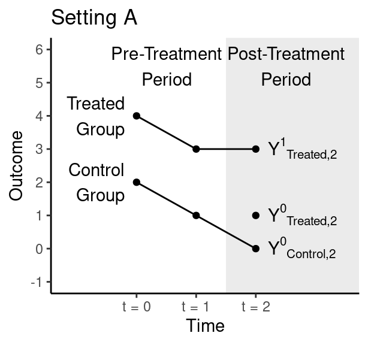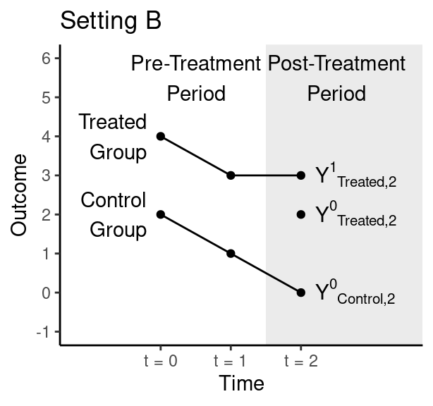

### 1.1 (5 points) {-}

In which setting does the parallel trends assumption hold: A, B, neither, or both?

 

### 1.2 (5 points) {-}

In actual data analysis, can we ever know for certain whether we are in Setting A or Setting B? If the answer is no, then tell us which outcome cannot be observed.

 

### 1.3 (5 points) {-}

A researcher comes to you with the data below, which depict only observed outcomes. That researcher wants to run a difference in difference analysis. Here, we have not depicted the counterfactual outcome because the researcher would not know it.


Why is the parallel trends assumption doubtful in this setting?

 

### 1.4 (5 points) {-}

A researcher is interested in the causal effect of a minimum wage increase on employment. They plan to study only the U.S., and they are interested in a time when the minimum wage rose simultaneously at every place in the U.S. Why won't a difference in difference design work for the researcher's question?

 

### 1.5 (5 points) {-}

Propose another design that the researcher could use to answer the question in (1.4), which may involve data outside the U.S. Answer this question in no more than 3 sentences. Many answers are possible.

 

\newpage

## 2. (25 points) Synthetic Control {-}
In discussion, we considered the paper by Abadie and Gardeazabal (2003) which estimates the effect of terrorist conflict in the Basque Country on GDP per capita. Using synthetic control, they construct a synthetic version of Basque Country. We show the selected weights and plot the gap between the observed and synthetic Basque Country below.


```
##    w.weights                   unit.names unit.numbers
## 2      0.000                    Andalucia            2
## 3      0.000                       Aragon            3
## 4      0.000       Principado De Asturias            4
## 5      0.000             Baleares (Islas)            5
## 6      0.000                     Canarias            6
## 7      0.000                    Cantabria            7
## 8      0.000              Castilla Y Leon            8
## 9      0.000           Castilla-La Mancha            9
## 10     0.851                     Cataluna           10
## 11     0.000         Comunidad Valenciana           11
## 12     0.000                  Extremadura           12
## 13     0.000                      Galicia           13
## 14     0.149        Madrid (Comunidad De)           14
## 15     0.000           Murcia (Region de)           15
## 16     0.000 Navarra (Comunidad Foral De)           16
## 18     0.000                   Rioja (La)           18
```

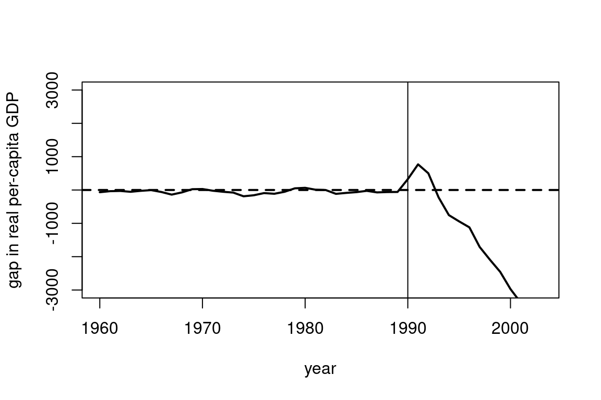

### 2.1 (10 points) Motivation {-}

Instead of selecting the weights using synthetic control, we could have instead estimated the potential outcome for Basque Country using a regression approach. Specifically, we consider the data prior 1970 and simply regress the GDP per capita in the Basque region onto the GDP per capita in other regions to find coefficients $\hat \beta$ so that
\[\widehat{Y^{0}}_{t, Basque} = \sum_j \hat \beta_{j} Y^{0}_{t, j}.\]
We then use the estimated $\hat \beta$ to predict $\widehat{Y^{0}}_{t, Basque}$ after treatment occurs. The weights and gap plot are shown below. We haven't included all the regions in the code below, but you don't need to worry about that.

Looking at the estimated weights sand the gap plots, why might you prefer the synthetic control estimate over the regression based estimate? Why might you prefer the regression estimate over the synthetic control estimate?


```
##   weights                         name id
## 1  -0.632                       Aragon  3
## 2   1.256       Principado De Asturias  4
## 3  -0.586             Baleares (Islas)  5
## 4   0.438                    Cantabria  7
## 5   0.594                     Cataluna 10
## 6  -0.788         Comunidad Valenciana 11
## 7   0.155        Madrid (Comunidad De) 14
## 8  -0.245 Navarra (Comunidad Foral De) 16
## 9   1.136                   Rioja (La) 18
```


 


### 2.2 (7.5 points) Assessing fit {-}

Using the same dataset, suppose we wanted to estimate the causal effect for some policy implemented in Extramadura (another region in Spain) in 1970. Running synthetic control gives an estimate of almost -1000 dollars in 1990. Looking at the plots below, why might you be skeptical of the resulting estimate?  


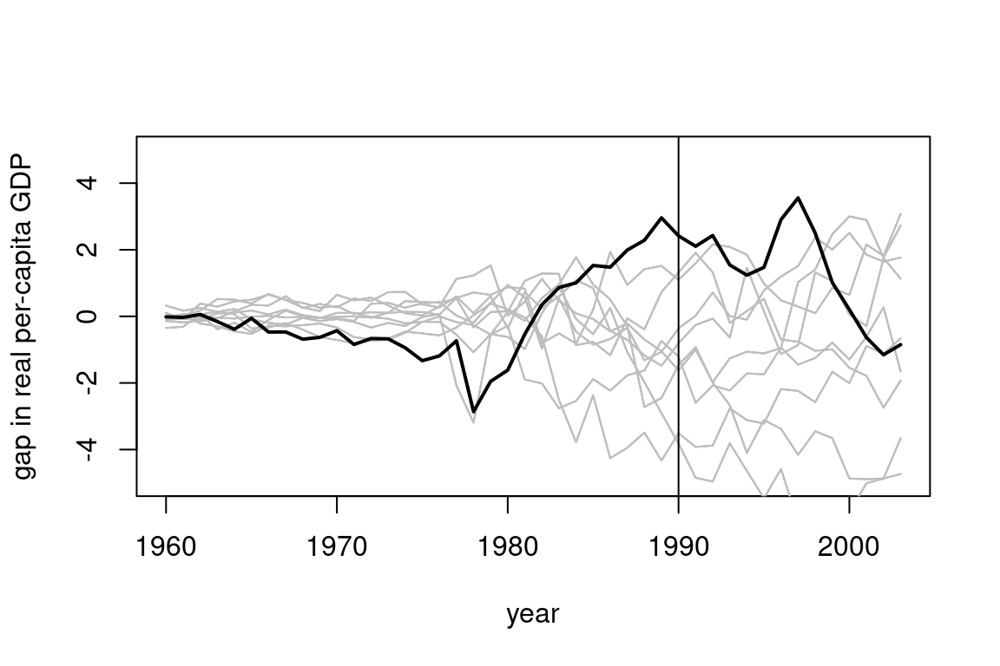
 


### 2.3 (7.5 points) Hypothesis testing {-}
Suppose we used synthetic control for each of the other regions in Spain as a placebo test. Below, we show a hypothetical plot for the gap between the observed and synthetic values for each region. The difference between observed and synthetic Basque country is shown in the dark black line and the others are shown in gray. Note this is made up data. However, if this were the real plot you saw, would you be confident that there was a non-zero causal effect for Basque Country? Explain why or why not.    


  


<!--chapter:end:pset6.Rmd-->


# (PART) Course information {-}

# Who we are {-}

<head>
<style>
img {
  border-radius: 50%;
}
</style>
</head>

## Faculty {.unnumbered}

<div class="row">
  <div class="column"></div>
  <div class="col-md-5">[**Y. Samuel Wang**](https://ysamuelwang.com/)<br>Assistant Professor<br>Statistics and Data Science<br>
[ysw7@cornell.edu](mailto:ysw7@cornell.edu)<br>OH W 3--4 Comstock 1192</div>
</div>

> I enjoy thinking about problems where the goal is to discover interpretable structure which underlies the data generating process. This includes problems in the areas of causal discovery, graphical models, and mixed membership models. In many cases, the methods are tailored for the high-dimensional setting where the number of variables considered may be large when compared to the number of observed samples. My applied interests vary but are generally social science related.

<div class="row">
  <div class="column"></div>
  <div class="col-md-5">[**Mayleen Cortez-Rodriguez**](https://www.mayleencortez.com/)<br>(she / her)<br>PhD Student<br>Applied Mathematics<br>
[mec383@cornell.edu](mailto:mec383@cornell.edu)<br> OH F 9--10 Rhodes 657 - Room 2</div>
</div>

> I'm currently working on problems in causal inference under network interference. I think causal inference is really cool because it has applications across so many different fields. I'm generally interested in applications to public health, social welfare, and social good. In my free time, I enjoy singing, dancing, cooking, watching movies, and traveling to various theme parks. 

<div class="row">
  <div class="column"></div>
  <div class="col-md-5">[**Ian Lundberg**](https://www.ianlundberg.org/)<br>(he / him)<br>Assistant Professor<br>Information Science<br>[ilundberg@cornell.edu](mailto:ilundberg@cornell.edu)<br>OH T 10:30--11:30 Gates 223</div>
</div>

>I study causal questions related to inequality: why some people have more money than others, why disparities exist across social groups, and how we could intervene to promote equality. Beyond causal inference, other joys of mine include hiking, surfing, and oatmeal with blueberries.

## Teaching assistants {.unnumbered}


<div class="row">
  <div class="column"></div>
  <div class="col-md-5">[**Daniel Molitor**](https://www.dmolitor.com/)<br>PhD Student<br>Information Science<br>
[djm484@cornell.edu](mailto:djm484@cornell.edu)<br> OH TH 1--2 Uris 302</div>
</div>

> I’m fascinated by causal relationships and enjoy exploring how they shape our world. My interests are broadly centered in the area of Computational Social Science, and are specifically focused on how we can apply computational and Machine Learning methods to uncover and estimate causal relationships. In my free time I enjoy doing pretty much anything that's active and outdoors and I particularly enjoy playing tennis, kayaking, and fishing (if you have any pro tips, let me know).


<!--chapter:end:y-who-we-are.Rmd-->


# References {-}


<!--chapter:end:z-references.Rmd-->

