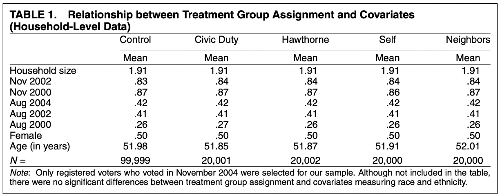
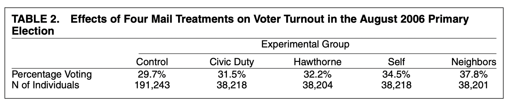
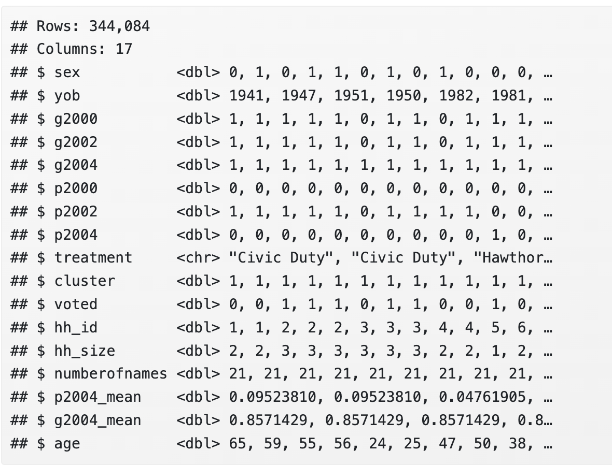
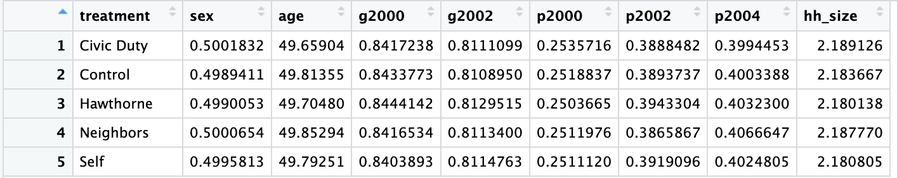
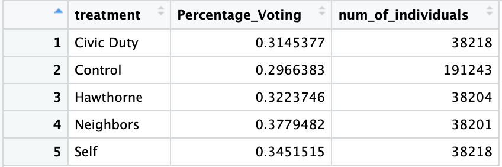

<style>li {line-height: 1.8;}</style>

# Discussion 2. Analyzing an Experiment in R {-}
## STSCI/INFO/ILRST 3900: Causal Inference {-}
#### September 3, 2025 {-}

```{r echo=FALSE, message=FALSE}
library(dplyr)
library(haven)
```
 

### Announcements {-}
- HW 1 due Tuesday (September 9) by 5pm
  - Submit a PDF from RMarkdown via Canvas
- Office Hours throughout the week (see Syllabus or website)
  - Filippo: Thursday 4-5pm in 321A CIS Building
  - Shira: Monday 5-6 pm in 329A CIS Building  
  - Sam: Tuesday 4-5pm, CIS Building  


### Get out and Vote Experiment {-}
- Why do people vote?
- One long-standing theory: People vote due to social norms (civic duty)
- Empirical evidence for this theory was extremely thin
- __Research Question:__ to what extent do social norms cause voter turnout?
- Article: ["Social Pressure and Voter Turnout: Evidence from a Large-scale Field Experiment."](https://www.cambridge.org/core/journals/american-political-science-review/article/social-pressure-and-voter-turnout-evidence-from-a-largescale-field-experiment/11E84AF4C0B7FBD1D20C855972C2C3EB#)in American Political Science Review
- Authors: Alan S. Gerber, Donald P. Green, and Christopher W. Larimer
- We’ll be analyzing their experiment today!


### Experimental Design {-}
- Approximately 80k Michigan households were randomly assigned 1 of 4 mailings encouraging them to vote
  1. Simply reminded them that voting is a civic duty
  2. Told that researchers would be studying their turnout based on public records
  3. Received record of voting turnout *within* their household
  4. Received record of voting turnout within their household *and* their neighbors’ households.
- Third and fourth treatment arms were told that their turnout would be revealed as well

### Goal for Today {-}
__Replicate Something Similar to Tables 1 and 2 from the article__
<div style="text-align: center;"></div>
<div style="text-align: center;"></div>


### Resources for Markdown {-}
- Hadley Wickham's R for Data Science ["Chapter 27"](https://r4ds.had.co.nz/r-markdown.html)
- ["RMarkdown cheat sheet"](https://rmarkdown.rstudio.com/lesson-15.HTML) from RStudio
- ["Data Wrangling and Analyses with Tidyverse"](https://bookdown.org/content/24942ad6-9ed7-44e9-b214-1ea8ba9f0224/data-wrangling-and-analyses-with-tidyverse.html) by Bookdown
- ["RMarkdown for Scientists"](https://rmd4sci.njtierney.com/) by Nicholas Tierney
- If you can’t figure out how to do something, try Googling it first!
- Also feel free to ask a classmate or ask me :)
- For homework sets, don’t forget about Ed Discussion! 


### Step 1: Download the [**.Rmd file here**](assets/discussions/discussion2.Rmd) {-}
- Start by running the code in Section “Necessary packages”
- If you get an error, you may need to install the package

### Step 2: Import and Clean the Data {-}

```{r}
gotv <- read_dta("https://causal3900.github.io/assets/data/social_pressure.dta")
```

- Quick peek at the dataset using the [function `glimpse`](https://dplyr.tidyverse.org/reference/glimpse.html)
- Notice that we have information about year of birth `yob` but not explicitly age
- Notice that the treatments are labeled with the numbers 0 through 4

```{r}
glimpse(gotv)
```

- Calculate the ages of everyone in our dataset in the year 2006
- Use [`mutatet()`](https://dplyr.tidyverse.org/reference/mutate.html) to construct an age variable
- You can do arithmetic operations with information from the dataset
- For example: `mutate(col_3 = col_1 + col_2)`

```{r eval=FALSE}
gotv <- gotv |>
  mutate(age = )
```

- Replace the numeric labels of treatment (0-4) with word labels: 
  - 0: "Control" 
  - 1: "Hawthorne" (this is the 'researchers viewing records via public data' treatment arm)
  - 2: "Civic Duty" (this is the 'voting is your civic duty' treatment arm)
  - 3: "Neighbors" (this is the 'voting turnout revealed to neighbors' treatment arm)
  - 4: "Self" (this is the 'voting turnout revealed to household' treatment arm)
- For this, you will want to use the function `case_when` which is described [here](https://www.sharpsightlabs.com/blog/case-when-r/)
- The general syntax is `case_when(condition ~ output-value)`
- A condition would be `treatement == 0` and an output value would be `"Control"`

```{r eval=FALSE}
gotv <- gotv |>
  mutate(treatment = case_when()) 
```

- When you run `glimpse(gotv)`, you should see something like this

<div style="text-align: center;"></div>


### Step 3: Table 1 {-}
- Is the data balanced on covariates?
- We want to check that the treatment groups are balanced on covariates
- For each treatment arm/group, calculate the mean for each of the designated covariates:
  - Household size, Nov 2002, Nov 2000, Aug 2004, Aug 2002, Aug 2000, Female, Age (in years)
- Use [`group_by()`](https://dplyr.tidyverse.org/reference/group_by.html) to calculate separate means for each treatment arm
- Use [`summarise()`](https://dplyr.tidyverse.org/reference/summarise.html)  to computes the mean of each covariate in `covariates`


```{r eval=FALSE}
covariates <- c("sex", "age", "g2000", "g2002", "p2000", "p2002", "p2004", "hh_size")

gotv_balance <- gotv |>
  group_by(...) |>
  summarise(...)

print(gotv_balance)
```
- Your table should look like this (covariates similar across the groups)
<div style="text-align: center;"></div>


### Step 4: Table 2 {-}
- What are the results of the experiment?
- For each treatment group, calculate the percent that voted and the total number of individuals in that group
- Use `group_by()` to calculate separate means for each treatment arm
- Use `summarise()` to to do the following:
  - Create a column `Percentage_Voting`- the percent that voted of each group
  - Create a column `num_of_individuals`- the total number of people in that group
```{r eval=FALSE}
gotv_results <- gotv |>
  group_by(...) |>
  summarise(...)

print(gotv_results)
```

- Your table should look like this
<div style="text-align: center;"></div>
