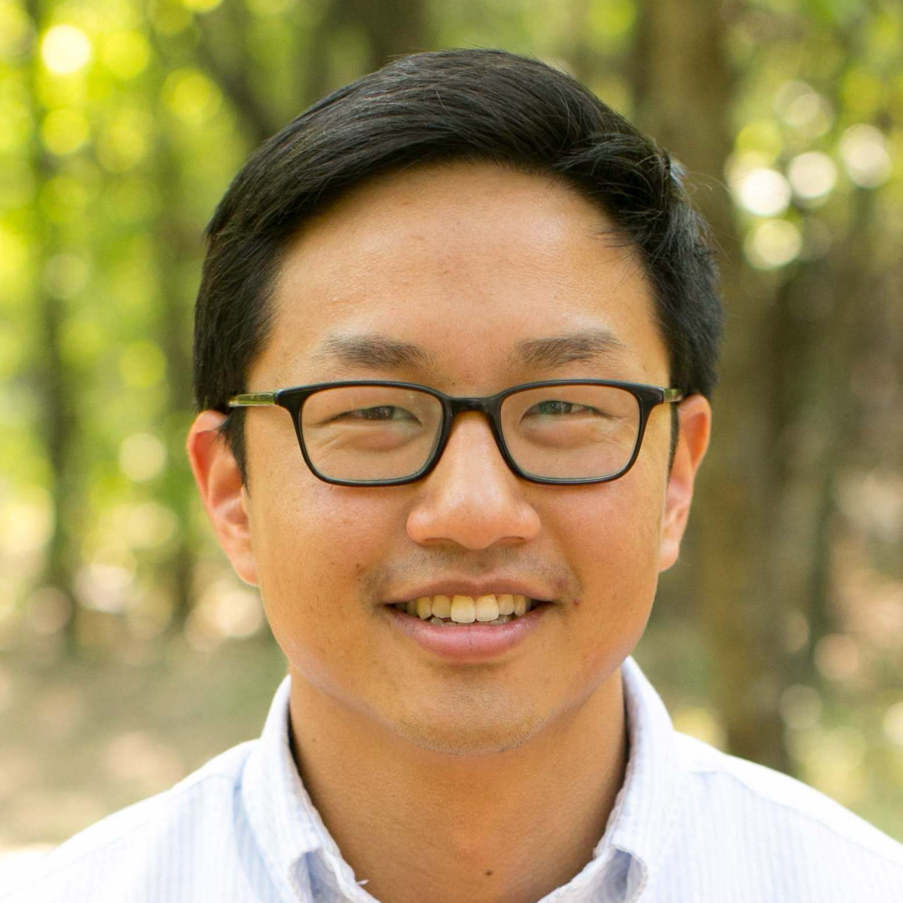
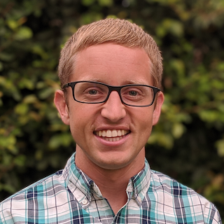

# Who we are {.unnumbered}

<head>

</head>

## Faculty {.unnumbered}

[**Y. Samuel Wang**](https://ysamuelwang.com/)\
[ysw7@cornell.edu](mailto:ysw7@cornell.edu)\

> I enjoy thinking about problems where the goal is to discover interpretable structure which underlies the data generating process. This includes problems in the areas of causal discovery, graphical models, and mixed membership models. In many cases, the methods are tailored for the high-dimensional setting where the number of variables considered may be large when compared to the number of observed samples. My applied interests vary but are generally social science related.

[**Ian Lundberg**](https://www.ianlundberg.org/) (he / him)\
[ilundberg@cornell.edu](mailto:ilundberg@cornell.edu)\

>I study causal questions related to inequality: why some people have more money than others, why disparities exist across social groups, and how we could intervene to promote equality. Beyond causal inference, other joys of mine include hiking, surfing, and oatmeal with blueberries.

## Teaching assistants {.unnumbered}

Coming soon!
