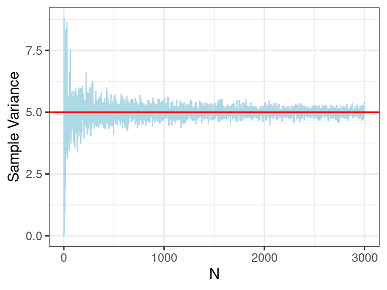
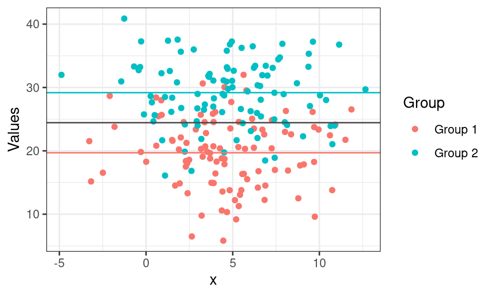
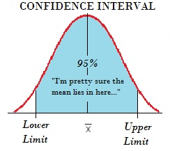

---
output:
  html_document:
    mathjax: "https://cdn.jsdelivr.net/npm/mathjax@3/es5/tex-mml-chtml.js"
---
# (PART) Discussions {-}
<style>li {line-height: 1.8;}</style>

# Discussion 1. Prob & Stats Review {-}
## STSCI/INFO/ILRST 3900: Causal Inference {-}
#### August 27, 2025 {-}

 
To execute these simulations locally, [**download the .Rmd here**](assets/discussions/discussion01.Rmd)

### Announcements {-}
- Office Hours throughout the week (see Syllabus or website)
  - Filippo: Thursday 4-5pm in 321A Computing & Information Science Building
  - Shira: Monday 5-6 pm in 329A Computing and Information Science Building  
  - See Ed Discussion for Zoom links/info

### Probability and Statistics Review {-}
- Expectation
- Variance
- Conditional Expectation 
- Independence
- Bernoulli Random Variables
- Law of Total Expectation
- Confidence Intervals
- Regression (OLS, logistic)


#### 1. Expectation {-}
##### (Expected Value, Population Mean, Average) {-}

- Notation: $E(X), \mu$
- The expected value of a finite random variable
  $$\mu=E(X) := \sum_{i=1}^N x_i P(x_i) \quad \text{where} \quad P(x_i):=\text{prob}(X=x_i)$$
- The expected value of a countable random variable, i.e. the (long run) average
  $$E(X):= \sum_{i=1}^\infty x_i P(x_i)$$
- For $n$ independent and identically distributed (i.i.d.) random variables $X_1,\ldots,X_N$
the sample mean is
$$\bar X = \frac{1}{N}\sum_{i=1}^N X_i$$
- Law of Large Numbers (LLN): the sample mean converges to the expected value (population mean) as $N \to \infty$
- Example: $X_i$ are random draws from $\sim \mathcal{N}(2,5)$ (a Normal r.v. with mean 2, variance 5)


``` r
true_mean <- 2
true_var <- 5

x <- seq(-8, 12 , length=1000)
y <- dnorm(x, mean=true_mean, sd=sqrt(true_var))

ggplot() + geom_line(aes(x,y)) + 
    geom_vline(xintercept = true_mean, color = "red") +
    theme_bw() +
    labs(y="Density")
```


``` r
sample_seq <- 1:3000
means <- numeric(length(sample_seq))
vars <- numeric(length(sample_seq))


for(i in 1:length(sample_seq)){
  n <- sample_seq[i]
  data <- rnorm(n = n, mean = true_mean, sd = sqrt(true_var))
  
  sample_mean <- mean(data)
  sample_var <- sum((data - sample_mean)^2)/length(data)
  
  means[i] <- sample_mean
  vars[i] <- sample_var
}


means <- tibble("N" = sample_seq, "Sample Mean" = means)
vars <- tibble("N" = sample_seq, "Sample Variance" = vars)

colors <- c("Sample Mean" = "lightblue", "Population Mean" = "red")

ggplot(means, aes(y = `Sample Mean`, x = N)) +
  geom_line(color = "lightblue") +
  geom_abline(slope = 0, intercept = true_mean, color = "red") +
  theme_bw()
```


#### 2. Variance {-}
##### Describes the spread of the data {-}

- Notation: $V(X), Var(X),\sigma^2$
- Variance is the average of the squared differences from the mean
- For a random variable $X$ with expected value $\mu:=E(X)$, the variance is
  $$\sigma^2 = Var(X) := E\Big[\big(X-\mu\big)^2\Big] = E\big[X^2\big] - \mu^2$$
  More explicitly
  $$Var(X) = \sum_{i=1}^n P(x_i)\cdot (x_i-\mu)^2 \quad \text{where} \quad P(x_i):=\text{prob}(X=x_i)$$

#### 3. Sample (Empirical) Variance {-}
##### For a finite dataset or finite sample {-}

- In practice, you can compute the variance of a finite dataset as
  $$\sigma^2 = \Big(\frac{1}{N}\sum_{i=1}^N x_i^2\Big)-\bar{X}^2 \quad \text{where} \quad \bar{X} := \frac{1}{N}\sum_{i=1}^N x_i$$ 
- You don’t need to have the formula memorized, just be aware of it
- Likely you’ll never have to explicitly compute it this way, just use an R function
- Example: $X_i$ are random draws from $\sim \mathcal{N}(2,5)$ (a Normal r.v. with mean 2, variance 5)


``` r
ggplot(vars, aes(y = `Sample Variance`, x = N)) +
  geom_line(color = "lightblue") +
  geom_abline(slope = 0, intercept = true_var, color = "red") +
  theme_bw()
```




#### 4. Conditional Expectation {-}

- Notation: $E(X|Y)$
- The expected value given a set of “conditions” 
- Read as “the expectation of $X$ given (or conditioned on) $Y$” 
  $$E(X|Y) = \sum_{i=1}^n x_i \cdot P(X=x_i | Y) \quad \text{where} \quad P(X=x_i|Y) = \frac{P(X=x_i \text{ and } Y)}{P(Y)}$$
- Example: Roll a fair dice
  - Let $A=1$ if you roll an even number, $0$ otherwise
  - Let $B=1$ if you roll a prime number,  $0$ otherwise
  - Then
    $$E[A] = \sum_{i=1}^6 a_i\cdot P(a_i) = \frac{0+1+0+1+0+1}{6} = \frac{1}{2}$$
    and the conditional expectation of $A$ given $B=1$ (i.e. we rolled 2, 3, or 5)
    $$E[A | B=1]= \sum_{i=1}^3 a_i\cdot P(a_i|B=1) = \frac{1 + 0 + 0}{3}= \frac{1}{3}$$
- Visualization in R for $E(X)=25$, $E[X| \text{group 1}] = 20$, $E[X| \text{group 2}] = 30$





#### 5. Independence {-}

- Notation: $\perp, \ X \perp Y$
- Two random variables are independent if the outcome of one does not give any information about the outcome of the other
- Events $A$ and $B$ are independent if $P(A \text{ and } B) =P(A \cap B) = P(A)P(B)$
- Recall: $P(A \cap B) = P(A | B)P(B)$
- If $A \perp B$ , then $P(A|B)=P(A) \text{ and } P(B|A)=P(B)$
- Example: 
  - Suppose you roll two fair dice. Let $A$ be the value of the first dice and let $B$ be the value of the second dice. 
  - If I say that $A=3$, does that give you any info about what the value of $B$ is?
  -  We can show that the events $A=3$ and $B=3$ are independent:
    \begin{align*}
    P(\{A=3\} \cap \{B=3\}) &= P(\{A=3\} | \{B=3\})\cdot P(\{B=3\}) \\
    &= \frac{1}{6} \cdot \frac{1}{6} \\
    &= P(\{A=3\}) \cdot P(\{B=3\})
    \end{align*}
  - To show $A \perp B$, you would show this holds for all values of $A$ and $B$


#### 6. Bernoulli Random Variables {-}
##### A binary/dichotomous random variable {-}

- Notation: $B(p), \text{Bernoulli}(p), \mathcal{B}(p)$
- Takes the value $1$ with probability (w.p.) $p$, and the value $0$ w.p. $q:=1-p$
- Let $X \sim B(p)$:
  - “Let $X$ be a Bernoulli random variable with mean $p$”
  - $E(X) = p \text{ and } Var(X) = p(1-p) = pq$
- Cool fact: $E(X) = P(X=1) = p$

#### 7. Law of Total Expectation {-}
##### (i.e. law of iterated expectations, tower rule) {-}

- Useful property (or “trick) that will be used in class $$E(X) = E\big(E(X|Y)\big) $$
- Don’t worry too much about the technical details, just add to your toolbox :)


#### 8. Confidence Intervals {-}

- A set of values that contains the real parameter with probability $1-\alpha$
- Define $CI=[L,U]$ then $P(L \leq \mu \leq U)= 1-\alpha$
- Usually $1-\alpha$ is $95\%$ or $99\%$
- Example: $X_i$ are random draws from $\sim \mathcal{N}(2,5)$
- Estimating expectation of a random variable using sample mean:
  $$\hat E(X)=\hat\mu= \bar X =\frac{1}{N}\sum_{i=1}^N X_i$$
- $\bar X$ is an estimate for $\mu$ with some uncertainty
- $P(\mu \leq \bar X -c)=P(\mu \geq \bar X +c)=\frac{\alpha}{2}$
- $P\left(\frac{\bar X-\mu}{\sigma/\sqrt{N}}\leq \frac{\mu-c-\mu}{\sigma/\sqrt{N}}\right) \Rightarrow -c=Z_\frac{\alpha}{2}\frac{\sigma}{\sqrt{N}}$
- $Z_\frac{\alpha}{2}$ is the the critical value of the Normal distribution (For example in R: $\texttt{qnorm(0.025)})$
- $CI= \bar X \pm Z_\frac{\alpha}{2} \frac{\sigma}{\sqrt{N}}$



#### 9. Regression {-}
- Estimates the relationships between $X$ and $Y$ where
- $Y$- the dependent variable, outcome/response 
- $X$- independent variable, regressor/explanatory
- Main types of regression: Linear and Logistic

##### 9.1. Linear Regression {-}
- Assume data was generated: $Y_i=\alpha+\beta X_i+\varepsilon_i$  for  $i=1,\ldots,N$
- $\alpha, \beta$ are the coefficients where $\alpha$ is the intercept and $\beta$ the slope
<div></div>
- Using ordinary least squares (OLS) to estimate $\hat Y_i=\hat\alpha+\hat\beta X_i$
- Minimizes sum of squared errors: $(\hat \alpha,\hat \beta)=\mathrm{argmin}_{a,b} \sum_{i=1}^N\big(Y_i-(a+bX_i)\big)^2$
- $\frac{\partial}{\partial a} SSE = \sum_{i=1}^N -2(Y_i-a-bX_i) \qquad \Rightarrow \qquad \hat \alpha=\bar Y-\hat \beta \bar X$
- $\frac{\partial}{\partial b} SSE = \sum_{i=1}^N -2(Y_i-(\bar Y-b\bar X) -bX_i)X_i$
$\qquad \qquad = \sum_{i=1}^N -2\big[(Y_i-\bar Y)X_i-b(X_i-\bar X)X_i \big]$
$\qquad\qquad\qquad \Rightarrow \hat \beta=\frac{\sum_{i=1}^N (Y_i-\bar Y)(X_i-\bar X)}{\sum_{i=1}^N (X_i-\bar X)^2}$

##### 9.2. Logistic Regression {-}
- $Y_i$- the outcome variable is binary for $i=1,\ldots,N$
- Use a link function to estimate $P(Y_i=1):=p_i$ that satisfies $\mathbb{R} \to (0,1)$
  - Most common- logistic function:  $\sigma(t)=\frac{1}{1+e^{-t}}$
  <div></div>
- In a linear model we estimate $\hat Y_i=\hat\alpha+\hat\beta X_i$
- In logistic model we estimate $\hat p_i= \frac{1}{1+e^{-(\hat\alpha+\hat\beta X_i)}}$
- $\alpha+\beta X_i= \ln\left(\frac{ p_i}{1- p_i}\right)$
- Odds ratio: $\frac{ p_i}{1- p_i}=\frac{P(Y_i=1)}{P(Y_1=0)}$
- For example: $\frac{P(\text{Passing exam})}{P(\text{Not passing})}=\frac{3/4}{1/4}$ the odds ratio is $3:1$
- To estimate $\hat \alpha, \hat \beta$ we use maximum likelihood estimates (MLE)
- Likelihood function:  $L(a,b;y)= \prod_{i=1}^N P(Y_i=y_i)= \prod_{i=1}^Np_i^{y_i}(1-p_i)^{(1-y_i)}$
- Log likelihood: $l(a,b;y)= \sum_{i=1}^N y_i\ln(p_i)+(1-y_i)\ln(1-p_i)=\sum_{i=1}^N \ln(1-p_i)+y_i \ln\left(\frac{p_i}{1-p_i}\right)$
- To find MLE we solve $\frac{\partial}{\partial (a,b)}l(a,b;y)=0$
- No close form solution iterative method such as: gradient descent or Newton–Raphson
<div style="text-align: center;"></div>


### R/RStudio Intro {-}

- R is an open-source programming language
- Used for statistical computing and creating plots
- [**Download and install R**](https://cran.r-project.org/)
<div style="text-align: center;"> </div>
- RStudio is an open-source IDE (integrated development environment)
- [**Download and install RStudio**](https://posit.co/download/rstudio-desktop/) (scroll down for earlier versions)
<div style="text-align: center;">  </div>
- install.packages("rmarkdown")
- install.packages(“knitr")
- [**Download this .Rmd**](discussion1.Rmd) and open in RStudio
- Compile to a PDF (HW submission will be a PDF file)
<div></div>
- [**R Markdown tutorial **](https://www.rforecology.com/post/how-to-use-rmarkdown-part-one/) and open in RStudio
<div style="text-align: center;">  </div>
- Subscripts and superscripts: to get $Y_{i}^{a}$ inline use `$Y_{i}^{a}$`
