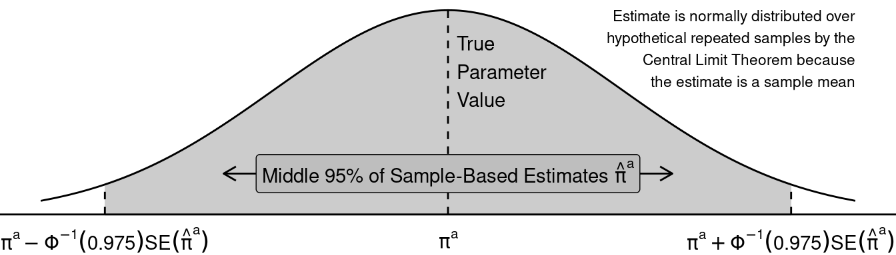

<style>li {line-height: 1.8;}</style>

# Discussion 4. Interference and Stat Review {-}
## STSCI/INFO/ILRST 3900: Causal Inference {-}
#### September 17, 2025 {-}


## Interference {-}
You can download the [**slides**](assets/discussions/discussion4-interference.pdf) for this week's discussion.


## Stat review reminder {-}
- $\pi^a= P(Y^a=1)$) under treatment condition $a$
- Let $\hat\pi^a$ be the estimate of that unknown probability
- $\hat\pi^a = \frac{1}{n_a}\sum_{i:A_i=a} Y_i^a$, proportion of people in that treatment condition to have outcome 1
- To make a confidence interval on $\hat\pi^a$ we need the standard error of $\hat\pi^a$

### Standard error {-}
- Let $Y^a$ be a Bernoulli random variable
- The variance of $Y^a$ is $V(Y^a) = \pi^a (1-\pi^a)$
- We have estimated by an average: $\hat\pi^a$
- If we did this many times in many hypothetical samples, we would get different estimate
- The estimates sampling variance is $V(\hat\pi^a) = \frac{\pi^a(1-\pi^a)}{n_a}$
- The standard error is the square root of the sampling variance: 
$$SE(\hat\pi^a) = \sqrt\frac{\pi^a(1-\pi^a)}{n_a}$$
- We can estimate this SE by plugging in our estimate $\hat\pi^a$
- In R: we translated the standard error formula into code


> 
> ``` r
> se_binary <- function(p, n) {
>   se <- sqrt( p * (1 - p) / n )
>   return(se)
> }
> ```

### Sampling distribution {-}

- $\hat\pi^a$ is a sample mean
- By the Central Limit Theorem: as $n \to \infty$, across hypothetical repeated samples the distribution of $\hat\pi^a$ estimates becomes Normal
- Across repeated samples, the middle 95% of estimates will fall within a known range:
$$\pi^a \pm \Phi^{-1}(.975) \times SE(\hat\pi^a)$$
- where $\Phi^{-1}()$ is the quantile of the standard Normal distribution
- $\Phi^{-1}(.975) \approx 1.96$, so the number 1.96 might be familiar to you 




- Plug in the estimates $\hat\pi^a$ and $\widehat{SE}(\hat\pi^a)$ to get a 95% confidence interval
- The CI is centered on the estimate $\hat\pi^a$
- If we repeatedly made a CI using hypothetical samples from the population, the CI would contain the unknown true parameter $\pi^a$ 95% of the time
- In R: we translated the confidence interval formula into code


> 
> ``` r
> ci_lower <- function(estimate, standard_error) {
>   estimate - qnorm(.975) * standard_error
> }
> ci_upper <- function(estimate, standard_error) {
>   estimate + qnorm(.975) * standard_error
> }
> ```
