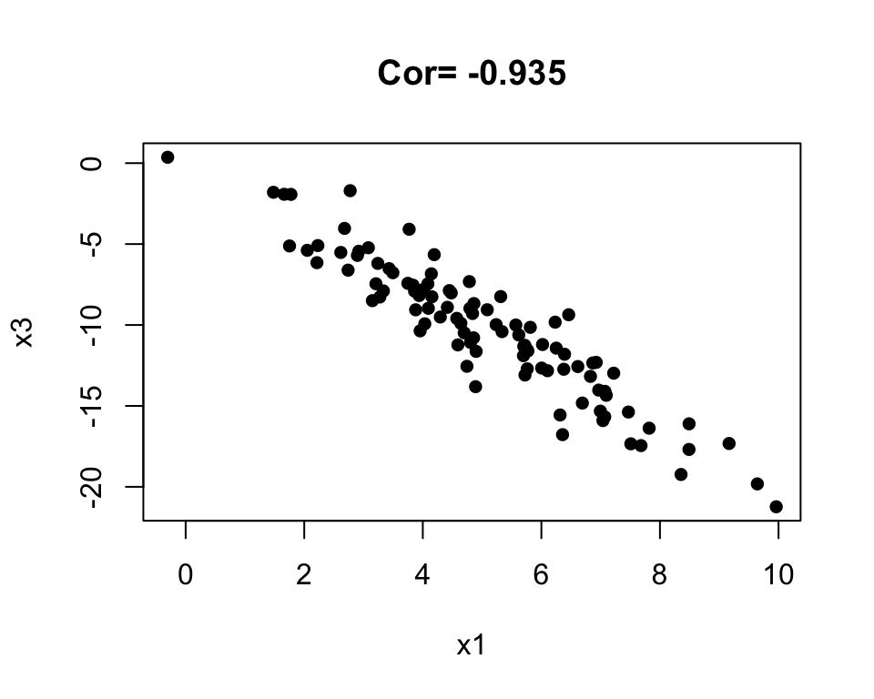
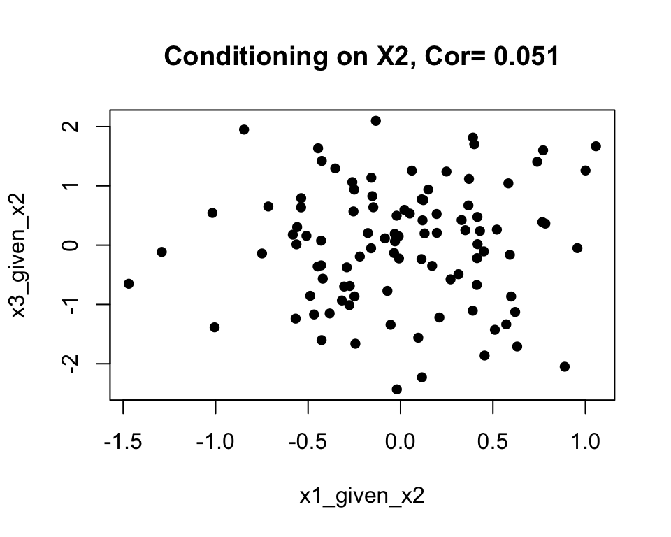
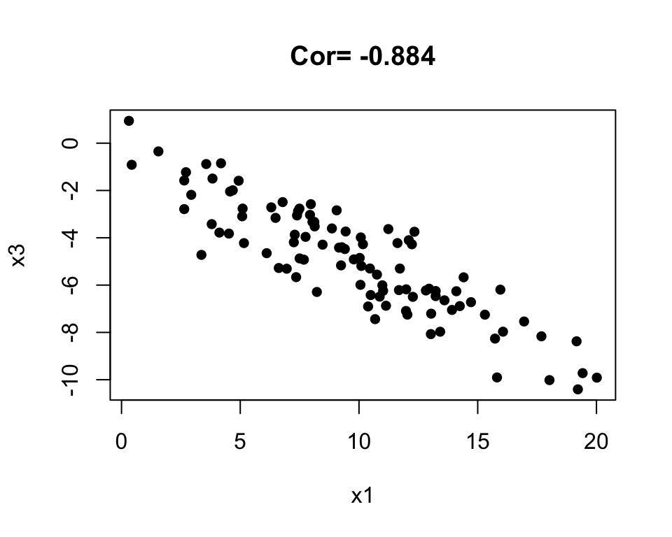
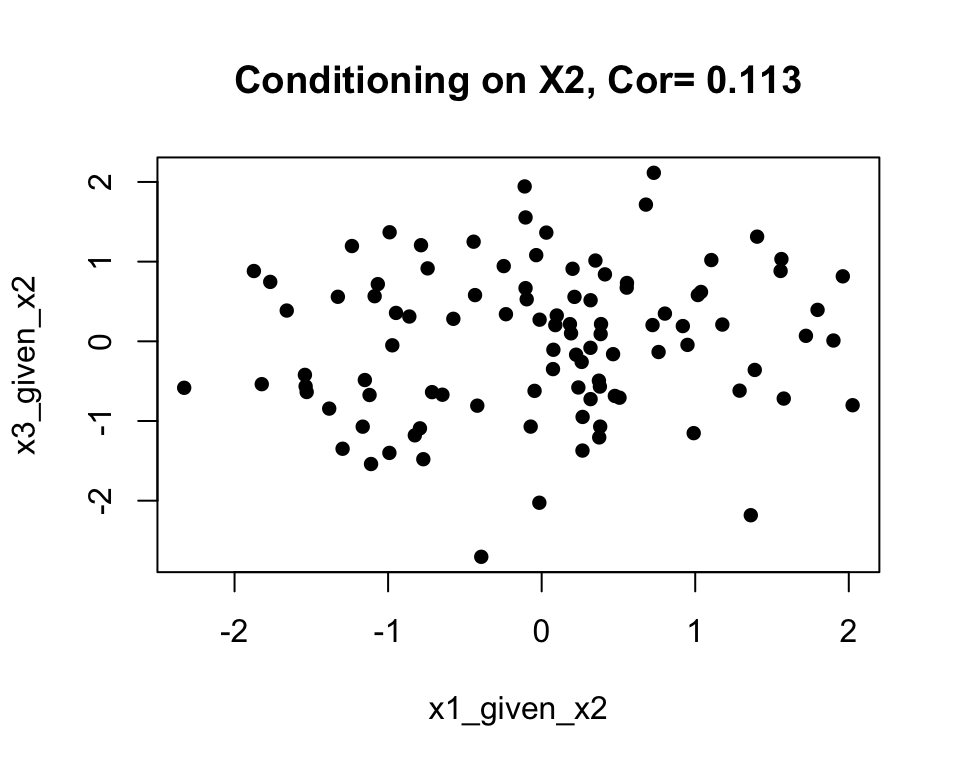
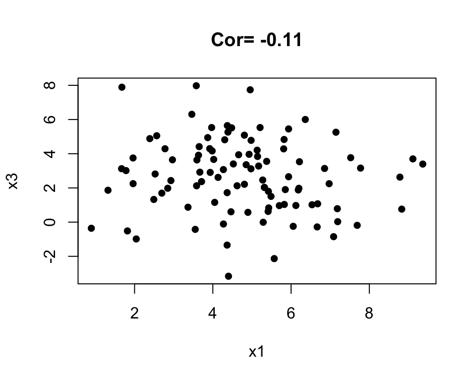
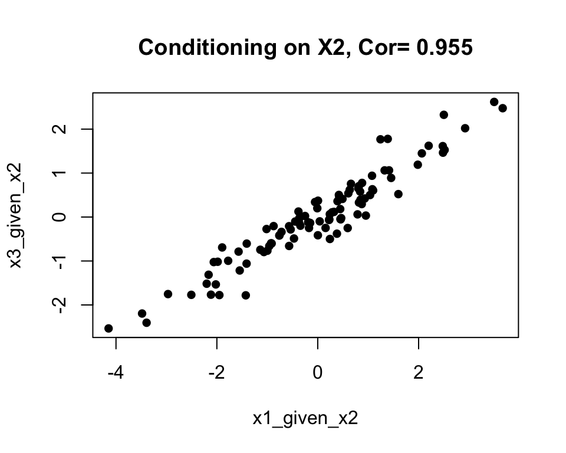

<style>li {line-height: 1.8;}</style>

# Discussion 5. Directed Acyclic Graphs {-}
## STSCI/INFO/ILRST 3900: Causal Inference {-}
#### September 30, 2026 {-}


You can download the [**slides**](assets/discussions/discussion5_dags.pdf) for this week's discussion.


### DAGs Review {-}

- Colliders: with example in R
- Open/closed paths
- In-class assignment: practice with DAGs


#### Colliders {-}


For each of the following DAGs we will look whether $X_1$ and $X_3$ are independent- $X_1 \perp\!\!\!\!\perp X_3$ and whether it changes when we condition on $X_2$: $X_1 \perp\!\!\!\!\perp X_3 \mid X_2$ \

In practice, conditioning $Y$ on $X$, involves linear regression $Y=\beta X + \varepsilon$. We ask "what part of $Y$ is *not* explained by $X$?". The residuals $Y-\hat \beta X$ represent the part of $Y$ that is left after removing the part explained by $X$.

### DAG 1: {-}
$$X_1 \rightarrow X_2 \rightarrow X_3$$


``` r
x1 <- rnorm(n = 100, mean = 5, sd = 2)
x2 <- 2 * x1 + rnorm(n = 100, mean = 0, sd = 1)
x3 <- -1 * x2 + rnorm(n = 100, mean = 0, sd = 1)

plot(x1,x3, pch=16, main = paste("Cor=",round(cor(x1,x3),3)))
```



``` r
x1_given_x2 <- lm(x1 ~ x2)$residuals
x3_given_x2 <- lm(x3 ~ x2)$residuals
plot(x1_given_x2,x3_given_x2, pch=16, main = paste("Conditioning on X2, Cor=",round(cor(x1_given_x2,x3_given_x2),3)))
```



### DAG 2: {-}
$$X_1 \leftarrow X_2 \rightarrow X_3$$


``` r
x2 <- rnorm(n = 100, mean = 5, sd = 2)
x1 <- 2 * x2 + rnorm(n = 100, mean = 0, sd = 1)
x3 <- -1 * x2 + rnorm(n = 100, mean = 0, sd = 1)

plot(x1,x3, pch=16, main = paste("Cor=",round(cor(x1,x3),3)))
```



``` r
x1_given_x2 <- lm(x1 ~ x2)$residuals
x3_given_x2 <- lm(x3 ~ x2)$residuals
plot(x1_given_x2,x3_given_x2, pch=16, main = paste("Conditioning on X2, Cor=",round(cor(x1_given_x2,x3_given_x2),3)))
```



### DAG 3: {-}
$$X_1 \rightarrow X_2 \leftarrow X_3$$
 

``` r
x1 <- rnorm(n = 100, mean = 5, sd = 2)
x3 <- rnorm(n = 100, mean = 3, sd = 2)
x2 <- 2 * x1 -3 * x3 + rnorm(n = 100, mean = 0, sd = 1)

plot(x1,x3, pch=16, main = paste("Cor=",round(cor(x1,x3),3)))
```



``` r
x1_given_x2 <- lm(x1 ~ x2)$residuals
x3_given_x2 <- lm(x3 ~ x2)$residuals
plot(x1_given_x2,x3_given_x2, pch=16, main = paste("Conditioning on X2, Cor=",round(cor(x1_given_x2,x3_given_x2),3)))
```


 
 
 
