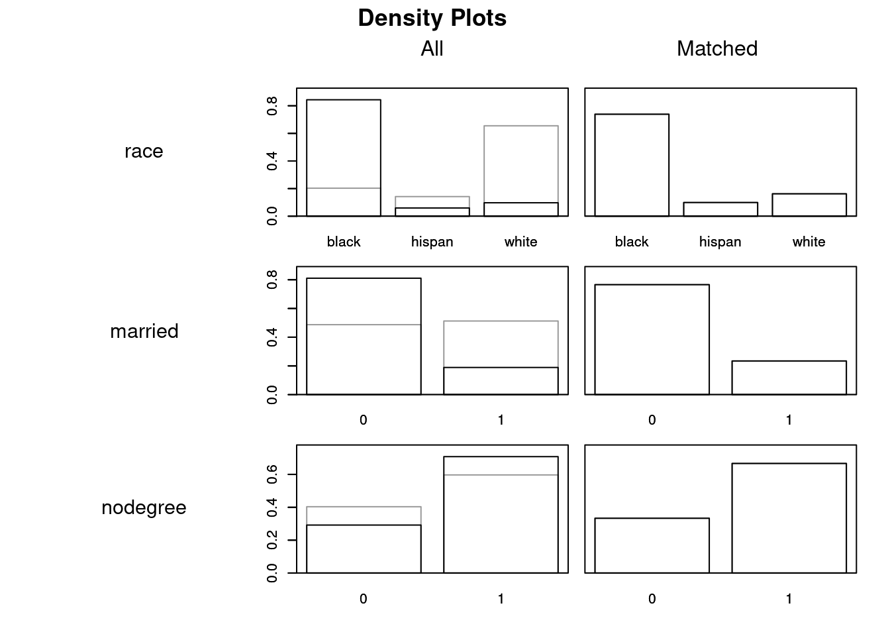

<style>li {line-height: 1.8;}</style>

# Discussion 8. Matching {-}
## STSCI/INFO/ILRST 3900: Causal Inference {-}
#### October 15, 2025 {-}

You can download the [**slides**](assets/discussions/matching_lab_slides.pdf) for this week's discussion and the [**.Rmd**](assets/discussions/matching_lab.Rmd).


The first exercise and problem set 4 use the `lalonde` dataset from the following paper:

> Dehejia, R. H. and Wahba, S. 1999. [Causal Effects in Nonexperimental Studies: Reevaluating the Evaluation of Training Programs](https://www-jstor-org.proxy.library.cornell.edu/stable/2669919?). Journal of the American Statistical Association 94(448):1053--1062.

The paper compares methods for observational causal inference to recover an average causal effect that was already known from a randomized experiment. You do not need to read the paper; we will just use the study's data as an illustration. We'll load the data into R with the first code block.


To learn about the data, type `?lalonde` in your R console.

## 2. Example: Exact Matching with low-dimensional confounding {-}

Our goal is to estimate the effect of job training `treat` on future earnings `re78` (real earnings in 1978), among those who received job training (the average treatment effect on the treated, ATT).

### 2.1.  Using `matchit()` to conduct a matching {-}

For this part, we assume that three variables comprise a sufficient adjustment set: `race`, `married`, and `nodegree`. We use `matchit` with:

- a formula `treat ~ race + married + nodegree`
- `method = "nearest"` to conduct exact matching, which matches two units only if they are identical along `race`, `married`, and `nodegree`
- `exact = ~ race + married + no degree' enforces exact 1:1 matching on the variables included
- `data = lalonde` since we are using the `lalonde` data
-  `estimand = "ATT"` since we are targeting the average treatment effect on the treated (ATT)

We then use the `summary()` function to see how many control units and how many treatment units were matched. 


``` r
exact_low <- matchit(treat ~ race + married + nodegree,
                 data = lalonde,
                 method = "nearest",
                 exact = ~ race + married + nodegree,
                 estimand = "ATT")
# Note: There are multiple correct ways to extract the numbers below
summary(exact_low)$nn
```

```
##               Control Treated
## All (ESS)         429     185
## All               429     185
## Matched (ESS)     111     111
## Matched           111     111
## Unmatched         318      74
## Discarded           0       0
```

**Question**: How many control units were matched? How many treated units?


### 2.2. Assessing the Match: Balance of Covariates {-}

In matching, one thing we care about is balance across covariates. In other words, we want to see that the distributions of different covariates are about the same between the treatment and the control groups. We can check how well the balancing has been done with the `summary()` function.

- `interactions`: check interaction terms too? (T or F)
- `un`: show statistics for unmatched data as well? (T or F)


``` r
summary(exact_low, interactions = F, un = F)$sum.matched
```

```
##            Means Treated Means Control Std. Mean Diff.
## distance       0.5005432     0.5005432   -3.330669e-16
## raceblack      0.7387387     0.7387387    0.000000e+00
## racehispan     0.0990991     0.0990991    0.000000e+00
## racewhite      0.1621622     0.1621622    0.000000e+00
## married        0.2342342     0.2342342    0.000000e+00
## nodegree       0.6666667     0.6666667    0.000000e+00
##            Var. Ratio   eCDF Mean     eCDF Max
## distance            1 4.91505e-18 1.734723e-17
## raceblack          NA 0.00000e+00 0.000000e+00
## racehispan         NA 0.00000e+00 0.000000e+00
## racewhite          NA 0.00000e+00 0.000000e+00
## married            NA 0.00000e+00 0.000000e+00
## nodegree           NA 0.00000e+00 0.000000e+00
##            Std. Pair Dist.
## distance                 0
## raceblack                0
## racehispan               0
## racewhite                0
## married                  0
## nodegree                 0
```

``` r
plot(exact_low, type = "density", interactive = F)
```



**Question**: What do you notice about the means of different covariates for the treated versus control groups? 


In this case, we basically have perfect balance. This doesn't always happen. Depending on the method and parameters you use, you could have "bad" matches where the covariates are unbalanced. If you conduct a matching and the covariate balance doesn't look good, try another matching procedure!


### 2.2. Effect estimate {-}

Here, we estimate linear regression models using the match data from 2.1 using the `lm()` function with the formula  `re78 ~ treat + race + married + nodegree` and `re78 ~ treat*(race + married + nodegree)`. The second linear model includes an interaction term. We pass weights that come from the matching. Notice that for this piece, we have passed the matched data `match.data(exact_low)`. In the model without an interaction, the coefficient in front of the variable `treat` in the linear regression is our estimated effect. We can also simply compare the means of the two groups or calculate the parametric g-formulat by hand or by using \textt{avg_comparisons} from the 'marginaleffects' package. When using exact 1:1 matching and simple linear model, all estimates will agree. 

If we use a different type of matching procedure, the estimates typically will not all be exactly the same. Additionally, if we use a more complicated model (such as the one with interactions) the causal effect will not correspond to a single coefficient from the linear model, but the parametric g-formula will still work.


``` r
fit <- lm(re78 ~ treat + race + married + nodegree,
          data = match.data(exact_low),
          w = weights)

coef(fit)
```

```
## (Intercept)       treat  racehispan   racewhite     married 
##   6855.9543    379.9167   3264.0613   3070.2140   1795.8455 
##    nodegree 
##  -3022.6687
```

``` r
fit_int <- lm(re78 ~ treat*(race + married + nodegree),
          data = match.data(exact_low),
          w = weights)

coef(fit_int)
```

```
##      (Intercept)            treat       racehispan 
##       6517.07875       1057.66787       5175.55809 
##        racewhite          married         nodegree 
##       4891.25175       1763.05130      -3229.92957 
## treat:racehispan  treat:racewhite    treat:married 
##      -3822.99362      -3642.07549         65.58842 
##   treat:nodegree 
##        414.52179
```

``` r
## parametric g-formula by hand from last week

## Get Actually treated individuals and set treatment to 0
d_all_control <- match.data(exact_low) %>%
  subset(treat == 1) %>% mutate(treat =0)

## Get Actually treated individuals
d_all_treat <- match.data(exact_low) %>%
  subset(treat == 1)

potential_outcomes_under_control <- predict(object = fit, newdata = d_all_control)
potential_outcomes_under_treatment <- predict(object = fit, newdata = d_all_treat)


# compare means of groups
mean(potential_outcomes_under_treatment) - mean(potential_outcomes_under_control)
```

```
## [1] 379.9167
```

``` r
# Take the average outcome for each group
match.data(exact_low) %>% group_by(treat) %>% summarise(mean = mean(re78)) 
```

```
## # A tibble: 2 × 2
##   treat  mean
##   <int> <dbl>
## 1     0 6083.
## 2     1 6463.
```

``` r
## parametric g-formula using marginal effects
avg_comparisons(fit,
                variables = "treat",
                vcov = ~subclass,
                newdata = subset(treat == 1))
```

```
## 
##  Estimate Std. Error     z Pr(>|z|)   S 2.5 % 97.5 %
##       380        903 0.421    0.674 0.6 -1391   2151
## 
## Term: treat
## Type: response
## Comparison: 1 - 0
```

``` r
potential_outcomes_under_control <- predict(object = fit_int, newdata = d_all_control)
potential_outcomes_under_treatment <- predict(object = fit_int, newdata = d_all_treat)

# compare means of groups
mean(potential_outcomes_under_treatment) - mean(potential_outcomes_under_control)
```

```
## [1] 379.9167
```

``` r
## parametric g-formula using marginal effects
avg_comparisons(fit_int,
                variables = "treat",
                vcov = ~subclass,
                newdata = subset(treat == 1))
```

```
## 
##  Estimate Std. Error     z Pr(>|z|)   S 2.5 % 97.5 %
##       380        898 0.423    0.672 0.6 -1379   2139
## 
## Term: treat
## Type: response
## Comparison: 1 - 0
```


**Question**: What is the estimated effect of job training on earnings?


## 3. Try it Yourself: Exact matching with high-dimensional confounding {-}

### 3.1. Using `matchit()` to conduct a matching {-}
Now suppose the adjustment set needs to also include 1974 earnings, `re74`. The adjustment set for this part is `race`, `married`, `nodegree`, and `re74`. Repeat exact matching as above.


``` r
# Your code goes here
```

**Question**: How many control units were matched? How many treated units?


### 3.2. Assessing the Match: Examining matched units {-}

Look at the `re74` values in the full data and among the matched units.

Here is one way to do this:

1. Use the `select()` function to get the `re74` column in the *full* data. Pass this to the `summary()` function to look at descriptive statistics of the `re74` values in the full data.
2. Use the `select()` function to get the `re74` column in the *matched* data. Pass this to the `summary()` function to look at descriptive statistics of the `re74` values in the full data. You can get the matched data using the `match.data` function. 

- Examples of using the `summary` function are [**here**](https://intro2r.com/summarising-data-frames.html).
- Examples of using the `select()` function are [**here**](https://benwhalley.github.io/just-enough-r/selecting-columns.html)

Full data:

``` r
# your code goes here
```

Matched data:

``` r
# your code goes here
```

**Explain what happened**: What do you notice? What is different about the values of `re74` in the full data versus the matched data? Explain what happened and why it happened. Briefly interpret the result from 3.2: what is the drawback of using exact matching in this setting?

### 3.3. Using `matchit()` to conduct a matching {-}
Now suppose the adjustment set needs to also include 1974 earnings, `re74`. The adjustment set for this part is `race`, `married`, `nodegree`, and `re74`. Use nearest neighbor matching, but do not require exact matches. Instead pick a distance of your choice.


``` r
# use help to see what the various distances are
?matchit

# Your code goes here

non_exact_high <- matchit(treat ~ race + married + nodegree + re74,
                 data = lalonde,
                 method = "nearest",
                 estimand = "ATT", 
                 distance = ...)
```


### 3.4.  Effect estimate {-}
Using the matching from above, estimate a causal effect using the parametric g-formula.


``` r
# Your code goes here
```

