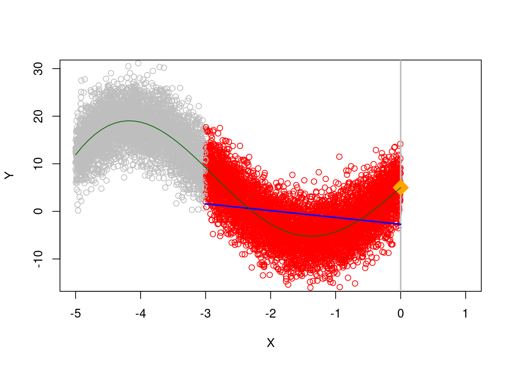
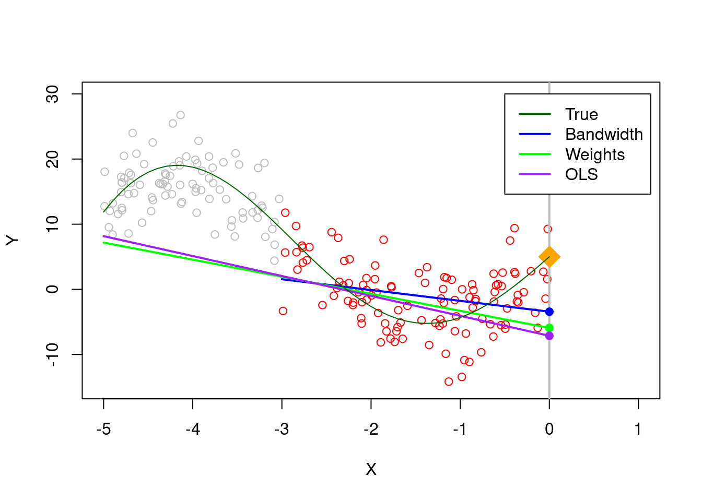
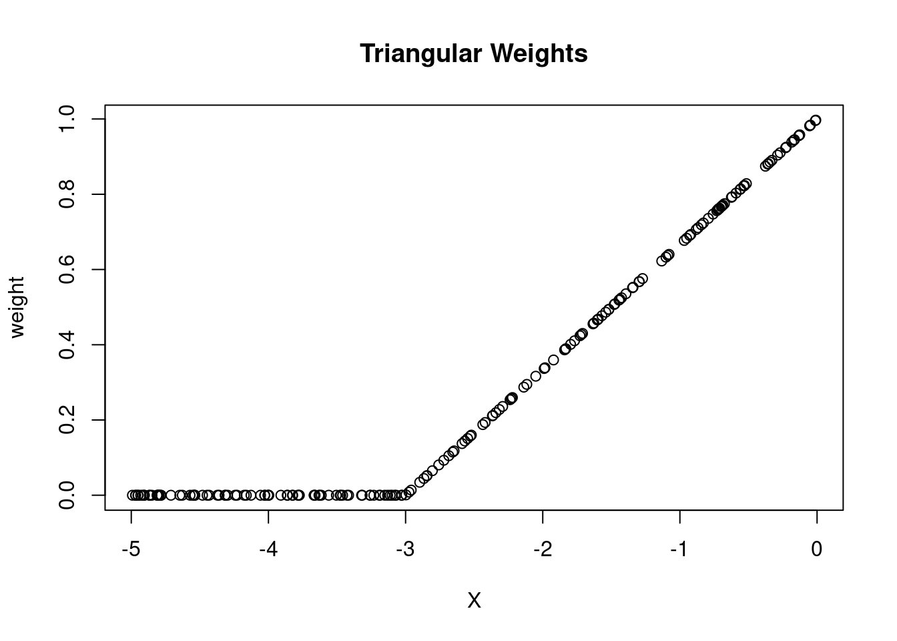
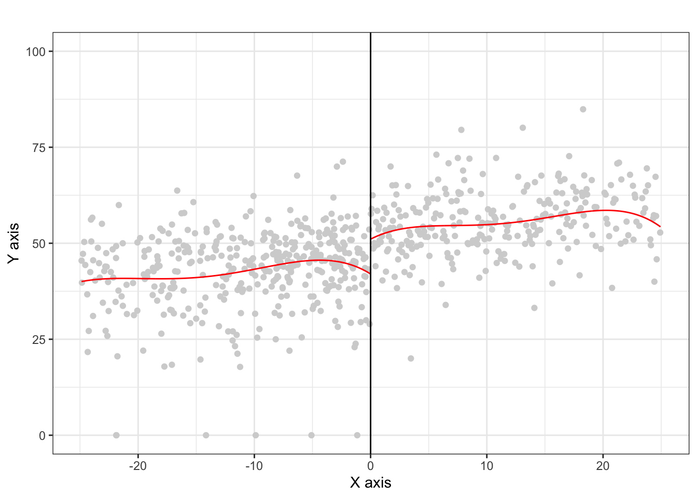

# Discussion 10. Causal Effects with Regression Discontinuity {-}

**NOTE: This is from Fall 2023. We have not updated to reflect the current term yet.**

[**Slides**](assets/discussions/discussion10.pdf)
Download today's [**.Rmd document here**](assets/discussions/discussion10.Rmd).

## Choosing a bandwidth
One of the main difficulties of a regression discontinuity analysis is choosing a ``good'' bandwidth. This is a good example of the bias variance trade-off which appears all the time in statistics. In general, we will let the software choose this for us, but it will be helpful to run through a small example to better understand the subtleties involved. 

Suppose $Y$ is a very non-linear function of $X$, and we want to extrapolate and predict $Y$ at $X=0$.

``` r
n <- 100
X <- runif(n, -5, 0)
### Y is a very non-linear function of X + some noise
Y <- 5 - 3*X + .6 * X^2 + .3 * X^3 + 15 * sin(X) + rnorm(n, sd = 4)
plot(X, Y, ylim = c(-15, 30), xlim = c(-5, 1))
abline(v = 0, col = "gray", lwd = 2)

### Avg Y when X = 0 is 5
points(0, 5, pch = 18, col = "orange", cex = 3)
```


If we blindly fit a line to all our observations, the predicted value for $X=0$ is off by quite a bit.


If we instead restrict ourselves to a smaller region around 0, we can do a bit better

``` r
## Only consider points h away from 0
h <- 3

fit.mod.bandwidth <- lm(Y~X, subset = X > -h)
plotColor <- ifelse(abs(X) > h, "gray", "red")

plot(X, Y, ylim = c(-15, 30), xlim = c(-5, 1), col = plotColor)
abline(v = 0, col = "gray", lwd = 2)
segments(-h, predict(fit.mod.bandwidth, newdata = data.frame(X = -h)),
         0, predict(fit.mod.bandwidth, newdata = data.frame(X = 0)),col = "blue",
         lwd = 2)
points(0, 5, pch = 18, col = "orange", cex = 3)
```


However, if we get more and more data, we don't really improve much

``` r
n <- 10000
X <- runif(n, -5, 0)
Y <- 5 - 3*X + .6 * X^2 + .3 * X^3 + 15 * sin(X) + rnorm(n, sd = 4)
h <- 3
fit.mod.bandwidth <- lm(Y~X, subset = X > -h)
plotColor <- ifelse(abs(X) > h, "gray", "red")

plot(X, Y, ylim = c(-15, 30), xlim = c(-5, 1), col = plotColor)
abline(v = 0, col = "gray", lwd = 2)
segments(-h, predict(fit.mod.bandwidth, newdata = data.frame(X = -h)),
         0, predict(fit.mod.bandwidth, newdata = data.frame(X = 0)),col = "blue",
         lwd = 2)

points(0, 5, pch = 18, col = "orange", cex = 3)
```



Ideally, we would decrease the bandwidth to reduce this bias, but this also means we are working with less data. Since each data point is noisy, if we were to get a new sample, the estimate could change quite a bit. Try running this a few times and see how much the estimate moves. Compare this which how much the estimate moves if the bandwidth is 2.


``` r
h <- .3 # bandwidth
# h <- 2 
n <- 100
X <- runif(n, -5, 0)
Y <- 5 - 3*X + .6 * X^2 + .3 * X^3 + 15 * sin(X) + rnorm(n, sd = 4)

fit.mod.bandwidth <- lm(Y~X, subset = X > -h)
plotColor <- ifelse(abs(X) > h, "gray", "red")

plot(X, Y, ylim = c(-15, 30), xlim = c(-5, 1), col = plotColor)
abline(v = 0, col = "gray", lwd = 2)
segments(-h, predict(fit.mod.bandwidth, newdata = data.frame(X = -h)),
         0, predict(fit.mod.bandwidth, newdata = data.frame(X = 0)),col = "blue",
         lwd = 2)

points(0, 5, pch = 18, col = "orange", cex = 3)
points(0, predict(fit.mod.bandwidth, newdata = data.frame(X = 0)), col = "blue", pch = 19)
```


Knowing the best bandwidth is a hard problem, but generally speaking a good choice of bandwidth will get smaller as the sample size increases. 

If we measure accuracy in terms of average squared error, we can see when $n = 100$, a bandwidth of 1.2 seems to be best. However, test and see if how that changes for larger values of $n$


``` r
n <- 100
h <- c(.5, .8, 1.2, 2)
sim.size <- 500
rec <- matrix(0, sim.size, 8)

for(i in 1:sim.size){
  X <- runif(n, -5, 0)
  Y <- 5 - 3*X + .6 * X^2 + .3 * X^3 + 15 * sin(X) + rnorm(n, sd = 4)

  fit.mod.bandwidth1 <- lm(Y~X, subset = X > -h[1])
  fit.mod.bandwidth2 <- lm(Y~X, subset = X > -h[2])
  fit.mod.bandwidth3 <- lm(Y~X, subset = X > -h[3])
  fit.mod.bandwidth4 <- lm(Y~X, subset = X > -h[4])

  rec[i, 1] <- (predict(fit.mod.bandwidth1, newdata = data.frame(X = 0)) - 5)^2
  rec[i, 2] <- (predict(fit.mod.bandwidth2, newdata = data.frame(X = 0)) - 5)^2
  rec[i, 3] <- (predict(fit.mod.bandwidth3, newdata = data.frame(X = 0)) - 5)^2
  rec[i, 4] <- (predict(fit.mod.bandwidth4, newdata = data.frame(X = 0)) - 5)^2
  
  rec[i, 5] <- predict(fit.mod.bandwidth1, newdata = data.frame(X = 0))
  rec[i, 6] <- predict(fit.mod.bandwidth2, newdata = data.frame(X = 0))
  rec[i, 7] <- predict(fit.mod.bandwidth3, newdata = data.frame(X = 0))
  rec[i, 8] <- predict(fit.mod.bandwidth4, newdata = data.frame(X = 0))

}

colMeans(rec)
```

```
## [1] 415.850072   4.568784   3.814795  12.415867   5.902811
## [6]   4.684360   4.115609   1.803256
```

``` r
boxplot(as.list(data.frame(rec[, 5:8])), ylim = c(0, 20))
abline(h = 5, col = "red")
```


### Weighted Least Squares

When we estimate a linear regression model, we usually pick linear coefficients to minimize the squared errors
$$\min_b \sum_i(Y_i - X_i b)^2$$
and the squared error for each observation count are considered equally. But if a good fit around some points is more important than other points, we can also use weighted least squares where $w_i$ is a weight. 
$$\min_b \sum_i w_i(Y_i - X_i b)^2$$
When $w_i$ is larger, the squared error for observation $i$ will cost more so the selected linear coefficient will prioritize minimizing errors where $w_i$ is large. In our particular setting, we want to prioritize fitting the data well around $0$, so we can use weights which are ``triangular'' which prioritize points near $0$.  


``` r
n <- 200
X <- runif(n, -5, 0)
Y <- 5 - 3*X + .6 * X^2 + .3 * X^3 + 15 * sin(X) + rnorm(n, sd = 4)
weight <- 1 - abs(X) / 5 
plot(X, weight, type = "p", main = "Triangular Weights")
```


#### Question
If we use a bandwidth of $h$ (i.e., only include observations within $h$ of the cut-off), what does this mean the the weights would be?   


When using triangular weights, we can see that this does better than using all the points.


``` r
n <- 200
h <- 3
X <- runif(n, -5, 0)
Y <- 5 - 3*X + .6 * X^2 + .3 * X^3 + 15 * sin(X) + rnorm(n, sd = 4)

weight <- 1 - abs(X) / 5 
# We don't include a bandwidth, but instead use triangular weights
fit.mod <- lm(Y~X)
fit.mod.weights <- lm(Y~X, weights = weight)
fit.mod.bandwidth <- lm(Y~X, subset = abs(X) < h)

plotColor <- ifelse(abs(X) > h, "gray", "red")

plot(X, Y, ylim = c(-15, 30), xlim = c(-5, 1), col = plotColor)
abline(v = 0, col = "gray", lwd = 2)
segments(-h, predict(fit.mod.bandwidth, newdata = data.frame(X = -h)),
         0, predict(fit.mod.bandwidth, newdata = data.frame(X = 0)),col = "blue",
         lwd = 2)

# Fit from weighted least squares
segments(-5, predict(fit.mod.weights, newdata = data.frame(X = -h)),
         0, predict(fit.mod.weights, newdata = data.frame(X = 0)),col = "green",
         lwd = 2)

# Fit from ordinary least squares
segments(-5, predict(fit.mod, newdata = data.frame(X = -h)),
         0, predict(fit.mod, newdata = data.frame(X = 0)),col = "purple",
         lwd = 2)

points(0, 5, pch = 18, col = "orange", cex = 3)
points(0, predict(fit.mod.bandwidth, newdata = data.frame(X = 0)), col = "blue", pch = 19)
points(0, predict(fit.mod.weights, newdata = data.frame(X = 0)), col = "green", pch = 19)
points(0, predict(fit.mod, newdata = data.frame(X = 0)), col = "purple", pch = 19)
```


In practice, we can combine both a hard thresholding bandwidth as well as triangular weights (within the bandwidth) 

``` r
# bandwidth
h <- 3
n <- 200
X <- runif(n, -5, 0)
Y <- 5 - 3*X + .6 * X^2 + .3 * X^3 + 15 * sin(X) + rnorm(n, sd = 4)

# weight is triangular within the bandwidth
weight <- ifelse(abs(X) < h, 1 - abs(X) / h, 0) 

plot(X, weight, type = "p", main = "Triangular Weights")
```


\newpage

## RDD Analysis
Now let's apply a regression discontinuity analysis to data. This example follows the analysis ``Randomization Inference in the Regression Discontinuity Design: An Application to Party Advantages in the U.S. Senate'' by Cattaneo, Frandsen, and Titiunik (2015) and their replication file.

Political scientists are interested in the effect of being an incumbent (the currently elected politician) on the share of votes in an election. Being the current public official means increased name recognition, fundraising opportunities, etc. On the other hand, being an incumbent means you can get blamed for all the bad things that have happened during your term. 

The data we analyze considers US senators. Each state in the US has two senators with 6 year terms, and the election for each of the two senators alternates every 3 years. So for instance, there are two senate seats: A and B. In 2000 senate seat A undergoes an election, in 2003 senate seat B undergoes an election but senate seat A continues, in 2006 senate seat A undergoes an election but senate seat B continues on, etc. 

We will look at the causal effect on being an incumbent in senate races in two different ways.First, does being an incumbent effect your vote share the next time you run for office? Second, if the other sitting senator is from your same party, what is the effect on your election share?  

#### Question
* Consider the first question and draw out a causal diagram where the treatment is being an incumbent and the outcome of interest is vote share in an election.
* How might we use regression discontinuity to provide an answer to this question?

### Data
We'll examine data from US Senate races from 1914 to 2010 to try and answer these questions. 


``` r
install <- function(package) {
  if (!require(package, quietly = TRUE, character.only = TRUE)) {
    install.packages(package, repos = "http://cran.us.r-project.org", type = "binary")
    library(package, character.only = TRUE)
  }
}

install("ggplot2")
install("lpdensity")
install("rddensity")
install("rdrobust")
install("rdlocrand")

data <- read.csv("https://raw.githubusercontent.com/rdpackages-replication/CIT_2020_CUP/master/CIT_2020_CUP_senate.csv")

head(data)
```

```
##         state year dopen population presdemvoteshlag1
## 1 Connecticut 1914     0    1233000          39.15937
## 2 Connecticut 1916     0    1294000          39.15937
## 3 Connecticut 1922     0    1431000          33.02737
## 4 Connecticut 1926     0    1531000          27.52570
## 5 Connecticut 1928     1    1577000          27.52570
## 6 Connecticut 1932     0    1637000          45.57480
##         demmv demvoteshlag1 demvoteshlag2 demvoteshfor1
## 1  -7.6885610            NA            NA      46.23941
## 2  -3.9237082      42.07694            NA      36.09757
## 3  -6.8686604      36.09757      46.23941      35.64121
## 4 -27.6680560      45.46875      36.09757      45.59821
## 5  -8.2569685      35.64121      45.46875      48.47606
## 6   0.7324815      45.59821      35.64121      51.74687
##   demvoteshfor2 demwinprv1 demwinprv2 dmidterm dpresdem
## 1      36.09757         NA         NA        1        1
## 2      45.46875          0         NA        0        1
## 3      45.59821          0          0        1        0
## 4      48.47606          0          0        1        0
## 5      51.74687          0          0        0        0
## 6      39.80264          0          0        0        0
```

``` r
# presdemvoteshlag1 is democratic vote share in the previous presidential election
# demmv is the democratic margin of victory in the current senate election (i.e., democratic percentage - next closest percentage)
#   so a value just above 0 indicates a very close victory, a value just below 0 indicates a very close loss
# demovoteshlag1 and 2 indicates the vote share 1 and 2 election cycles ago
# demovoteshfor1 and 2 indicates the vote share 1 and 2 elections cycles in the future
```


For the first analysis, we will consider whether being the incumbent effects vote share in the next election. Thus, the outcome of interest is \texttt{demvoteshfor2} because the next time the same seat goes up for election is 2 cycles in the future.


``` r
dem_vote_t2 <- data$demvoteshfor2
dem_margin_t0 <- data$demmv

# plot the data
# Set p = 0 for a straight line (i.e., regression with X^p)
rdplot(y = dem_vote_t2, x =  dem_margin_t0, nbins = c(1000, 1000), p = 0, col.lines = "red", col.dots = "lightgray", title = "Incumbency Advantage", y.lim = c(0,100), x.label = "Dem Margin of Victory", y.label = "Dem Vote Share in next election")
```


Let's zoom in a bit to the closer races and use non-linear regression. There appears to still be a slight discontinuity. 

``` r
rdplot(dem_vote_t2[abs(dem_margin_t0) <= 25], dem_margin_t0[abs(dem_margin_t0) <= 25], nbins = c(2500, 500), p = 4, col.lines = "red", col.dots = "lightgray", title = "",  y.lim = c(0,100))
```



### Estimating the causal effect
As an example, we'll manually set the bandwidth to 10, and then estimate a linear regression on both sides of the cut-off. The estimated intercept is the prediction at $0$, so to get the estimate, we just take the difference.

``` r
# Set bandwidth to 10
h <- 10
# Fit regression to left and right of cut-off
lm_left <- lm(dem_vote_t2 ~ dem_margin_t0, subset = dem_margin_t0 < 0 & abs(dem_margin_t0) <= h)
lm_right <- lm(dem_vote_t2 ~ dem_margin_t0, subset = dem_margin_t0 > 0 & abs(dem_margin_t0) <= h)

# Estimate is difference in interecepts
lm_right$coefficients[1] - lm_left$coefficients[1] 
```

```
## (Intercept) 
##    6.898794
```

We can try the same with the triangular weights.

``` r
h <- 10
weight <- ifelse(abs(dem_margin_t0) < h, 1 - abs(dem_margin_t0) / h, 0) 

## Note we don't need subs
lm_left <- lm(dem_vote_t2 ~ dem_margin_t0, subset = dem_margin_t0 < 0 & abs(dem_margin_t0) <= h, weights = weight)
lm_right <- lm(dem_vote_t2 ~ dem_margin_t0, subset = dem_margin_t0 > 0 & abs(dem_margin_t0) <= h, weights = weight)


# Estimate is difference in interecepts
lm_right$coefficients[1] - lm_left$coefficients[1] 
```

```
## (Intercept) 
##    7.984687
```

#### Question
* Describe in both mathematical notation, and in plain language what causal effect is being estimated.

## Using rdrobust
As you can see, getting the estimates aren't so difficult once we've selected a bandwidth. But selecting a good bandwidth can be tricky and getting standard errors on the estimate are also difficult.  We can use the R package \texttt{rdrobust} to select the bandwidth, estimate the causal effect quantities, and give standard errors. 


``` r
# uniform kernel with bandwidth 10
out <- rdrobust(dem_vote_t2, dem_margin_t0, kernel = 'uniform',  p = 1, h = 10)
summary(out)
```

```
## Sharp RD estimates using local polynomial regression.
## 
## Number of Obs.                 1297
## BW type                      Manual
## Kernel                      Uniform
## VCE method                       NN
## 
## Number of Obs.                  595          702
## Eff. Number of Obs.             245          206
## Order est. (p)                    1            1
## Order bias  (q)                   2            2
## BW est. (h)                  10.000       10.000
## BW bias (b)                  10.000       10.000
## rho (h/b)                     1.000        1.000
## Unique Obs.                     595          702
## 
## =============================================================================
##         Method     Coef. Std. Err.         z     P>|z|      [ 95% C.I. ]       
## =============================================================================
##   Conventional     6.899     1.722     4.007     0.000     [3.525 , 10.273]    
##         Robust         -         -     3.891     0.000     [5.156 , 15.624]    
## =============================================================================
```


``` r
# triangular kernel with bandwidth 10
out <- rdrobust(dem_vote_t2, dem_margin_t0,  kernel = 'triangular',  p = 1, h = 10)
summary(out)
```

```
## Sharp RD estimates using local polynomial regression.
## 
## Number of Obs.                 1297
## BW type                      Manual
## Kernel                   Triangular
## VCE method                       NN
## 
## Number of Obs.                  595          702
## Eff. Number of Obs.             245          206
## Order est. (p)                    1            1
## Order bias  (q)                   2            2
## BW est. (h)                  10.000       10.000
## BW bias (b)                  10.000       10.000
## rho (h/b)                     1.000        1.000
## Unique Obs.                     595          702
## 
## =============================================================================
##         Method     Coef. Std. Err.         z     P>|z|      [ 95% C.I. ]       
## =============================================================================
##   Conventional     7.985     1.838     4.344     0.000     [4.382 , 11.587]    
##         Robust         -         -     4.387     0.000     [6.595 , 17.249]    
## =============================================================================
```


If we don't specify a bandwidth directly, the software will choose for us

``` r
# uniform kernel with software selected bandwidth
out <- rdrobust(dem_vote_t2, dem_margin_t0, kernel = 'triangular',  p = 1)
summary(out)
```

```
## Sharp RD estimates using local polynomial regression.
## 
## Number of Obs.                 1297
## BW type                       mserd
## Kernel                   Triangular
## VCE method                       NN
## 
## Number of Obs.                  595          702
## Eff. Number of Obs.             360          323
## Order est. (p)                    1            1
## Order bias  (q)                   2            2
## BW est. (h)                  17.754       17.754
## BW bias (b)                  28.028       28.028
## rho (h/b)                     0.633        0.633
## Unique Obs.                     595          665
## 
## =============================================================================
##         Method     Coef. Std. Err.         z     P>|z|      [ 95% C.I. ]       
## =============================================================================
##   Conventional     7.414     1.459     5.083     0.000     [4.555 , 10.273]    
##         Robust         -         -     4.311     0.000     [4.094 , 10.919]    
## =============================================================================
```


### Try on your own

Now try on your own and estimate the causal effect of the senator who is not up for election being a democrat on the democratic vote share of the senator who is up for election. In this case, the outcome of interest is demvoteshfor1 since we are interested in the immediately following election.  


``` r
dem_vote_t1 <- data$demvoteshfor1
dem_margin_t0 <- data$demmv

# plot the data
# Set p = 0 for a straight line (i.e., regression with X^p)
rdplot(y = dem_vote_t1, x =  dem_margin_t0, nbins = c(1000, 1000), p = 0, col.lines = "red", col.dots = "lightgray", title = "Incumbency Advantage", y.lim = c(0,100), x.label = "Dem Margin of Victory", y.label = "Dem Vote Share in next election")
```


