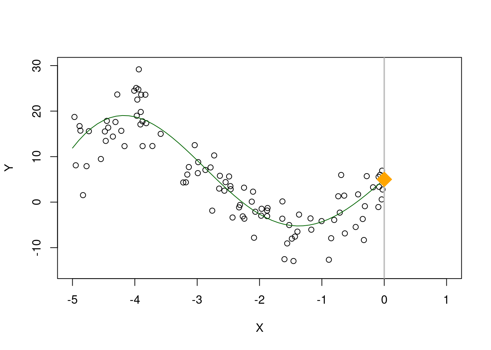
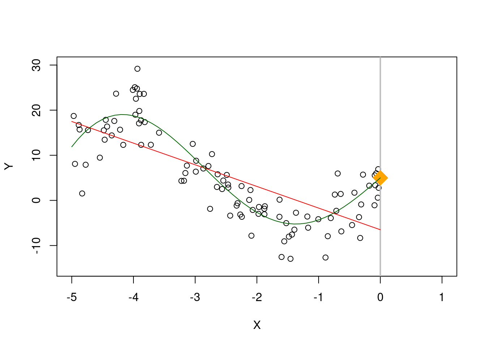
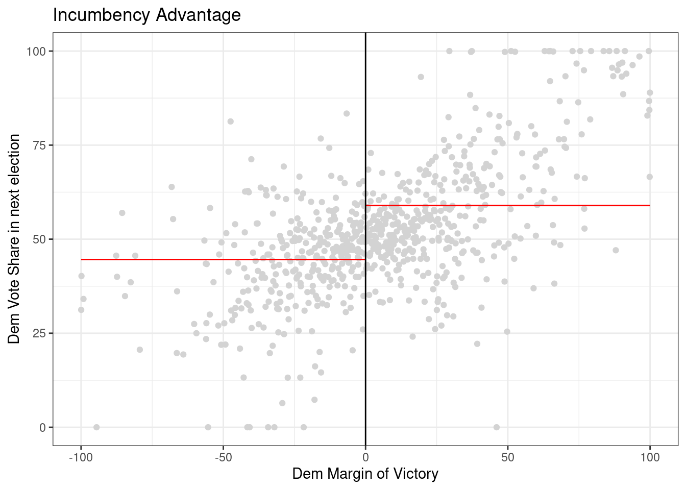

<style>li {line-height: 1.8;}</style>

# Discussion 10. Regression discontinuity {-}
## STSCI/INFO/ILRST 3900: Causal Inference {-}
#### October 29, 2025 {-}

You can download the [**slides**](assets/discussions/discussion10_rdd.pdf) for this week's discussion and the [**.Rmd**](assets/discussions/discussion10.Rmd).

## Choosing a bandwidth {-}
One of the main difficulties of a regression discontinuity analysis is choosing a ''good'' bandwidth. This is a good example of the bias variance trade-off which appears all the time in statistics. In general, we will let the software choose this for us, but it will be helpful to run through a small example to better understand the subtleties involved. 

Suppose $Y$ is a very non-linear function of $X$, and we want to extrapolate and predict $Y$ at $X=0$.

``` r
n <- 100
X <- runif(n, -5, 0)
### Y is a very non-linear function of X + some noise
Y <- 5 - 3*X + .6 * X^2 + .3 * X^3 + 15 * sin(X) + rnorm(n, sd = 4)
plot(X, Y, ylim = c(-15, 30), xlim = c(-5, 1))
abline(v = 0, col = "gray", lwd = 2)
## plot the "true line"
xTrue <- seq(-5, 0, by = .1)
yTrue <- 5 - 3*xTrue + .6 * xTrue^2 + .3 * xTrue^3 + 15 * sin(xTrue)
lines(xTrue, yTrue, col = "darkgreen")

### Avg Y when X = 0 is 5
points(0, 5, pch = 18, col = "orange", cex = 3)
```



If we blindly fit a line to all our observations, the predicted value for $X=0$ is off by quite a bit.


If we instead restrict ourselves to a smaller region around 0, we can do a bit better

``` r
## Only consider points h away from 0
h <- 3

fit.mod.bandwidth <- lm(Y~X, subset = X > -h)
plotColor <- ifelse(abs(X) > h, "gray", "red")

plot(X, Y, ylim = c(-15, 30), xlim = c(-5, 1), col = plotColor)
abline(v = 0, col = "gray", lwd = 2)
segments(-h, predict(fit.mod.bandwidth, newdata = data.frame(X = -h)),
         0, predict(fit.mod.bandwidth, newdata = data.frame(X = 0)),col = "blue",
         lwd = 2)
points(0, 5, pch = 18, col = "orange", cex = 3)
lines(xTrue, yTrue, col = "darkgreen")
```


However, if we get more and more data, we don't really improve much

``` r
n <- 10000
X <- runif(n, -5, 0)
Y <- 5 - 3*X + .6 * X^2 + .3 * X^3 + 15 * sin(X) + rnorm(n, sd = 4)
h <- 3
fit.mod.bandwidth <- lm(Y~X, subset = X > -h)
plotColor <- ifelse(abs(X) > h, "gray", "red")

plot(X, Y, ylim = c(-15, 30), xlim = c(-5, 1), col = plotColor)
abline(v = 0, col = "gray", lwd = 2)
segments(-h, predict(fit.mod.bandwidth, newdata = data.frame(X = -h)),
         0, predict(fit.mod.bandwidth, newdata = data.frame(X = 0)),col = "blue",
         lwd = 2)

points(0, 5, pch = 18, col = "orange", cex = 3)
lines(xTrue, yTrue, col = "darkgreen")
```


Ideally, we would decrease the bandwidth to reduce this bias, but this also means we are working with less data. Since each data point is noisy, if we were to get a new sample, the estimate could change quite a bit. Try running this a few times and see how much the estimate moves. Compare this which how much the estimate moves if the bandwidth is 2.


``` r
h <- .3 # bandwidth
# h <- 2 
n <- 100
X <- runif(n, -5, 0)
Y <- 5 - 3*X + .6 * X^2 + .3 * X^3 + 15 * sin(X) + rnorm(n, sd = 4)

fit.mod.bandwidth <- lm(Y~X, subset = X > -h)
plotColor <- ifelse(abs(X) > h, "gray", "red")

plot(X, Y, ylim = c(-15, 30), xlim = c(-5, 1), col = plotColor)
abline(v = 0, col = "gray", lwd = 2)
segments(-h, predict(fit.mod.bandwidth, newdata = data.frame(X = -h)),
         0, predict(fit.mod.bandwidth, newdata = data.frame(X = 0)),col = "blue",
         lwd = 2)

points(0, 5, pch = 18, col = "orange", cex = 3)
points(0, predict(fit.mod.bandwidth, newdata = data.frame(X = 0)), col = "blue", pch = 19)
lines(xTrue, yTrue, col = "darkgreen")
```


Knowing the best bandwidth is a hard problem, but generally speaking a good choice of bandwidth will get smaller as the sample size increases. 

If we measure accuracy in terms of average squared error, we can see when $n = 100$, a bandwidth of 1.2 seems to be best. However, test and see if how that changes for larger values of $n$


``` r
n <- 100
h <- c(.5, .8, 1.2, 2)
sim.size <- 500
rec <- matrix(NA, nrow = sim.size, ncol = 2*length(h))

for(i in 1:sim.size){
  X <- runif(n, -5, 0)
  Y <- 5 - 3*X + .6 * X^2 + .3 * X^3 + 15 * sin(X) + rnorm(n, sd = 4)
  
  for(j in 1:length(h)){
    fit.mod.bandwidth <- lm(Y~X, subset = X > -h[j])
    rec[i,j] <- predict(fit.mod.bandwidth, newdata = data.frame(X = 0))
    rec[i,(j+4)] <- (predict(fit.mod.bandwidth, newdata = data.frame(X = 0)) - 5)^2
  }
 

}
```

```
## Warning in predict.lm(fit.mod.bandwidth, newdata =
## data.frame(X = 0)): prediction from rank-deficient fit;
## attr(*, "non-estim") has doubtful cases
## Warning in predict.lm(fit.mod.bandwidth, newdata =
## data.frame(X = 0)): prediction from rank-deficient fit;
## attr(*, "non-estim") has doubtful cases
```

``` r
data.frame(h = h,
           y_hat = colMeans(rec)[1:4],
           accuracy = colMeans(rec)[5:8])
```

```
##     h    y_hat  accuracy
## 1 0.5 4.629777 10.677399
## 2 0.8 4.594853  4.943018
## 3 1.2 4.097309  3.609071
## 4 2.0 1.756800 12.439169
```

``` r
boxplot(as.list(data.frame(rec[, 1:4])), ylim = c(-5, 20),names = h)
abline(h = 5, col = "red")
```


### Weighted Least Squares {-}

When we estimate a linear regression model, we usually pick linear coefficients to minimize the squared errors
$$\min_b \sum_i(Y_i - X_i b)^2$$
and the squared error for each observation count are considered equally. But if a good fit around some points is more important than other points, we can also use weighted least squares where $w_i$ is a weight. 
$$\min_b \sum_i w_i(Y_i - X_i b)^2$$
When $w_i$ is larger, the squared error for observation $i$ will cost more so the selected linear coefficient will prioritize minimizing errors where $w_i$ is large. In our particular setting, we want to prioritize fitting the data well around $0$, so we can use weights which are ``triangular'' which prioritize points near $0$.  


``` r
n <- 200
X <- runif(n, -5, 0)
Y <- 5 - 3*X + .6 * X^2 + .3 * X^3 + 15 * sin(X) + rnorm(n, sd = 4)
weight <- 1 - abs(X) / 5 
plot(X, weight, type = "p", main = "Triangular Weights")
```


#### Question {-}
If we use a bandwidth of $h$ (i.e., only include observations within $h$ of the cut-off), what does this mean the the weights would be?   


When using triangular weights, we can see that this does better than using all the points.


``` r
n <- 200
h <- 3
X <- runif(n, -5, 0)
Y <- 5 - 3*X + .6 * X^2 + .3 * X^3 + 15 * sin(X) + rnorm(n, sd = 4)

weight <- 1 - abs(X) / 5 
# We don't include a bandwidth, but instead use triangular weights
fit.mod <- lm(Y~X)
fit.mod.weights <- lm(Y~X, weights = weight)
fit.mod.bandwidth <- lm(Y~X, subset = abs(X) < h)

plotColor <- ifelse(abs(X) > h, "gray", "red")

plot(X, Y, ylim = c(-15, 30), xlim = c(-5, 1), col = plotColor)
abline(v = 0, col = "gray", lwd = 2)
segments(-h, predict(fit.mod.bandwidth, newdata = data.frame(X = -h)),
         0, predict(fit.mod.bandwidth, newdata = data.frame(X = 0)),col = "blue",
         lwd = 2)

# Fit from weighted least squares
segments(-5, predict(fit.mod.weights, newdata = data.frame(X = -h)),
         0, predict(fit.mod.weights, newdata = data.frame(X = 0)),col = "green",
         lwd = 2)

# Fit from ordinary least squares
segments(-5, predict(fit.mod, newdata = data.frame(X = -h)),
         0, predict(fit.mod, newdata = data.frame(X = 0)),col = "purple",
         lwd = 2)

points(0, 5, pch = 18, col = "orange", cex = 3)
points(0, predict(fit.mod.bandwidth, newdata = data.frame(X = 0)), col = "blue", pch = 19)
points(0, predict(fit.mod.weights, newdata = data.frame(X = 0)), col = "green", pch = 19)
points(0, predict(fit.mod, newdata = data.frame(X = 0)), col = "purple", pch = 19)
lines(xTrue, yTrue, col = "darkgreen")
legend(x = -.5,y = 30,
      legend = c("True","Bandwidth","Weights","OLS"),
      col = c("darkgreen","blue","green","purple"), lwd = 2)
```


In practice, we can combine both a hard thresholding bandwidth as well as triangular weights (within the bandwidth) 

``` r
# bandwidth
h <- 3
n <- 200
X <- runif(n, -5, 0)
Y <- 5 - 3*X + .6 * X^2 + .3 * X^3 + 15 * sin(X) + rnorm(n, sd = 4)

# weight is triangular within the bandwidth
weight <- ifelse(abs(X) < h, 1 - abs(X) / h, 0) 

plot(X, weight, type = "p", main = "Triangular Weights")
```


## RDD Analysis {-}

Now let's apply a regression discontinuity analysis to data. This example follows the analysis ``Randomization Inference in the Regression Discontinuity Design: An Application to Party Advantages in the U.S. Senate'' by Cattaneo, Frandsen, and Titiunik (2015) and their replication file.

The goal of today's activity is to interact with regression discontinuity through a real-world example using R. The first section is more conceptual, to help you understand the particular application. Afterwards, there is a mix of conceptual and coding questions. Most of the coding is already done for you and we instead ask that you explore the code by changing some variables.

### 1. Background: An Application to Party Advantages in the U.S. Senate {-}
Let's apply a regression discontinuity analysis to data. This example follows the analysis ``Randomization Inference in the Regression Discontinuity Design: An Application to Party Advantages in the U.S. Senate'' by Cattaneo, Frandsen, and Titiunik (2015) and their replication file.

Political scientists are interested in the effect of being an incumbent (the currently elected politician) on the share of votes in an election. Being the current public official means increased name recognition, fundraising opportunities, etc. On the other hand, being an incumbent means you can get blamed for all the bad things that have happened during your term. Elections also give a natural setting where you have a cutoff: if you only win 49.9% of the votes, you're out of luck... but win 50.1% of the votes and you've won the whole election!

The data we analyze considers US senators. Each state in the US has two senators with 6 year terms, and the election for each of the two senators alternates every 3 years. So for instance, there are two senate seats: A and B. In 2000 senate seat A undergoes an election, in 2003 senate seat B undergoes an election but senate seat A continues, in 2006 senate seat A undergoes an election but senate seat B continues on, etc. 

_Causal question_: Does being an incumbent affect your vote share the next time you run for office?

_Treatment_: Being an incumbent (in other words, being in office)

_Outcome_: Vote share in your next election (i.e. what percentage of votes did you get?)

_Running variable_: Margin of victory (by how much did you win in your last election)

_Cutoff_: 0 (you win, i.e. become incumbent, if your margin of victory is greater than 0; otherwise, you lost!)


### 2. Data {-}
For this section, run the code block below and read through the comments inside the code block. The following code installs and loads some libraries into R, then reads in data from an online fine, and finally prints out the first few rows of the data table.


``` r
# Below, we create a function that loads in libraries, but first checks if it is installed
# The piece of code below is not necessary, but it makes loading libraries more convenient 
install <- function(package) {
  if (!require(package, quietly = TRUE, character.only = TRUE)) {
    install.packages(package, repos = "http://cran.us.r-project.org", type = "binary")
    library(package, character.only = TRUE)
  }
}

# install and load some libraries using the function created above
install("ggplot2")
install("lpdensity")
install("rddensity")
install("rdrobust")
install("rdlocrand")

# read in the datafile
data <- read.csv("https://raw.githubusercontent.com/rdpackages-replication/CIT_2020_CUP/master/CIT_2020_CUP_senate.csv")

# the head function shows us the first few rows of our data
head(data)
```

```
##         state year dopen population presdemvoteshlag1
## 1 Connecticut 1914     0    1233000          39.15937
## 2 Connecticut 1916     0    1294000          39.15937
## 3 Connecticut 1922     0    1431000          33.02737
## 4 Connecticut 1926     0    1531000          27.52570
## 5 Connecticut 1928     1    1577000          27.52570
## 6 Connecticut 1932     0    1637000          45.57480
##         demmv demvoteshlag1 demvoteshlag2 demvoteshfor1
## 1  -7.6885610            NA            NA      46.23941
## 2  -3.9237082      42.07694            NA      36.09757
## 3  -6.8686604      36.09757      46.23941      35.64121
## 4 -27.6680560      45.46875      36.09757      45.59821
## 5  -8.2569685      35.64121      45.46875      48.47606
## 6   0.7324815      45.59821      35.64121      51.74687
##   demvoteshfor2 demwinprv1 demwinprv2 dmidterm dpresdem
## 1      36.09757         NA         NA        1        1
## 2      45.46875          0         NA        0        1
## 3      45.59821          0          0        1        0
## 4      48.47606          0          0        1        0
## 5      51.74687          0          0        0        0
## 6      39.80264          0          0        0        0
```
Here is what some of these column names (variables) mean:

- `demmv` is the democratic margin of victory in the current senate election (i.e., democratic percentage - next closest percentage)
    - so a value just above 0 indicates a very close victory, a value just below 0 indicates a very close loss
- `demovoteshlag1` and `demovoteshlag2` indicates the vote share 1 and 2 election cycles ago, respectively
- `demovoteshfor1` and `demovoteshfor2` indicates the vote share 1 and 2 elections cycles in the future, respectively


## 3. RDD in R {-}
We are considering whether being the incumbent affects vote share in the next election. Thus, the outcome of interest is `demvoteshfor2` because the next time the same seat goes up for election is 2 cycles in the future. The running variable is `demmv`.


``` r
# Save the column "demvoteshfor2" from data into a variable called "outcome"
outcome <- data$demvoteshfor2

# Save the column "demmv" from data into a variable called "running_variable"
running_variable <- data$demmv

# plot the data
rdplot(y = outcome, x =  running_variable, nbins = c(1000, 1000), 
       p = 0, col.lines = "red", col.dots = "lightgray", 
       title = "Incumbency Advantage", y.lim = c(0,100), 
       x.label = "Dem Margin of Victory", y.label = "Dem Vote Share in next election")
```


Optional: Explore the documentation for the function [`rdplot()`](https://rdrr.io/cran/rdrobust/man/rdplot.html) Read the description and the arguments. What do the arguments (`y`, `x`, `nbins`, `p`, `col.lines`, etc) in the function mean? Are any of them optional? Do any of them have default values?

### 3.1 Is there a discontinuity? {-}
**Question:** In the code above, compare what happens when you run the code with $p=0$ versus $p=1$ versus $p=2$. To do this, look for `p` in the function `rdplot` above. It is currently set to `p = 0` so if you run the code, it will give you results for `p = 0`. Then, you can change the value of `p` and re-run the code. What changes? Is there a discontinuity (jump) at the cutoff?


### 3.2 Estimating the causal effect using rdrobust {-}
Getting the estimates aren't so difficult once we've selected a bandwidth, but selecting a good bandwidth can be tricky and getting standard errors on the estimate are also difficult. The R package `rdrobust` selects the bandwidth, estimates the causal effect quantities, and give standard errors with just a couple of lines of code. 

For `rdrobust`, the syntax is `rdrobust(y, x, kernel, p, h)` where y is the outcome, x is the running variable, kernel says what types of weights to use, p says what degree model (e.g. p = 1 means linear model), and h is the bandwidth. 


``` r
# uniform kernel with bandwidth 10 and a linear (degree 1) model
out <- rdrobust(outcome, running_variable, kernel = 'uniform',  p = 1, h = 10)

# print the results
summary(out)
```

```
## Sharp RD estimates using local polynomial regression.
## 
## Number of Obs.                 1297
## BW type                      Manual
## Kernel                      Uniform
## VCE method                       NN
## 
## Number of Obs.                  595          702
## Eff. Number of Obs.             245          206
## Order est. (p)                    1            1
## Order bias  (q)                   2            2
## BW est. (h)                  10.000       10.000
## BW bias (b)                  10.000       10.000
## rho (h/b)                     1.000        1.000
## Unique Obs.                     595          702
## 
## =====================================================================
##                    Point    Robust Inference
##                 Estimate         z     P>|z|      [ 95% C.I. ]       
## ---------------------------------------------------------------------
##      RD Effect     6.899     3.891     0.000     [5.156 , 15.624]    
## =====================================================================
```

#### 3.2.1 Questions {-}
**Question:** In both mathematical notation and in your own words, describe the causal effect that is being estimated. What is the estimated value?


## 4. Try coding on your own {-}

For this next piece, the question is "If the other sitting senator is from your same party, what is the effect on your vote share?" In other words, if I am a democrat (resp, republican) senator, what is the effect of the other senator also being a democrat (resp, republican) on my share of votes when I run for office? Recall that I would not be competing with the other senator, because elections are every 3 years and alternate between senators.

Now try on your own and estimate the causal effect of the senator who is not up for election being a democrat on the democratic vote share of the senator who is up for election. In this case, the outcome of interest is `demvoteshfor1` since we are interested in the immediately following election. The running variable is still margin of victory `demmn`. We've plotted the data for you below. 

``` r
outcome_2 <- data$demvoteshfor1
running_variable_2 <- data$demmv

# plot the data
# Set p = 0 for a straight line (i.e., regression with X^p)
rdplot(y = outcome_2, x =  running_variable_2, nbins = c(1000, 1000), p = 0, col.lines = "red", col.dots = "lightgray", title = "Incumbency Advantage", y.lim = c(0,100), x.label = "Dem Margin of Victory", y.label = "Dem Vote Share in next election")
```



Your task is to use `rdrobust()` to get an estimate of the LATE by specifying a kernel, model degree (`p`) and bandwidth size (`h`). Can you explain what you did and why? Can you explain what quantity you estimated?


``` r
# Your code goes here
```


**Question:** Does the estimate change if you change the value of `kernel` (see what happens when you set to 'uniform' versus 'triangular')? What if you change the value of `p`? What happens if you change `h` or remove it completely? Do the standard errors change? How does what you see relate to bias and variance?
