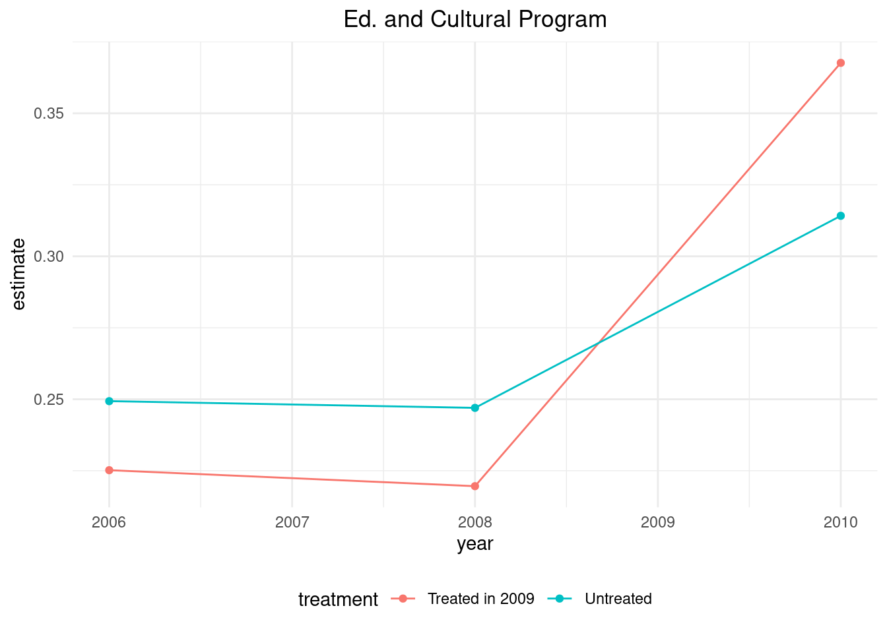

# Discussion 11: DiD Lab {-}

Nov 6 [**Slides.**](assets/discussions/DIDdiscussion_slides.pdf) for this discussion section. Download the R Markdown file [**here**](assets/discussions/DID-discussion.Rmd). 

## Empirical Application: How the Abolition of Elected Councils Affects Local Public Services in Vietnam

Refer to Tuesday's lecture ([slides](assets/slides/did_intro.pdf) and recording) for some background on this experiment. Here's a [link](https://www.cambridge.org/core/journals/american-political-science-review/article/impact-of-recentralization-on-public-services-a-differenceindifferences-analysis-of-the-abolition-of-elected-councils-in-vietnam/3477854BAAFE152DC93C594169D64F58) to the paper from the original experiment and a [link](https://www.cambridge.org/core/journals/political-analysis/article/using-multiple-pretreatment-periods-to-improve-differenceindifferences-and-staggered-adoption-designs/747F618FD4AD82A536823521D89310F7) to the paper that re-analyzed this experiment, which we're basing this lab on. 

### Download the data
All you need to do in this section is run the code block.


```r
# Recall that lines starting with hashtags are called comments

# The next few lines a code create a function called install that installs and loads a package/library
install <- function(package) {
  if (!require(package, quietly = TRUE, character.only = TRUE)) {
    install.packages(package, repos = "http://cran.us.r-project.org", type = "binary")
    library(package, character.only = TRUE)
  }
}

# We are using the function created above to install and load some libraries
install("cowplot")
install("dplyr")
```

```
## 
## Attaching package: 'dplyr'
```

```
## The following objects are masked from 'package:stats':
## 
##     filter, lag
```

```
## The following objects are masked from 'package:base':
## 
##     intersect, setdiff, setequal, union
```

```r
install("tidyverse")
```

```
## ── Attaching core tidyverse packages ──── tidyverse 2.0.0 ──
## ✔ forcats   1.0.0     ✔ readr     2.1.4
## ✔ ggplot2   3.4.2     ✔ stringr   1.5.0
## ✔ lubridate 1.9.2     ✔ tibble    3.2.1
## ✔ purrr     1.0.1     ✔ tidyr     1.3.0
```

```
## ── Conflicts ────────────────────── tidyverse_conflicts() ──
## ✖ dplyr::filter()    masks stats::filter()
## ✖ dplyr::lag()       masks stats::lag()
## ✖ lubridate::stamp() masks cowplot::stamp()
## ℹ Use the conflicted package (<http://conflicted.r-lib.org/>) to force all conflicts to become errors
```

```r
# Read in the raw data file
malesky2014 <- read_csv("https://github.com/causal3900/causal3900.github.io/raw/main/assets/data/malesky2014.csv")
```

```
## Rows: 6265 Columns: 42
## ── Column specification ────────────────────────────────────
## Delimiter: ","
## dbl (42): goodroadv, transport, pro3, tapwater, roadv, r...
## 
## ℹ Use `spec()` to retrieve the full column specification for this data.
## ℹ Specify the column types or set `show_col_types = FALSE` to quiet this message.
```

```r
# some data cleaning (drop rows with missing values in particular columns)
malesky2014 <- drop_na(malesky2014, lnarea, lnpopden, city) 
```


### About the data
All you need to do in this section is read the text and run the code block.

Variables in the data set:

- `treatment`: binary variable indicating if the record is from the treatment group ($1$) or the control group ($0$)
- `pro4`: educational and cultural program number 4 outcome variable (binary: $1$ if they participated in the program, $0$ if not)
- `tapwater`: tap water outcome variable (binary: $1$ if they drink tap water, $0$ if not)
- `agrext`: agricultural center outcome variable (binary: $1$ if they use the center, $0$ if not)
- `year`: the year the record is from
- `post_treat`: binary variable indicating if the record is from the pre-treatment period ($0$) or the post-treatment period ($0$)


```r
# show the first few lines of the dataset
head(malesky2014)
```

```
## # A tibble: 6 × 42
##   goodroadv transport  pro3 tapwater roadv  rm2c7d rm2c7e
##       <dbl>     <dbl> <dbl>    <dbl> <dbl>   <dbl>  <dbl>
## 1         0         1     1        0     1 0       0.216 
## 2         1         1     0        0     1 0.0109  0.164 
## 3         1         1     1        0     1 0       0     
## 4         1         0     0        0     1 0       0.0384
## 5         1         0     1        0     1 0.00860 0.119 
## 6         1         1     1        0     1 0.00857 0.357 
## # ℹ 35 more variables: rm2c7g <dbl>, animal_s <dbl>,
## #   agrvisit <dbl>, plant_s <dbl>, agrext <dbl>,
## #   irrigation <dbl>, rm2c7c <dbl>, pro5 <dbl>, pro4 <dbl>,
## #   rm2c7b <dbl>, useschool <dbl>, kgarten <dbl>,
## #   v_prischool <dbl>, broadcast <dbl>, post <dbl>,
## #   vpost <dbl>, rm2c7a <dbl>, rm2c7f <dbl>, market <dbl>,
## #   nonfarm <dbl>, vmarket1 <dbl>, vmarket2 <dbl>, …
```


### Visualizing Trends in the Treatment and Control Groups

In a DID design, the first step is to visualize the trends of the treatment and control groups to check if the parallel trends assumption is credible. Here, we look at one possible outcome: "Education and Cultural Program."

All you need to do in this section is run the code block and look at the plot. What is going on in the plot?


```r
# Plot the outcome for `Education and Cultural Program`
ed_and_culture <- malesky2014 %>%
  mutate(treatment = ifelse(treatment == 1, "Treated in 2009","Untreated")) %>%
  group_by(treatment, year) %>%
  summarize(estimate = mean(pro4)) %>%
  ggplot(aes(x = year, y = estimate, color = treatment)) + 
  geom_point() + 
  geom_line() + 
  ggtitle("Ed. and Cultural Program") +
  theme_minimal() +
  theme(legend.position = "none",
        legend.background = element_rect(fill = "white", colour = "white"),
        plot.title = element_text(hjust = 0.5))
```

```
## `summarise()` has grouped output by 'treatment'. You can
## override using the `.groups` argument.
```

```r
ed_and_culture + 
    guides(color = guide_legend(nrow = 1)) +
    theme(legend.position = "bottom")
```



### Basic Difference in Differences Analysis with One Pretreatment Period
All you need to do in this section is read the text and fill in the TASK pieces within the code. 

In the data our treatment indicator variable is called `treatment`, and our
post-treatment time period indicator is called `post_treat`. You will need to
create the interaction variable that is `treatment`*`post_treat`. Call this
new variable `did`. 


```r
# remove the extra pretreatment periods from the dataset
onePerMalesky <- malesky2014 %>%
  filter(year==2008 | year ==2010) # keep only 2008 and 2010

# TASK: create the interaction term between treatment and post_treat
onePerMalesky <- onePerMalesky %>%
  mutate(did = ...create your interaction variable here...)
```

Now that you have your `treatment`, `post_treat`, and `did` variables, you are
ready to estimate the causal effect of de-centralizing government on whether or
not people participate in an Educational and Cultural Program. Your outcome
variable in this case is `pro4`. We will estimate the causal effect with an 
OLS regression. Use the formula that we discussed in the slides to create 
your model formula.


```r
# TASK: regression for Education and Cultural Program on treatment, time period, and interaction term
didReg <- lm(...put your formula here..., data = onePerMalesky)

# TASK
summary(...put your DiD model object here...) # hint: what did you create above?

# estimate
print(didReg$coefficients["did"])
```
