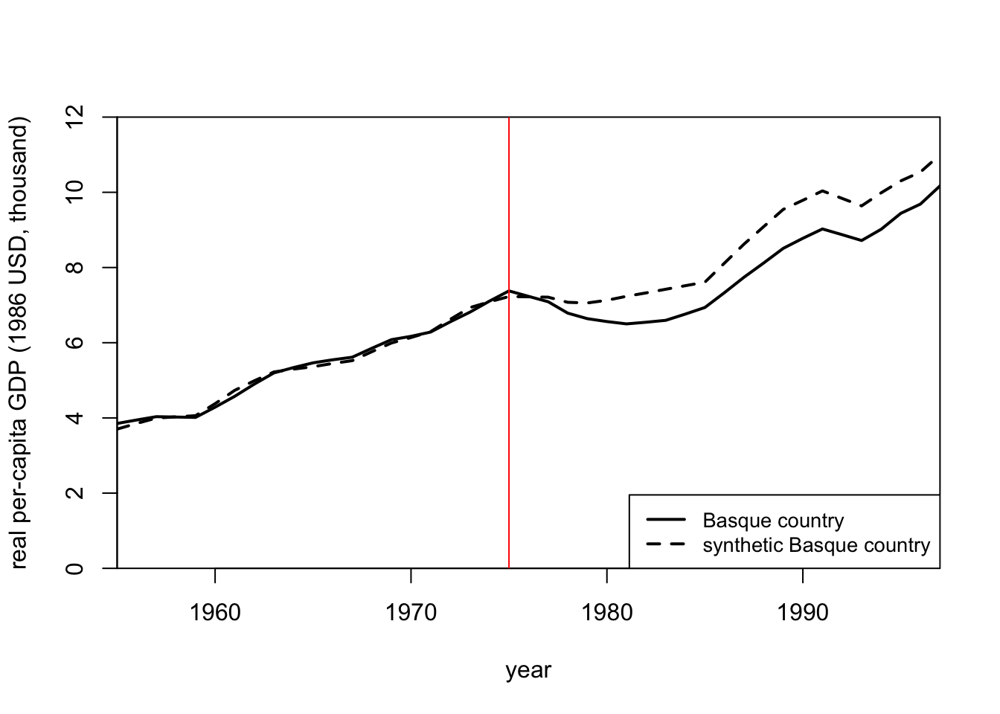
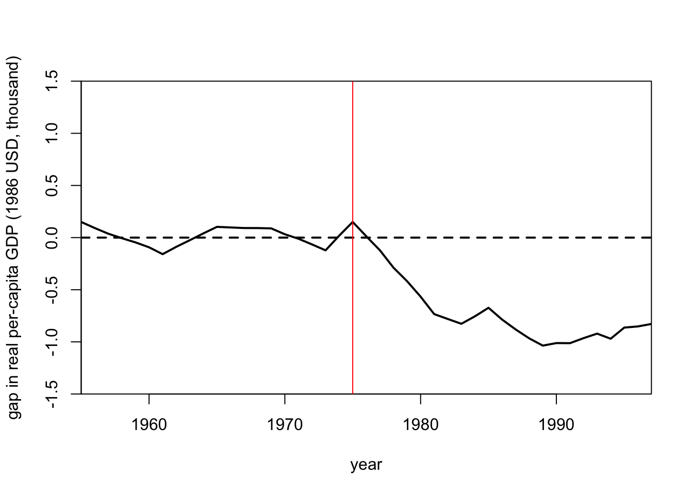

# Discussion 12. Empirical Application: How the Onset of Violent Conflict Affects Economic Output {-}

**NOTE: This is from Fall 2023. We have not updated to reflect the current term yet.**

We will demonstrate the synthetic control method using data from [Abadie and 
Gardeazabal (2003)](https://www.aeaweb.org/articles?id=10.1257/000282803321455188), which studied the economic effects of conflict, using the
terrorist conflict in the Basque Country as a case study. This paper used a 
combination of other Spanish regions to construct a synthetic Basque Country
resembling many relevant economic characteristics of the Basque Country before
the onset of political terrorism in the 1970s.

## Load the Data
Let's go ahead and load our packages and data. If you notice that there is quite
a lot of missing data, don't worry, that's how it is meant to be!

``` r
install <- function(package) {
  if (!require(package, quietly = TRUE, character.only = TRUE)) {
    install.packages(package, repos = "http://cran.us.r-project.org", type = "binary")
    library(package, character.only = TRUE)
  }
}

# Load packages
install("dplyr")
install("Synth")

# Load data
data("basque")
glimpse(basque)
```

```
## Rows: 774
## Columns: 17
## $ regionno              <dbl> 1, 1, 1, 1, 1, 1, 1, 1, 1, 1…
## $ regionname            <chr> "Spain (Espana)", "Spain (Es…
## $ year                  <dbl> 1955, 1956, 1957, 1958, 1959…
## $ gdpcap                <dbl> 2.354542, 2.480149, 2.603613…
## $ sec.agriculture       <dbl> NA, NA, NA, NA, NA, NA, 19.5…
## $ sec.energy            <dbl> NA, NA, NA, NA, NA, NA, 4.71…
## $ sec.industry          <dbl> NA, NA, NA, NA, NA, NA, 26.4…
## $ sec.construction      <dbl> NA, NA, NA, NA, NA, NA, 6.27…
## $ sec.services.venta    <dbl> NA, NA, NA, NA, NA, NA, 36.6…
## $ sec.services.nonventa <dbl> NA, NA, NA, NA, NA, NA, 6.44…
## $ school.illit          <dbl> NA, NA, NA, NA, NA, NA, NA, …
## $ school.prim           <dbl> NA, NA, NA, NA, NA, NA, NA, …
## $ school.med            <dbl> NA, NA, NA, NA, NA, NA, NA, …
## $ school.high           <dbl> NA, NA, NA, NA, NA, NA, NA, …
## $ school.post.high      <dbl> NA, NA, NA, NA, NA, NA, NA, …
## $ popdens               <dbl> NA, NA, NA, NA, NA, NA, NA, …
## $ invest                <dbl> NA, NA, NA, NA, NA, NA, NA, …
```

## Data definitions

The following are definitions of all the variables you see above:

- `regionno` and `regionname`: Numeric identifiers for each Spanish region,
and the names (as a character) of each region.

- `year`: The year corresponding with each row of the data. Spans from
1955-1997.

- `gdpcap`: 1960–1969 averages for real GDP per-capita measured in thousands of
1986 USD.

- Variables with `sec.` prefix: 1961–1969 average percentage of total GDP for
six different industries. For example, the first non-missing value of 
`sec.agriculture` is = 19.54. This means that in 1961, the Agriculture industry 
made up about 20% of the total GDP in all of Spain (note the `regionname`
variable = `Spain (Espana)`.

- Variables with `school.` prefix: 1964–1969 averages for the share of the 
working-age population that was illiterate (`school.illit`), the share with up
to primary school education (`school.prim`), the share with some high school
(`school.med`), the share with high school (`school.high`), and the share with
more than high school (`school.post.high`).

- `popdens`: 1969 population density measured in people per square kilometer.

- `invest`: 1964–1969 averages for gross total investment divided by total GDP.

Running the following line of code will show you some helpful information in the "Help" box on the bottom right of your R Studio Screen. We call this *documentation*. It tells you what the outcome variable and predictor variables are, plus descriptions of each variable in the dataset. Please ask us if you have any additional questions about what each variable means.


``` r
?basque
```

### Questions For You
After running the code above and reading the documentation for the dataset, answer the following questions:

1. What years are contained in the dataset?

**Answer.** 

2. How many Spanish regions are contained in the dataset?

**Answer.**

3. What is the outcome variable and what is it called in the dataset?

**Answer.**

4. What are the possible predictor variables?

**Answer.**

## Prepare the data for analysis using `dataprep`

The **first step** is to reorganize the dataset into an appropriate format that is
suitable for the main estimator function `synth()`. To do this, we will use the
`dataprep()` function. To see more examples and details on data extraction, run
`?dataprep` in your console. This should pop up a helpful page in the "Help" tab on the bottom right of your R Studio screen.

In the code below, we need to tell Synth the following:

1. What our predictor variables are (split up into two groups)
  - (a) `predictors`: variables that are non-missing for all years included in our analysis
  - (b) `special.predictors`: for predictor variables with missing values or require a little extra handling
2. How we want these predictor variables to be aggregated (in our case, the average)
3. What time period we are considering (in our case, 1964 to 1969)
4. What the outcome variable is (in our case, `gdpcap`)
5. What variable(s) identify the different regions (`regionname`) and/or 
numbers (`regionno`).
6. What variable denotes the time period (`year`)
7. Which region is the treated unit (region 17 AKA Basque Country) 
8. Which regions are control units (`c(2:16,18)`)
9. What time period we want to train out model in (pre-treatment period 1960:1969)
10. The time-period over which our outcome data should be plotted
(usually before and after treatment, e.g., 1955 to 1997)

Okay, now let's prepare what we've just described in code. 
We've added comments in the code to explain exactly what's happening in each line.
We are creating a "prepared" dataset `dataprep.out` by running our "unprepared" data through the `dataprep` function. 
This is because the Synth package requires the data to be in a specific format to do synthetic control.


``` r
dataprep.out <- dataprep(
  foo = basque,          # Our analysis data that needs to be prepared
  predictors = c(        # 1(a). list the variables that we want to use as predictors
    "school.illit",     
    "school.prim",       
    "school.med",
    "school.high",
    "school.post.high",
    "invest"
  ),
  predictors.op = "mean",               # 2. Tell Synth to take the average of all variables in `predictors` above.
  time.predictors.prior = 1964:1969,    # 3. Take the average of variables in `predictors` from 1964 to 1969.
  special.predictors = list(            # 1(b). Additional variables to include as predictors in our model:
    list("gdpcap", 1960:1969 , "mean"), # -    Take the average of `gdcap` from 1960 to 1969
                                        # -    Take the average of all others for every OTHER year from 1961 to 1969
    list("sec.agriculture", seq(1961, 1969, 2), "mean"),
    list("sec.energy", seq(1961, 1969, 2), "mean"),
    list("sec.industry", seq(1961, 1969, 2), "mean"),
    list("sec.construction", seq(1961, 1969, 2), "mean"),
    list("sec.services.venta", seq(1961, 1969, 2), "mean"),
    list("sec.services.nonventa", seq(1961, 1969, 2), "mean"),
    list("popdens", 1969, "mean")       # -    Take the average of `popdens` only in 1969
  ),
  dependent = "gdpcap",                 # 4. Specify our outcome variable
  unit.variable = "regionno",           # 5(a). Specify the numeric identifier of each region
  unit.names.variable = "regionname",   # 5(b). Specify the name of each region
  time.variable = "year",               # 6. Specify what variable is our time variable
  treatment.identifier = 17,            # 7. Specify which region in `regionno` is our treated region
  controls.identifier = c(2:16, 18),    # 8. Specify which regions in `regionno` should be in our donor pool
  time.optimize.ssr = 1960:1969,        # 9. Specify what years should make up our pre-treatment time period
  time.plot = 1955:1997                 # 10. Specify what years to plot our outcome variable for
)
```

Notice that in the code above we use the arguments `predictors`, 
`predictors.op`, and `time.predictors.prior`, and the rest of the information
for the other predictor variables is specified in the `special.predictors`
list. This functionality was designed to allow for easy handling of
several predictors with the same operator (e.g. taking the average) over the
same pre-treatment period (in this case, the school and investment variables)
as well as additional custom (or “special”) predictors with varying operators
and time-periods. For example, the variables for the sector production
shares (e.g. `sec.agriculture`) is only available on a biennial basis
(1961,1963,...,1969) extracted which is why we use the code `seq(1961,1969,2)`.
More details and examples on the use of the `special.predictors`
can be seen by running `?dataprep` in the console.

## Construct our Synthetic Control

Now, we're ready to use the `synth()` function to create the synthetic control
for the GDP of the Basque Country region of Spain. As described in discussion,
this means that `synth()` will create weights for each of the other regions
so that the weighted average of the other regions' GDP will closely match the
true GDP of the Basque Country region.

``` r
synth.out <- synth(data.prep.obj = dataprep.out, method = "BFGS")
```

```
## 
## X1, X0, Z1, Z0 all come directly from dataprep object.
## 
## 
## **************** 
##  searching for synthetic control unit  
##  
## 
## **************** 
## **************** 
## **************** 
## 
## MSPE (LOSS V): 0.008864649 
## 
## solution.v:
##  0.01362299 1.1816e-06 1.17692e-05 0.0002695623 3.9871e-06 6.7728e-06 0.06912319 0.2228821 0.02116312 0.1942574 0.0506171 8.776e-06 0.06653104 0.361501 
## 
## solution.w:
##  4.52e-08 6.26e-08 7.86e-08 4.59e-08 5.36e-08 6.607e-07 6.32e-08 1.068e-07 0.8508159 3.109e-07 3.49e-08 1.098e-07 0.1491821 8.8e-08 1.315e-07 2.362e-07
```
We'll explore the model output below. 

## Summarizing our Synthetic Control with Tables

First, we can begin by creating some summary tables from our Synthetic Control
model.

``` r
synth.tables <- synth.tab(dataprep.res = dataprep.out, synth.res = synth.out)
```

The `synth.tables` variable now contains four tables that will help us evaluate
our synthetic control. The first table looks at our pre-treatment period and
compares the predictor values between the Basque Country (denoted `Treated` in
the table) and our Synthetic Control. **Note** we want the values in the
`Treated` and `Synthetic` columns to be really close together.

``` r
synth.tables$tab.pred
```

```
##                                          Treated Synthetic
## school.illit                              39.888   256.337
## school.prim                             1031.742  2730.105
## school.med                                90.359   223.340
## school.high                               25.728    63.437
## school.post.high                          13.480    36.153
## invest                                    24.647    21.583
## special.gdpcap.1960.1969                   5.285     5.271
## special.sec.agriculture.1961.1969          6.844     6.179
## special.sec.energy.1961.1969               4.106     2.760
## special.sec.industry.1961.1969            45.082    37.636
## special.sec.construction.1961.1969         6.150     6.952
## special.sec.services.venta.1961.1969      33.754    41.104
## special.sec.services.nonventa.1961.1969    4.072     5.371
## special.popdens.1969                     246.890   196.283
##                                         Sample Mean
## school.illit                                170.786
## school.prim                                1127.186
## school.med                                   76.260
## school.high                                  24.235
## school.post.high                             13.478
## invest                                       21.424
## special.gdpcap.1960.1969                      3.581
## special.sec.agriculture.1961.1969            21.353
## special.sec.energy.1961.1969                  5.310
## special.sec.industry.1961.1969               22.425
## special.sec.construction.1961.1969            7.276
## special.sec.services.venta.1961.1969         36.528
## special.sec.services.nonventa.1961.1969       7.111
## special.popdens.1969                         99.414
```
We can see that the values in the `Treated` and `Synthetic` columns are pretty
different for some variables so this would indicate that perhaps our synthetic
control isn't as similar as we would like.

Next, we can look at the weights that got assigned to each of the non-treatment
regions. We can drop regions that have a weight of 0 since those regions don't
contribute to our synthetic control at all!

``` r
synth.tables$tab.w[synth.tables$tab.w$w.weights != 0, ]
```

```
##    w.weights            unit.names unit.numbers
## 10     0.851              Cataluna           10
## 14     0.149 Madrid (Comunidad De)           14
```
From the `w.weights` column we can see that only two regions contribute to our
synthetic control. The Cataluna region makes up approximately 85% of our
synthetic control and the Madrid region makes up the additional 15%. This means
that out of 16 regions in our donor pool, only 2 of them were picked to create
our synthetic control!

Finally we can look at the weights that got assigned to each of our predictor
variables. This can be interpreted as the relative importance of each of our
predictor variables.

``` r
synth.tables$tab.v
```

```
##                                         v.weights
## school.illit                            0.014    
## school.prim                             0        
## school.med                              0        
## school.high                             0        
## school.post.high                        0        
## invest                                  0        
## special.gdpcap.1960.1969                0.069    
## special.sec.agriculture.1961.1969       0.223    
## special.sec.energy.1961.1969            0.021    
## special.sec.industry.1961.1969          0.194    
## special.sec.construction.1961.1969      0.051    
## special.sec.services.venta.1961.1969    0        
## special.sec.services.nonventa.1961.1969 0.067    
## special.popdens.1969                    0.362
```

We can see that the `school.med`, `school.high`, `school.post.high`, and
`invest` variables had a weight of 0, which means that they are the least
important and had no impact in the creation of our synthetic control. On the 
other hand, the population density in 1969 (`special.popdens.1969`) was the
most important variable.

## Summarizing our Synthetic Control with Plots

Finally, we can plot the economic output for the Basque Contry region and
compare it to the economic output for our Synthetic Control. To make a
convincing case for a large treatment effect, we would like to see the two
trajectories of the outcome variable for the Basque Country and its Synthetic
Control unit to be quite similar prior to the violent conflict and to diverge
sharply when the violent conflict occurs.

Let's create such a plot and see if it indicates a significant treatment effect.

``` r
path.plot(
  synth.res = synth.out,
  dataprep.res = dataprep.out,
  Ylab = "real per-capita GDP (1986 USD, thousand)",
  Xlab = "year",
  Ylim = c(0, 12),
  Legend = c("Basque country", "synthetic Basque country"),
  Legend.position = "bottomright"
)
abline(a = NULL, b = NULL, h = NULL, v = 1975, col = "red")
```



We can see that the economic output of both units looks super similar until
1975 which is when the violent conflict began in earnest. From that point on,
the economic output of the Basque Country drops significantly. This would
indicate that the violent conflict had a fairly large and negative impact on
economic output in the Basque Country region.

Another way we can visualize this is by creating the same plot, but instead
of showing two lines for the outcome of the Basque Country region and the
outcome of the Synthetic Control Unit, we plot a single line that is the
difference between the two lines in each time period.

``` r
gaps.plot(
  synth.res = synth.out,
  dataprep.res = dataprep.out,
  Ylab = "gap in real per-capita GDP (1986 USD, thousand)",
  Xlab = "year",
  Ylim = c(-1.5, 1.5),
  Main = NA
)
abline(a = NULL, b = NULL, h = NULL, v = 1975, col = "red")
```



This plot conveys the same information as before. That is, the economic output
of the Basque Country region drops well below the economic output of the
Synthetic Control unit once the violent conflict begins in 1975. In other words
the violent conflict lowers economic output.

## Summary

In this tutorial, we've walked through how to prepare data for the Synthetic
Control method with the following steps:

- Prepare your data using the `dataprep()` function.

- Create a Synthetic Control unit using the `synth` function.

- Evaluate our model with tables using the `synth.tab` function.

- Plot the outcomes of our treated unit and our synthetic control unit with the
`path.plot` and `gaps.plot` functions.

