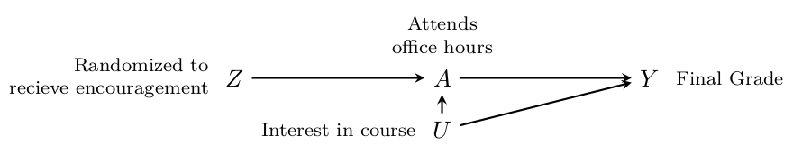

# Problem Set 5. IV + RD {-}

Relevant material will be covered by **Oct 31**. Problem set is due **Nov 7**.

To complete the problem set, feel free to [**Download the .Rmd**](https://github.com/causal3900/causal3900.github.io/blob/main/assets/psets/pset5_download.Rmd) and the [pdf](https://github.com/causal3900/causal3900.github.io/blob/main/assets/psets/pset5_download.pdf). Omit your name so we can have anonymous peer feedback. Submit the PDF on Canvas.

The learning goals of completing this problem set are to engage with conceptual assumptions for instrumental variables and regression discontinuity and to apply these methods to data from a real-world example in order to answer a causal question using R.

*You are allowed to use outside resources as you study and work on this problem set. However, if you do, you must cite the source to receive credit. In addition, the use of generative AI is prohibited. In addition, to receive any credit, you must use the terminology from class (lecture slides or discussion material). Under no circumstances should you directly copy and paste work that is not your own, including from online resources, other students, or AI-generated text/code.* 
     
## 1. (25 points) Instrumental variables in experiments {-}
Suppose you are a professor at Cornell and are interested in the effect of attending office hours on a students final grade. You randomly select some students to receive an email encouraging them to regularly attend office hours.   

<style>.img-responsive {
  max-width: 100%;
}
</style>

<div class="panel">
  
</div>


In many cases, whether a student received the email $Z$ determines their actual treatment $A$ (when $Z = 1$ then $A = 1$, and when $Z = 0$ then $A = 0$). But there are some difficulties:

a) Some students have no interest in the class material ($U$). No matter the value of $Z$, these students will not attend office hours($A = 0$).
b) Some students have a lot of interest in the class material ($U$) so that regardless of the value of $Z$, these students will attend office hours ($A = 1$).

Answer the following in a sentence each.

1. (2 points) What is the intent to treat effect and why would it be useful to know?

2. (2 points) Who are the always-takers?

3. (2 points) Who are the never-takers?

4. (2 points) Who are the compliers?

5. (2 points) Although they are not discussed above, describe how someone could be a defier.

6. (5 points) What assumption was made credible by randomization of $Z$? What did we call this assumption in class?

7. (5 points) Suppose the causal graph drawn above is not correct. In particular, receiving an email encouraging a student to attend office hours makes them feel better supported so the email has a direct positive impact on their final grade (regardless of whether or not they attend office hours). This means we ought to include the edge $Z \rightarrow Y$ in our graph. If this is true, how would your estimated causal effect differ from the true causal effect? Specifically, would it be larger or smaller? Explain your answer by referring to which part of the Wald estimator ($(E(Y \mid Z = 1) - E(Y \mid Z = 0)) / (E(A \mid Z = 1) - E(A \mid Z = 0))$  would be incorrect. Which assumption that we discussed in class does this situation relate to? You must cite a lecture slide to receive credit.

8. (5 points) Suppose the causal graph drawn above is not correct. In particular, the emails got caught in a spam filter, so no student actually received the email. Explain why the Wald estimator would give an unreliable estimate of the true causal effect. Which assumption that we discussed in class does this situation relate to? You must cite a lecture slide to receive credit.

## 2. (10 points) Regression Discontinuity Design (RDD) {-}

**2.1. (3 points)** In your own words, explain the key assumption of regression discontinuity. Your answer should include what it means intuitively, what it means in math, and why it's important. 

**Answer**:

**2.2. (7 points)** Draw two images by hand:

- In the first, draw a visual representation of what it looks like when the assumption is satisfied
- In the second, draw a visual representation of what it looks like when the assumption is not satisfied

Include a picture of your hand-drawn images below. This [**YouTube video**](https://youtu.be/zX3ug6Hu3aE?si=bnfdmv_yJ_82WNse) shows how to include an image in RMarkdown. Make sure any axes, variables, cutoffs, etc are clearly labeled. You may include a short sentence explaining or describing your picture, but this is not required. 

**Answer**:

## IV and RDD in R {-}
For this section, pick ONE coding question (either number 3 or number 4) to answer. You will not get any extra points for doing both. If you do both, peers and graders will be instructed to grade the first one. 

## 3. (10 points) Estimating a causal effect via instrumental variables{-}
In the paper [Using Geographic Variation in College Proximity to Estimate the Return to Schooling, in Aspects of Labour Market Behavior](https://davidcard.berkeley.edu/papers/geo_var_schooling.pdf#page=2.00) the economist David Card estimates the causal effect of schooling on wages. Specifically, the treatment of interest ($A_i$) is the number of years of schooling from (1 to 18; where 12 indicates completing high school and values above 12 indicate some college or even graduate school) and the outcome of interest ($Y_i$) is wages in 1976 measured in cents. Of course, there are many confounders present, but Card uses growing up near a 4yr college as an instrument ($Z_i$). In particular, he argues that growing up near a 4yr college increases the years of education by making an individual more likely to go to college so that $Z_i \rightarrow A_i$. However, he argues that growing up near a 4 year college does not have a causal effect on wages except through education levels. 

You can access the data in the \texttt{woolridge} package. However, since it's not easily installable from R, we have provided an alternative for you to get the data here:
```{r, eval=F}
card <- read.csv("https://raw.githubusercontent.com/causal3900/causal3900.github.io/refs/heads/main/assets/data/card.csv")

###
# this variable indicates whether someone grew up near a 4 year college or not
card$nearc4 
# this variable indicates years of education
card$educ
# this variable indicates wages (measured in cents)
card$wage 
```


### 3.1 (5 points) Suppose we believe the argument and want to use the instrument of being near a 4 year college. Estimate the causal effect of years of education on wage. {-}

**Answer**:

```{r}


```

### 3.2 (5 points) There is some disagreement about whether the instrumental variables setup is reasonable in this setting. Playing devil's advocate, give at least one reason why the assumptions of instrumental variables might be violated for this example. {-}

**Answer**:


## 4. (10 points) Estimating a causal effect via RDD {-}

Continuing the example from the discussion section, we'll answer a causal question based on ``Randomization Inference in the Regression Discontinuity Design: An Application to Party Advantages in the U.S. Senate'' by Cattaneo, Frandsen, and Titiunik (2015). 

The question is "If the other sitting senator is from your same party, what is the effect on your vote share?" In other words, if I am a democrat (resp, republican) senator, what is the effect of the other senator also being a democrat (resp, republican) on my share of votes when I run for office? Recall that I would not be competing with the other senator, because elections are every 3 years and alternate between senators. For more context, refer to the [RDD Lab](https://causal3900.github.io/discussion-10-rdd-lab-solutions.html).

Your task is to estimate the causal effect of the senator who is not up for election being a democrat on the democratic vote share of the senator who is up for election. In this case, the outcome of interest is `demvoteshfor1` since we are interested in the immediately following election. The running variable is the margin of victory `demmn`. We have started the code for you below.

```{r}
install <- function(package) {
  if (!require(package, quietly = TRUE, character.only = TRUE)) {
    install.packages(package, repos = "http://cran.us.r-project.org", type = "binary")
    library(package, character.only = TRUE)
  }
}

# install and load some libraries using the function created above
install("ggplot2")
install("rdrobust")

# read in the datafile
data <- read.csv("https://raw.githubusercontent.com/rdpackages-replication/CIT_2020_CUP/master/CIT_2020_CUP_senate.csv")
```


**4.1 (5 points)** Using [`rdrobust`](https://rdrr.io/cran/rdrobust/man/rdrobust.html), get an estimate of the LATE by specifying a kernel, model degree (`p`) and bandwidth size (`h`). 
```{r}
outcome <- data$demvoteshfor1
running_variable <- data$demmv

# your code goes here
```

**4.2 (5 points)** What happens if you change the value of `p`? What happens if you change `h`? How do these changes relate to bias and variance? For full credit, your should try a few different values of `p` and `h`, reporting the estimate and standard error for each. 

**Answer**: