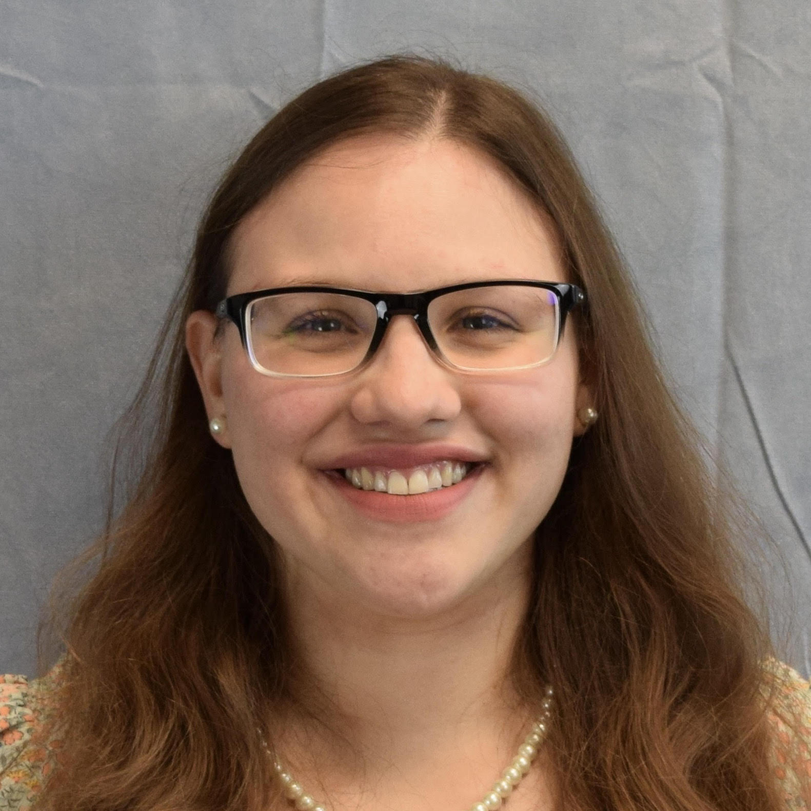

# (PART) Course information {-}

# Who we are {-}

<head>

</head>

## Faculty {.unnumbered}

  

  
[**Y. Samuel Wang**](https://ysamuelwang.com/) Assistant Professor Statistics and Data Science 
[ysw7@cornell.edu](mailto:ysw7@cornell.edu) OH W 3--4 Comstock 1192

> I enjoy thinking about problems where the goal is to discover interpretable structure which underlies the data generating process. This includes problems in the areas of causal discovery, graphical models, and mixed membership models. In many cases, the methods are tailored for the high-dimensional setting where the number of variables considered may be large when compared to the number of observed samples. My applied interests vary but are generally social science related. Test

  

  
[**Ian Lundberg**](https://www.ianlundberg.org/) (he / him) Assistant Professor Information Science [ilundberg@cornell.edu](mailto:ilundberg@cornell.edu) OH T 10:30--11:30 Gates 223

>I study causal questions related to inequality: why some people have more money than others, why disparities exist across social groups, and how we could intervene to promote equality. Beyond causal inference, other joys of mine include hiking, surfing, and oatmeal with blueberries.

## Teaching assistants {.unnumbered}

  

  
[**Mayleen Cortez-Rodriguez**](https://www.mayleencortez.com/) (she / her) PhD Student Applied Mathematics 
[mec383@cornell.edu](mailto:mec383@cornell.edu)  OH F 9--10 Rhodes 657 - Room 2

> I'm currently working on problems in causal inference under network interference. I think causal inference is really cool because it has applications across so many different fields. I'm generally interested in applications to public health, social welfare, and social good. In my free time, I enjoy singing, dancing, cooking, watching movies, and traveling to various theme parks. 

  

  
[**Daniel Molitor**](https://www.dmolitor.com/) PhD Student Information Science 
[djm484@cornell.edu](mailto:djm484@cornell.edu)  OH TH 1--2 Uris 302

> I’m fascinated by causal relationships and enjoy exploring how they shape our world. My interests are broadly centered in the area of Computational Social Science, and are specifically focused on how we can apply computational and Machine Learning methods to uncover and estimate causal relationships. In my free time I enjoy doing pretty much anything that's active and outdoors and I particularly enjoy playing tennis, kayaking, and fishing (if you have any pro tips, let me know).

