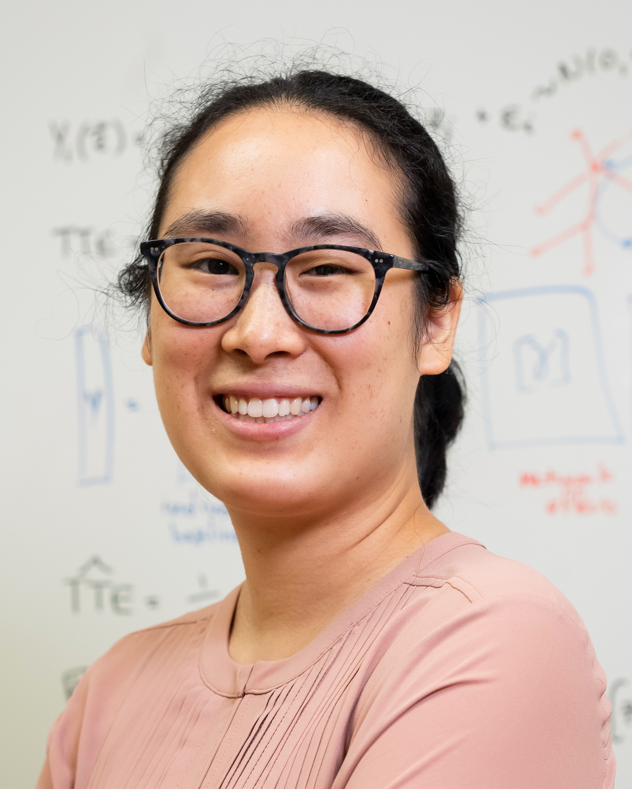

# (PART) Course information {-}

# Who we are {-}

<head>

</head>

## Faculty {.unnumbered}

  

  
[**Christina Lee Yu**](https://cleeyu.orie.cornell.edu/) Assistant Professor Operations Research and Information Engineering 
[cleeyu@cornell.edu](mailto:cleeyu@cornell.edu) OH TBD

> Christina Lee Yu is an Assistant Professor at Cornell University in the School of Operations Research and Information Engineering. She is also an Amazon scholar. Prior to Cornell, she was a postdoc at Microsoft Research New England. She received her PhD and MS in Electrical Engineering and Computer Science from Massachusetts Institute of Technology, and her BS in Computer Science from California Institute of Technology. She is a recipient of the NSF CAREER Award, ACM SIGMETRICS Rising Stars Award, Intel Rising Stars Award, JPMorgan Faculty Research Award, and honorable mention for the 2018 INFORMS Dantzig Dissertation Award. Her work is supported by grants from the National Science Foundation and the Air Force Office of Scientific Research. She is currently an associate editor for Stochastic Systems. Her research interests include algorithm design and analysis, high dimensional statistics, inference over networks, sequential decision making under uncertainty, online learning, and network causal inference.

  

  
[**Y. Samuel Wang**](https://ysamuelwang.com/) Assistant Professor Statistics and Data Science 
[ysw7@cornell.edu](mailto:ysw7@cornell.edu) OH TBD

> I enjoy thinking about problems where the goal is to discover interpretable structure which underlies the data generating process. This includes problems in the areas of causal discovery, graphical models, and mixed membership models. In many cases, the methods are tailored for the high-dimensional setting where the number of variables considered may be large when compared to the number of observed samples. My applied interests vary but are generally social science related.

## Teaching assistants {.unnumbered}

  

  
[**Filippo Fiocchi**](https://filippofiocchi.github.io/) PhD Student Statistics and Data Science 
[ff257@cornell.edu](mailto:ff257@cornell.edu)  OH TBD

> I am currently working on problem related to Causality, particularly on Causal and Graph discovery for Functional data. I am interested in how to learn interpretable structures from data with hidden confounders. In my free time I enjoy playing basketball, running and hanging out with friends.

  

  
[**Shira Mingelgrin**](https://stat.cornell.edu/people/phds/shira-mingelgrin) PhD Student Statistics and Data Science 
[sm2267@cornell.edu](mailto:sm2267@cornell.edu)  OH TBD

> I am currently working on graphical models with noisy measurements. I am interested in causal discovery and its applications in social science and biology. In my free time I like doing puzzles, playing pool, and baking.  

